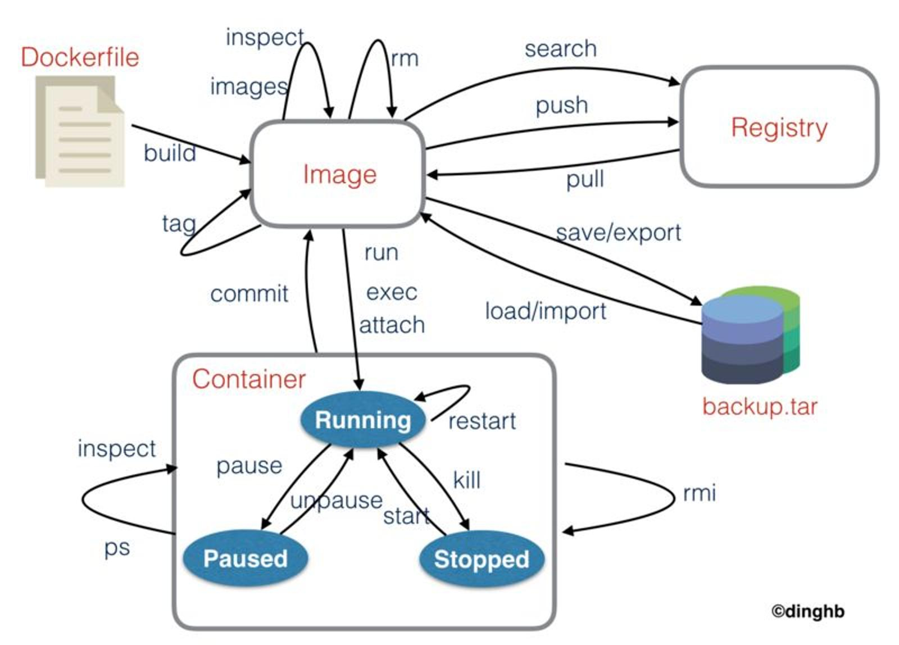

## Docker 前世今生

### 1、虚拟化技术

云计算技术在逻辑上将机房中的所有的物理机打碎，然后捡出所有的 CPU、内存、存储、网络等物理资源碎片分门别类集中起来组成一个个逻辑上的资源池。整个系统是一个拥有超级多的物理资源的整体，称为“云”，负责管理和调度整个系统中所有物理资源的操作系统，称为“云操作系统”。

当“云”对外提供服务时，提供的不再是物理的服务器，而是更细粒度的物理资源。外部用户不知道也不需要知道他所使用的资源由云中的哪个机房的哪个物理机提供。例如，当我们部署一个应用需要用到 4 个 CPU 核、2G 的内存、20G 的存储以及 2M 的网络带宽，“云”就会从他的 CPU 池中取出 4 个 CPU 核，从内存池中取出 2G，从存储池中取出 20G ，从网络池中取出 2M 分配给用户使用，“云”中不需要真是存在这么一台具有 4 个 CPU 核、2G 的内存、20G 的存储以及 2M 的网络带宽真实物理机。

那么“云”提供的 CPU、内存、存储和网络等资源需要以怎样的形式给到用户去使用呢？这就需要用到虚拟化技术。“云”中已经没有了物理机的概念，利用虚拟化技术，“云”可以将这些资源整合打包成为一个逻辑上的虚拟机，提供给用户使用。所以，虚拟化技术的一个重要的功能是对资源进行**封装**。

虚拟化技术另外一个重要的功能是实现环境的**隔离**。在同一个环境中运行多个应用，应用之间很可能会出现端口冲突，或者应用依赖的一些软件包的版本不一致，以及应用需要用到的一些环境变量冲突等等。有了虚拟化技术，可以为我们提供一个隔离的运行环境，存在冲突的应用分别放到不同的环境中运行。

虚拟化技术存在两种类型：

1. 主机级别虚拟化：虚拟出来的是一个独立的硬件平台，需要自己装操作系统和应用软件
    - Type-1：Hypervisor 直接装在硬件平台上，例如 ESX/ESXI
    - Type-2：Hypervisor 装在宿主操作系统上装，例如 VMWare Workstation
2. 容器级别虚拟化：虚拟出来的是一个独立的容器，容器拥有各自隔离的用户空间，可以为目标进程供需要的运行环境，并且保护目标进程在容器内部运行时不受外部干扰


主机级别的虚拟化存在一个非常严重的问题，就是 VM 占有资源过多，导致资源利用率低。每个 VM 中都需要安装 Guest OS，然后再在 Guest OS 上运行具有实际生产功能的应用。但是实际上，具有实际生产功能的应用可能只占据几 M 的存储，运行起来占有内存不超过几百M，但是 Guest OS 运行起来可能就需要占据几十 G 的存储和几 G 的内存，资源大部分被不具有实际生产功能的 Guest OS 白白浪费了。这时候容器级别的虚拟化技术的优势就体现出来了，容器运行不需要安装 Guest OS，多个容器共享 Host OS 内核，避免了资源的浪费的同时，更加的轻量灵活。

|  **特性**  |      **容器**      | **虚拟机** |
|:----------:|:------------------:|:----------:|
|  启动速度  |        秒级        |   分钟级   |
|  硬盘占用  |      一般为MB      |  一般为GB  |
|    性能    |      接近原生      |  弱于原生  |
| 系统支持量 | 单机支持上千个容器 | 一般几十个 |

### 2、容器技术

现在说到容器技术，脑海中的第一个概念就是 Docker，Docker 几乎是容器的代名词。在 Docker 之前，不是没有人认识到容器这种虚拟化方案的优势，也不是没有比较成熟的容器解决方案。其实 Docker 之前，容器技术已经历了漫长的发展：


2008 年出现的 LXC 提供了一组工具和模板来极大的简化了容器的创建和使用，是第一个比较完善的容器技术。

LXC 基于以下两项已经被加入内核的技术，不需要在内核上打补丁就能运行：

**1. linux namespaces：提供隔离用户空间的能力**

| **命名空间** | **系统调用参数**     | **隔离内容**      | **内核版本**            | **发布时间**                  |
|:--------:|:--------------:|:-------------:|:-------------------:|:-------------------------:|
| Mount    | CLONE\_NEWNS   | 挂载点，文件系统      | 2\.4\.19            | 2002\-8\-3                |
| UTS      | CLONE\_NEWUTS  | 主机名和域名        | 2\.6\.19            | 2002\-8\-3                |
| IPC      | CLONE\_NEWIPC  | 信号量、消息队列和共享内存 | 2\.6\.19            | 2002\-8\-3                |
| PID      | CLONE\_NEWPID  | 进程编号          | 2\.6\.24            | 2008\-1\-24               |
| Net      | CLONE\_NEWNET  | 网络设备、网络栈、端口等  | 2\.6\.24 ~ 2\.6\.29 | 2008\-1\-24 ~ 2009\-3\-23 |
| User     | CLONE\_NEWUSER | 用户和用户组        | 2\.6\.23 ~ 3\.8     | 2007\-10\-9 ~ 2013\-2\-18 |

> centos 6 使用的是 2.6 的内核，不支持

**2. cgroups：提供管控用户空间使用资源的能力**

前身是 2006 年 Google 发布的 Process Containers，在 2007 年被加入 Linux 内核 2.6.24 版本中。cgroups 的功能是限制、记录和隔离进程组所使用的资源(包括 CPU、内存、硬盘 I/O、网络等)

2013 年出现的 Docker 定义了则是在 LXC 的基础上，着重攻克了容器分发的难题。Docker 定义了一个容器镜像标准，围绕容器镜像的构建、传输和运行建设起一套完整的生态，使得容器技术迅速普及开始大范围使用。

> 后来 Docker 发布了自己的 libcontainer 替换了 LXC

### 3、docker 技术

2010 年，Solomon Hykes 和他的伙伴们在旧金山创建了 dotCloud 公司。dotCloud 最初是一家 Paas 提供商，在底层技术上，dotCloud 使用了 lxc 技术，并且开发了一套用户创建和管理容器的工具，之后被命名为 docker。

2013 年，dotCloud 的 PaaS 业务并不景气，公司举步维艰。穷则思变，Solomon Hykes 决定将公司的 docker 项目开源。docker 项目用镜像的封装和分发容器的方式直击软件交付环节中环境不一致的痛点，很快就吸引了众多开发者和 Paas 巨头，docker 迅速蹿红。dotCloud 公司果断放弃 Paas 业务，将公司改名为 “Docker”，专注 docker 的开发和推广。

还有标准化的历程？？？

## docker 架构


Docker 的架构由 Docker Host、Docker Client 和 Docker Registry 三部分组成：

- Docker Host：运行着 docker deamon 守护进程的主机
- Docker Client：安装了 docker cli 或者其他 docker 管理工具的主机
- Docker Registry：提供 Docker 仓库托管和检索服务的仓库注册服务器

Docker Host 和 Docker Client 可以是两个不同的主机，通过 tcp/ip socket 进行通信，也可以是同一个主机，通过 unix domain socket 通信。docker deamon 默认只监听 unix domain socket，如果需要开启 TCP/IP 监听，修改 `/etc/systemd/system/multi-user.target.wants/docker.service`:

```properties
[Service]
Type=notify
ExecStart=/usr/bin/dockerd -H unix:///var/run/docker.sock -H tcp://0.0.0.0:2375
ExecReload=/bin/kill -s HUP $MAINPID
```

Docker Host 和 Docker Client 之间通信的应用层协议是 https 或者 http，docker deamon 对外提供一套 RESTful 风格的 Docker Remote API，可以让 Docker Client 查看和管理 Docker Host 上的容器、镜像等各种资源。


Docker Registry 和 Docker Host 之间通信的应用层协议也是 https 或者 http，Docker Registry 对外同样提供一套 RESTful 风格的 Docker Registry API，可以让 Docker Host 检索和上传镜像。

从架构图中可以看出 Docker 的三个核心概念：镜像 - Image、容器 - Container 和仓库 - Repository。其中最重要的概念是镜像，镜像是 Docker 能够在迅速脱引而出一炮而红的杀手锏。Docker 镜像可以类比于生活中的集装箱。集装箱使用统一的规格来封装货物，极大提高了货物运输的效率。并且集装箱隔离的环境，避免了A公司的货物和B公司的货物混在一起。


Docker 中，开发者只要把自己的应用打包成符合这种标准的镜像，就可以在 Docker 这个生态系统中传输、分发和运行。在 Docker 之前，传统的软件的交付需要提供代码以及说明文档，运维人员需要安装和配置应用运行所需要的环境和依赖，在 Docker 之后，只需要交付一个标准镜像，这个镜像中已经包含了应用本身和需要的环境和依赖信息，运维人员不需要任何安装配置就可以在任何服务器上运行应用。

也正是因为镜像的核心地位，Docker 的命名来自英国口语，意为码头工人（Dock Worker），Docker 最初的 logo 也是一个装载着集装箱的鲸鱼。


镜像本地构建完成之后，需要上传到仓库。仓库是集中托管镜像文件的地方，别的主机可以从仓库中下载镜像到本地运行。仓库分为官方仓库和用户仓库，例如 `nginx` 是一个官方仓库，而 `portainer/portainer` 是一个用户仓库。一个仓库可以存放多个不同版本的镜像文件，不同版本的镜像用 tag 标记，例如 `nginx` 仓库最新版本的镜像标记为 `nginx:latest`，稳定版本的镜像标记为 `nginx:stable`，另外还有带有版本号的版本 `nginx:1.17.7`，带有构建环境的版本 `nginx:alpine` 等等。不带任何 tag 默认取最新版本。

> 仓库保存在仓库注册服务器中，一个仓库注册服务器保存着成千上万的仓库和索引信息。

镜像下载到本地，运行得到容器。容器是镜像的运行实例，类似与程序和进程的关系，一个镜像可以多次运行得到多个容器。容器真正运行项目程序、消耗系统资源、提供服务的地方。

---

镜像：文件系统及内容
aufs -> overlay => overlay2
分层构建、联合挂载

docker commit -> docker push -> docker loign

dockercn 镜像 阿里云镜像 还有一个什么仓库来着？

docker cp ./a.txt b1:/  拷贝文件到容器的根文件系统

docker port containerId

镜像由多个只读层叠加而成，创建容器时，Docker 会加载只读镜像层并在镜像层的顶部添加一个读写层


容器编排工具：能够记录下容器的启动命令，启动参数什么的，这也是容器编排工具的作用。容器编排可以让一系列具有依赖关系的容器先后按照顺序启动

docker-compose 是 docker 官方推出的容器编排工具。但是业界用的都是更强大的 k8s

https://blog.csdn.net/deng624796905/article/details/86493330
https://support-it.huawei.com/docs/zh-cn/hcs-6.5.0/scenarized/zh-cn_topic_0159901028.html

[docker 镜像和容器的关系 - 分层构建、联合挂载](http://merrigrove.blogspot.com/2015/10/visualizing-docker-containers-and-images.html)

[容器技术及其应用白皮书](http://www.cesi.ac.cn/201612/750.html)

[推荐文章](https://www.cnblogs.com/zhangxingeng/p/11236968.html)

[docker 学习笔记](https://skyao.io/learning-docker/introduction/history.html)

https://blog.csdn.net/deng624796905/article/details/86493330


## docker 的基本使用



### 镜像管理

使用 `docker search` 命令可以从 docker hub 搜索仓库：

```bash
➜  ~ docker search busybox
NAME                      DESCRIPTION                                     STARS               OFFICIAL            AUTOMATED
busybox                   Busybox base image.                             1777                [OK]
progrium/busybox                                                          71                                      [OK]
radial/busyboxplus        Full-chain, Internet enabled, busybox made f…   26                                      [OK]
arm32v7/busybox           Busybox base image.                             8
```

这个命令可以列举出 Docker Hub 上所有的官方仓库和用户仓库，仓库名称使用 `/` 分割的是用户仓库，如 `progrium/busybox`，没有分割的是官方仓库，如 `nginx`

每个仓库里面有很多个使用 tag 标记的镜像，docker 命令中目前没有直接显示仓库下所有 tag 的命令，因此最好还是去 [Docker Hub](https://hub.docker.com/) 查看。

使用 `docker pull` 命令将仓库注册服务器上的镜像拉取到本地：

```bash
➜  ~ docker pull busybox:1.31.1
1.31.1: Pulling from library/busybox
bdbbaa22dec6: Pull complete
Digest: sha256:6915be4043561d64e0ab0f8f098dc2ac48e077fe23f488ac24b665166898115a
Status: Downloaded newer image for busybox:1.31.1
docker.io/library/busybox:1.31.1
```

拉取镜像需要指定 tag，没有指定 tag，则默认拉取这个仓库下的 latest 标签标记的镜像。

使用 `docker images/docker image ls` 命令可以列举出所有本地已下载的镜像

```bash
➜  ~ docker images
REPOSITORY          TAG                 IMAGE ID            CREATED             SIZE
busybox             1.31.1              6d5fcfe5ff17        4 weeks ago         1.22MB
nginx               1.17.6-alpine       a624d888d69f        2 months ago        21.5MB
```

使用 `docker rmi/docker image rm` 命令可以删除本地的镜像：

```bash
➜  ~ docker rmi busybox:1.31.1
Untagged: busybox:1.31.1
Untagged: busybox@sha256:6915be4043561d64e0ab0f8f098dc2ac48e077fe23f488ac24b665166898115a
Deleted: sha256:6d5fcfe5ff170471fcc3c8b47631d6d71202a1fd44cf3c147e50c8de21cf0648
Deleted: sha256:195be5f8be1df6709dafbba7ce48f2eee785ab7775b88e0c115d8205407265c5
➜  ~ docker images
REPOSITORY          TAG                 IMAGE ID            CREATED             SIZE
nginx               1.17.6-alpine       a624d888d69f        2 months ago        21.5MB
```

注意，如果存在用这个镜像创建的容器，这个镜像是不能被删除的，需要先删除所有使用这个镜像创建的容器才能够删除这个镜像。

- commit/build/push
- load/import


### 启动容器

当一个namespace里面的所有进程都退出时，namespace也会被销毁，所以抛开进程谈namespace没有意义