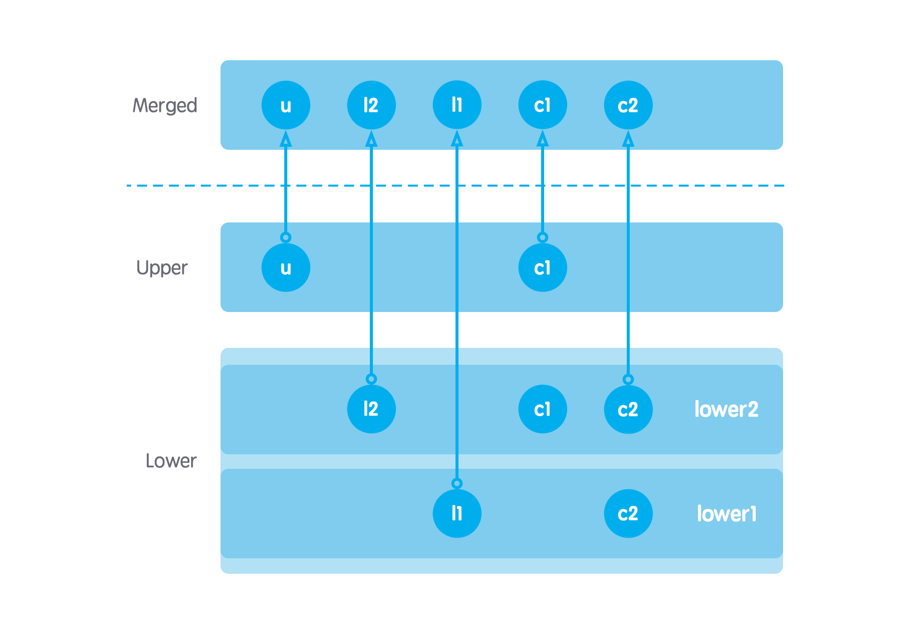
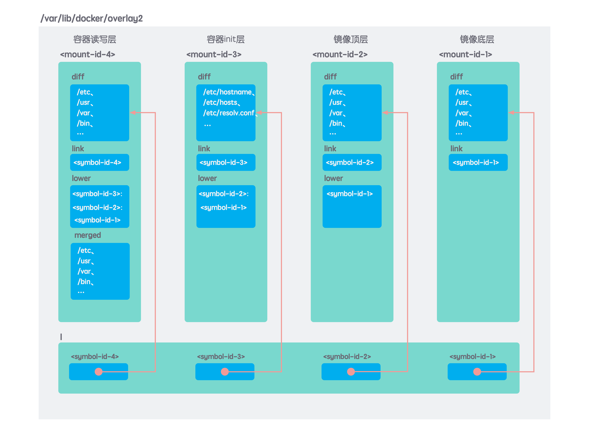
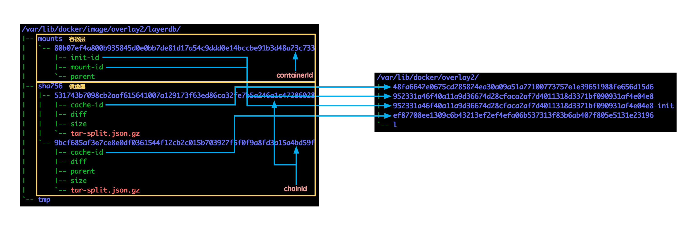

## 什么是联合挂载技术？

一个 linux 系统的运行，需要用到两个文件系统：

**1. bootfs：**

- 包含了 boot loader 和 kernel
- 使用同一个内核版本的所有 linux 系统 bootfs 都是一样的
- 只在系统启动阶段被挂载，系统启动完成会被立刻卸载掉

**2. rootfs：**

- 包含了 `/dev`、`/proc`、`/bin`、`/etc`、`/lib`、`/usr`、`/tmp` 等这些典型的目录结构以及这些目录下的配置文件、二进制文件以及库文件等
- 不同的发行版 rootfs 是不同的，并且用户可以直接对 rootfs 进行修改
- rootfs 在系统启动之后首先以只读模式挂载，完成一系列自检之后重新挂载为读写模式

一个容器的运行则有些不同：

**1. bootfs：**

容器共享宿主机的内核，因此不需要 rootfs

**2. rootfs：**

采用联合挂载的机制，将镜像以只读方式挂载，再在最上层叠加一个容器专用的可写层，形成容器最终的 rootfs。

这里所谓的联合挂载，就是把多个不同的文件系统合并挂载到同一个挂载点，形成一个虚拟文件系统的技术。联合挂载技术需要特殊的存储驱动来支撑，这样的存储驱动有 aufs、devicemapper、zfs、vfs、btrfs、overlay、overlay2 等，这些存储驱动与常说的 ext4fs、xfs 等存储驱动不同，他们依赖并且建立在 ext4fs、xfs 之上，不参与磁盘结构的划分，仅仅实现将 ext4fs、xfs 文件系统中的目录合并成到一个挂载点，向用户呈现。

在 Docker 最初的版本中使用的是 aufs，aufs 是在 2006 年对 UnionFS 的重新实现，但是由于代码质量的原因，一直没有被加入到 linux 内核中，需要通过打补丁的方式在 linux 系统上使用。因此在 Docker 初期：

- 友好激进的 Ubuntu（Debian 系） 中，直接将 aufs 打包进自己的发行版中，所以 Docker 在 Ubuntu 中默认采用 aufs
- 稳定保守的 CentOS（Redhat 系） 中，不能直接使用 aufs，因此 Docker 在 CentOS 中默认采用自家主导的 devicemapper

overlay 作为 aufs 主要竞争者，成功在 3.18 版本中整合进 linux 内核，overlay2 在 4.0 版本中整合进 linux 内核。因此最新版本的 Docker 默认使用 overlay2 作为存储驱动器。

```shell
# 查看 Docker 使用的存储驱动器类型
root@vps:~# docker info | grep 'Storage Driver'
WARNING: No swap limit support
 Storage Driver: overlay2
```

下面以 overlay 为例，研究以下联合挂载是怎么工作的。overlay 的挂载需要用到三种目录：

- lower：只读目录，可以是多个，合并之后的修改操作不会影响到这些目录
- upper：读写目录，只能是一个，合并之后的修改操作只会影响这个目录
- work：工作目录，overlay 用来解决文件拷贝问题，用户不需要关心

首先按照以下方法快速创建演示目录：

```shell
root@vps:~# mkdir -p overlaytest/{U,L1,L2,W,M}
root@vps:~# cd overlaytest/
root@vps:~/overlaytest# echo U | tee U/u U/c1
U
root@vps:~/overlaytest# echo L1 | tee L1/l1 L1/c2
L1
root@vps:~/overlaytest# echo L2 | tee L2/l2 L2/c1 L2/c2
L2
root@vps:~/overlaytest# echo W | tee W/w
W
root@vps:~/overlaytest# tree .
.
|-- L1
|   |-- c2
|   `-- l1
|-- L2
|   |-- c1
|   |-- c2
|   `-- l2
|-- M
|-- U
|   |-- c1
|   `-- u
`-- W
    `-- w

5 directories, 8 files
```

使用 mount 命令使用联合挂载：

```shell
root@vps:~/overlaytest# mount -t overlay overlaytest -o lowerdir=L2:L1,upperdir=U,workdir=W M
```

**合并**

这时候去查看合并目录 M 下的内容：

```shell
root@vps:~/overlaytest# mount -t overlay overlaytest -o lowerdir=L2:L1,upperdir=U,workdir=W M
root@vps:~/overlaytest# tree M/
M/
|-- c1
|-- c2
|-- l1
|-- l2
`-- u

0 directories, 5 files
root@vps:~/overlaytest# cat M/c1
U
root@vps:~/overlaytest# cat M/c2
L2
```

联合挂载的过程如下图所示，每个层中的文件都会投射到合并后的目录，如果存在同名文件，upper 中的文件覆盖 lower 中的文件，lower 中较顶层的文件覆盖较底层的文件：



**写时复制**

当对合并后的目录做写操作时，改动只会发生在 upper，不会影响到 lower。写操作分为 3 种：

- 新增操作：

```shell
root@vps:~/overlaytest# echo create > M/x
root@vps:~/overlaytest# tree .
.
|-- L1
|   |-- c2
|   `-- l1
|-- L2
|   |-- c1
|   |-- c2
|   `-- l2
|-- M
|   |-- c1
|   |-- c2
|   |-- l1
|   |-- l2
|   |-- u
|   `-- x
|-- U
|   |-- c1
|   |-- u
|   `-- x
`-- W
    |-- w
    `-- work

6 directories, 15 files
```

可以看到实际上，新增文件直接写到了 upper

- 删除操作：

```shell
root@vps:~/overlaytest# rm M/x
root@vps:~/overlaytest# tree .
.
|-- L1
|   |-- c2
|   `-- l1
|-- L2
|   |-- c1
|   |-- c2
|   `-- l2
|-- M
|   |-- c1
|   |-- c2
|   |-- l1
|   |-- l2
|   `-- u
|-- U
|   |-- c1
|   `-- u
`-- W
    |-- w
    `-- work

6 directories, 13 files
root@vps:~/overlaytest# rm M/l2
root@vps:~/overlaytest# tree .
.
|-- L1
|   |-- c2
|   `-- l1
|-- L2
|   |-- c1
|   |-- c2
|   `-- l2
|-- M
|   |-- c1
|   |-- c2
|   |-- l1
|   `-- u
|-- U
|   |-- c1
|   |-- l2
|   `-- u
`-- W
    |-- w
    `-- work

6 directories, 13 files
root@vps:~/overlaytest# ls -l U/l2
c--------- 1 root root 0, 0 Feb 18 01:38 U/l2
```

可以看到，如果删除的文件只存在于 upper，则直接删除了 upper 中的对应文件。如果这个文件同时存在于 lower，则需要在 upper 中创建一个对应文件名的字符设备文件以隐藏 lower 的同名文件。这个字符设备文件称为 without 文件，可以手动使用 `mknod U/l2 c 0 0` 的方式创建。

- 修改操作：

```shell
root@vps:~/overlaytest# echo update >> M/u
root@vps:~/overlaytest# tree .
.
|-- L1
|   |-- c2
|   `-- l1
|-- L2
|   |-- c1
|   |-- c2
|   `-- l2
|-- M
|   |-- c1
|   |-- c2
|   |-- l1
|   `-- u
|-- U
|   |-- c1
|   |-- l2
|   `-- u
`-- W
    |-- w
    `-- work

6 directories, 13 files
root@vps:~/overlaytest# cat U/u
U
update
root@vps:~/overlaytest# echo update >> M/c2
root@vps:~/overlaytest# tree .
.
|-- L1
|   |-- c2
|   `-- l1
|-- L2
|   |-- c1
|   |-- c2
|   `-- l2
|-- M
|   |-- c1
|   |-- c2
|   |-- l1
|   `-- u
|-- U
|   |-- c1
|   |-- c2
|   |-- l2
|   `-- u
`-- W
    |-- w
    `-- work

6 directories, 14 files
root@vps:~/overlaytest# cat U/c2
L2
update
```

如果被修改的文件存在于 upper，则直接修改 upper 中的对应文件即可。如果被修改的文件不存在于 upper，则需要从 lower 层拷贝一份到 upper，然后修改 upper 中拷贝的文件。

在 Docker 中，lower 目录是镜像中的各个层，upper 是容器专有的层。对镜像中各层和容器专有层进行联合挂载，节约了本地磁盘空间。同时通过写时复制策略，对容器 rootfs 的写操作不会篡改镜像。Docker 的这种设计一举两得。

## 镜像和容器在本地是如何存储的？

首先下载一个镜像到本地，并且用这个镜像创建一个流程：

```shell
root@vps:~# docker pull nginx:1.17.8-alpine
1.17.8-alpine: Pulling from library/nginx
4167d3e14976: Pull complete
db94a93dfca0: Pull complete
Digest: sha256:9e81b8f9cef5a095f892183688798a5b2c368663276aa0f2be4b1cd283ace53d
Status: Downloaded newer image for nginx:1.17.8-alpine
docker.io/library/nginx:1.17.8-alpine
root@vps:~# docker run -d nginx:1.17.8-alpine
80b07ef4a800b935845d0e0bb7de81d17a54c9ddd0e14bccbe91b3d48a23c733
root@vps:~# docker image ls
REPOSITORY          TAG                 IMAGE ID            CREATED             SIZE
nginx               1.17.8-alpine       48c8a7c47625        3 weeks ago         21.8MB
root@vps:~# docker container ls
CONTAINER ID        IMAGE                 COMMAND                  CREATED             STATUS              PORTS               NAMES
80b07ef4a800        nginx:1.17.8-alpine   "nginx -g 'daemon of…"   20 seconds ago      Up 19 seconds       80/tcp              goofy_curie
```

查看挂载信息，其中一种挂载类型为 overlay 就是用作新创建的容器用到的 rootfs：

```shell
root@vps:~# mount | grep overlay
overlay on /var/lib/docker/overlay2/952331a46f40a11a9d36674d28cfaca2af7d4011318d3371bf090931af4e04e8/merged type overlay (rw,relatime,lowerdir=/var/lib/docker/overlay2/l/ODKPAETYNOBL32D2WWHN3LCDCV:/var/lib/docker/overlay2/l/7SUFXLAVVCLGPEMXOD2HO2LIPE:/var/lib/docker/overlay2/l/5COFXQJPHOFSTSENU2FRW4MNK3,upperdir=/var/lib/docker/overlay2/952331a46f40a11a9d36674d28cfaca2af7d4011318d3371bf090931af4e04e8/diff,workdir=/var/lib/docker/overlay2/952331a46f40a11a9d36674d28cfaca2af7d4011318d3371bf090931af4e04e8/work)
```

仔细看 overlay 挂载参数：

```
lowerdir=
  /var/lib/docker/overlay2/l/ODKPAETYNOBL32D2WWHN3LCDCV:
  var/lib/docker/overlay2/l/7SUFXLAVVCLGPEMXOD2HO2LIPE:
  /var/lib/docker/overlay2/l/5COFXQJPHOFSTSENU2FRW4MNK3,
upperdir=
  /var/lib/docker/overlay2/952331a46f40a11a9d36674d28cfaca2af7d4011318d3371bf090931af4e04e8/diff,
workdir=
  /var/lib/docker/overlay2/952331a46f40a11a9d36674d28cfaca2af7d4011318d3371bf090931af4e04e8/work
```

`/var/lib/docker/overlay2` 这个目录就是 overlay 联合挂载用到的目录在本地存放的位置。这个目录的结构如下：

```shell
root@vps:~# tree -L 2 /var/lib/docker/overlay2/
/var/lib/docker/overlay2/
|-- 48fa6642e0675cd285824ea30a09a51a77100773757e1e39651988fe656d15d6
|   |-- committed
|   |-- diff
|   `-- link
|-- 952331a46f40a11a9d36674d28cfaca2af7d4011318d3371bf090931af4e04e8
|   |-- diff
|   |-- link
|   |-- lower
|   |-- merged
|   `-- work
|-- 952331a46f40a11a9d36674d28cfaca2af7d4011318d3371bf090931af4e04e8-init
|   |-- committed
|   |-- diff
|   |-- link
|   |-- lower
|   `-- work
|-- ef87708ee1309c6b43213ef2ef4efa06b537313f83b6ab407f805e5131e23196
|   |-- committed
|   |-- diff
|   |-- link
|   |-- lower
|   `-- work
`-- l
    |-- 5COFXQJPHOFSTSENU2FRW4MNK3 -> ../48fa6642e0675cd285824ea30a09a51a77100773757e1e39651988fe656d15d6/diff
    |-- 7SUFXLAVVCLGPEMXOD2HO2LIPE -> ../ef87708ee1309c6b43213ef2ef4efa06b537313f83b6ab407f805e5131e23196/diff
    |-- ODKPAETYNOBL32D2WWHN3LCDCV -> ../952331a46f40a11a9d36674d28cfaca2af7d4011318d3371bf090931af4e04e8-init/diff
    `-- PHFCWZBUDYG2LZB3WG6G73GNJJ -> ../952331a46f40a11a9d36674d28cfaca2af7d4011318d3371bf090931af4e04e8/diff

17 directories, 10 files
```

可以看到这个目录下存在 4 个层，其中：
- `48fa6642e0675cd285824ea30a09a51a77100773757e1e39651988fe656d15d6` 和 `ef87708ee1309c6b43213ef2ef4efa06b537313f83b6ab407f805e5131e23196` 是属于 `nginx:1.17.8-alpine` 镜像的两个层，镜像是分层构建的，`48fa6642e0675cd285824ea30a09a51a77100773757e1e39651988fe656d15d6` 是底层，`ef87708ee1309c6b43213ef2ef4efa06b537313f83b6ab407f805e5131e23196` 是较高的层。镜像中的层在 overlay 挂载时都作为 lowerdir，是只读的，永远都不会被更改。

- `952331a46f40a11a9d36674d28cfaca2af7d4011318d3371bf090931af4e04e8-init` 和 `952331a46f40a11a9d36674d28cfaca2af7d4011318d3371bf090931af4e04e8` 是属于 `goofy_curie` 容器专有的两个层，`952331a46f40a11a9d36674d28cfaca2af7d4011318d3371bf090931af4e04e8-init` 层仅仅存放 `/etc/hostname`、`/etc/hosts`、`resolv.conf` 等文件，这些文件一般是根据 `docker run` 命令指定的参数动态生成的，在挂载时作为 lowerdir。`952331a46f40a11a9d36674d28cfaca2af7d4011318d3371bf090931af4e04e8` 在挂载时作为 upperdir，是唯一可写的层，容器中对 rootfs 的写操作都会保存在这里。

`/var/lib/docker/overlay2` 这个目录存储的文件和文件之间的关系可以有下面的图表示：



其中 `/var/lib/docker/overlay2/l` 这个目录下都是到每个层 diff 目录下的符号链接，作用是避免挂载时 mount 参数超过页大小。

知道了各个层内容的存放在 `/var/lib/docker/overlay2` 这个目录下，每个层内容所在的目录以 `mountId`（暂可这么叫） 命名。但是各个层的元信息存放在 `/var/lib/docker/image/overlay2/layerdb/` 这个目录下，这个目录下有专门的文件记录存放这个层实际内容的 `mountId`：



注意到这里有个 `chainId` 的概念，`chainId` 的计算规是父层的 `chaindId` 和本层的 `layerId` 一起做 sha256sum 运算。如果没有父层，则直接取本层的 `layerId` 作为 `chainId`。`layerId` 是镜像中的层固有的 ID，记录在镜像的元数据里：

```shell
root@vps:~# docker image inspect -f {{.RootFS.Layers}} nginx:1.17.8-alpine
[sha256:531743b7098cb2aaf615641007a129173f63ed86ca32fe7b5a246a1c47286028 sha256:1d98ebade1db75cfe4c8e65592ea579e929a6d105998d214d7d6620dad9578e2]
root@vps:~# echo -n "sha256:531743b7098cb2aaf615641007a129173f63ed86ca32fe7b5a246a1c47286028 sha256:1d98ebade1db75cfe4c8e65592ea579e929a6d105998d214d7d6620dad9578e2" | sha256sum -
9bcf685af3e7ce8e0df0361544f12cb2c015b703927f5f0f9a8fd3a15a4bd59f  -
```

## 从镜像到容器

镜像是静态的，在分发的过程中不可以被篡改，也没有自己的状态。镜像有两种来源：

- 从仓库下载而来
- 由本地构建而来

镜像的构建后续会再展开说，先看从仓库下载。使用 `docker pull` 命令将仓库注册服务器上的镜像拉取到本地：

```shell
➜  ~ docker pull busybox:1.31.1
1.31.1: Pulling from library/busybox
bdbbaa22dec6: Pull complete
Digest: sha256:6915be4043561d64e0ab0f8f098dc2ac48e077fe23f488ac24b665166898115a
Status: Downloaded newer image for busybox:1.31.1
docker.io/library/busybox:1.31.1
```

容器是动态的，有完整的生命周期，所以和容器相关的操作大多是关于容器状态转换的。看下面这张容器状态转换图能够帮助理清楚思路：


创建容器使用 `docker create` 命令，启动容器使用 `docker start` 命令，在实际使用中通常使用 `docker run` 命令一步到位创建并且启动容器。`docker run` 命令比较复杂，常用的选项列举在下：

```shell
Usage: docker run [OPTIONS] IMAGE [COMMAND] [ARG...]
Options:
  --name string                        Assign a name to the container
  -d, --detach                         Run container in background and print container ID
  -t, --tty                            Allocate a pseudo-TTY
  -i, --interactive                    Keep STDIN open even if not attached
```

**1、容器的标识**

每个容器都拥有唯一ID，这个 ID 由 docker daemon 自动生成，是一个 64 位长度，由数字和字母 a~f 组成。同时 Docker 也允许截取完整 ID 的前 12 个字符作为容器的截断 ID。

```shell
➜  ~ docker run busybox
➜  ~ docker ps -a --no-trunc
# 显示完整ID
CONTAINER ID                                                       IMAGE               COMMAND             CREATED             STATUS                     PORTS               NAMES
90d1896b3c50c63331bc665e122dc1587bb31d8f0a6fdd9617d6ac0b55f3317d   busybox             "sh"                9 seconds ago       Exited (0) 8 seconds ago                       nostalgic_chaum
# 显示截断ID
➜  ~ docker ps -a
CONTAINER ID        IMAGE               COMMAND             CREATED             STATUS                     PORTS               NAMES
90d1896b3c50        busybox             "sh"                5 seconds ago       Exited (0) 3 seconds ago                       nostalgic_chaum
```

无论是完整 ID 还是截断 ID，对于人类来说无论识别还是记忆都不是很友好。因此 Docker 还允许为每个容器指定便于识记的名字。指定名字使用 `--name` 选项，如果没有指定，Docker 会随机生成一个：

```shell
➜  ~ docker run --name b1 busybox
➜  ~ docker ps -a
CONTAINER ID        IMAGE               COMMAND             CREATED              STATUS                          PORTS               NAMES
0cb154d0591f        busybox             "sh"                6 seconds ago        Exited (0) 6 seconds ago                            b1
90d1896b3c50        busybox             "sh"                8 minutes ago        Exited (0) 8 minutes ago                            nostalgic_chaum
```

以后对某个容器进行操作，可以使用这个容器的完整ID、截断ID、名字中的任何一个：

```shell
➜  ~ docker rm b1
b1
➜  ~ docker ps -aq
90d1896b3c50
➜  ~ docker rm $(docker ps -aq)
# 这个命令可以用于批量删除容器
90d1896b3c50
➜  ~ docker ps -a
CONTAINER ID        IMAGE               COMMAND             CREATED             STATUS              PORTS               NAMES
```

**2、入口命令和 1 号进程**

创建容器需要用到一个**入口命令（ENTRYPOINT CMD）**来创建容器的 1 号进程，如果没有指定入口命令，就自动读取配置文件中指定的入口命令。

```shell
➜  ~ docker run --name b1 busybox sh
➜  ~ docker ps -a | grep b1
85735bb9c7ac        busybox             "sh"                5 seconds ago       Exited (0) 4 seconds ago                       b1
# 可以看到容器创建成功了，但是容器的状态是 Exited
```

这个命令启动了一个容器，容器使用 `sh` 来创建容器的 1 号进程。但是这个容器在创建后不久就自动退出了，这是因为 `sh` 命令创建的 1 号进程的 stdin 关闭了，1 号进程接收不到输入自动返回了，根据 Docker 的设计，1 号进程返回，则容器退出。

为了避免这个问题，创建容器时常常需要指定 `-it` 选项，`-i` 选项维持 STDIN 打开状态，`-t` 选项给容器分配一个伪终端：

<!-- 指定 -t 是为了避免标准输入来自一个管道：$ echo test | docker run -i busybox cat -->

```shell
➜  ~ docker run --name b2 -it busybox sh
/ # %
# 进入到 sh 交互界面
# ctrl-p ctrl-q 断开连接
➜  ~ docker ps -a | grep b2
ca807ebbb65e        busybox             "sh"                10 seconds ago       Up 8 seconds                                        b2
```

需要注意的是这个 1 号进程不能运行在后台，例如：

```shell
$ docker run -p 80:80 my_image service nginx start
```

这个操作成功启动了容器里面的 nginx 服务，但是 1 号进程 - `service nginx start` 返回了，容器也就停止了。虽然容器里面的 nginx 服务启动了，但是使用不了。正确的做法是使用下面的命令：

```shell
$ docker run -p 80:80 my_image nginx -g 'daemon off;'
```

**3、连接和断开**

所谓的 attach 指的是将当前终端的 `stdin`、`stdout` 和 `stderr` 连接到一个运行中的容器，让你可以能够查看容器正在输出的内容，并且交互控制容器，就像直接你的终端上执行命令一样。所谓的 detach 当然就是将当前终端的 `stdin`、`stdout` 和 `stderr` 和容器断开连接。

`docker run` 默认自动连接上启动的容器：

```shell
➜  ~ docker run --name b3 -it busybox ping www.baidu.com
PING www.baidu.com (14.215.177.38): 56 data bytes
64 bytes from 14.215.177.38: seq=0 ttl=37 time=29.920 ms
64 bytes from 14.215.177.38: seq=1 ttl=37 time=29.025 ms
64 bytes from 14.215.177.38: seq=2 ttl=37 time=29.370 ms
read escape sequence
```

在连接模式下，使用 `ctrl-c` 会向容器发送 SIGKILL 信号，如果指定了 `--sig-proxy` 选项，则向容器发送 SIGINT 信号。
在连接模式下并且指定了 `-it` 选项，使用 `ctrl-p ctrl-q` 可以断开容器与当前控制台的连接，但是保持容器的运行。

`docker run` 命令指定了 `-d` 选项，则创建完这个容器不会自动连接上：

```shell
➜  ~ docker run --name b4 -it -d busybox ping www.baidu.com
2482f220a5445786d03910a3cbe647c6b4fa658177a87bfdc9a924789836b39f
➜  ~ docker ps -a | grep b4
2482f220a544        busybox             "ping www.baidu.com"   13 seconds ago      Up 12 seconds                                  b4
# 容器创建成功，并且处于运行中状态
```

没有连接上的运行中容器，可以使用 `docker attach` 命令连接上：

```shell
➜  ~ docker ps -a | grep b4
2482f220a544        busybox             "ping www.baidu.com"   13 seconds ago      Up 12 seconds                                  b4
➜  ~ docker attach b4
64 bytes from 14.215.177.38: seq=61 ttl=37 time=30.061 ms
64 bytes from 14.215.177.38: seq=62 ttl=37 time=29.371 ms
64 bytes from 14.215.177.38: seq=63 ttl=37 time=32.594 ms
read escape sequence
```

每当连接上一个容器时，Docker 划分一个 1MB 的缓存区，当缓存区被填满，进程输出显示的速度会受到影响。因此如果只是需要查看进程的输出，建议使用 `docker logs` 访问而不是通过 `docker attach` 连接容器。

```shell
➜  ~ docker logs b4
PING www.baidu.com (14.215.177.38): 56 data bytes
64 bytes from 14.215.177.38: seq=0 ttl=37 time=27.592 ms
64 bytes from 14.215.177.38: seq=1 ttl=37 time=32.219 ms
# ...
```

创建完容器，参考容器状态转换图，可以对不同状态下的容器使用下面这些命令：

- `docker stop`：停止一个运行中的容器（向容器 1 号进程发送 SIGTERM 信号，比较温和）
- `docker kill`：杀死一个运行中的容器（向容器 1 号进程发送 SIGKILL 信号，比较粗暴）
- `docker start`：开始一个停止的容器
- `docker pause`：暂停一个运行中的容器
- `docker unpause`：恢复一个暂停中的容器
- `docker rm`：删除一个运行中的容器，加 -f 选项强制删除非运行中的容器

`docker exec` 命令用于在一个运行中的容器中执行一个命令：

```shell
➜  ~ docker run -it -d --name b1 busybox sh
461c969e510b6146a5f330e5e61ae06400da9328f31b40d269f62c46a9d61b02
➜  ~ docker ps -a
CONTAINER ID        IMAGE               COMMAND             CREATED             STATUS              PORTS               NAMES
461c969e510b        busybox             "sh"                4 seconds ago       Up 3 seconds                            b1
➜  ~ docker exec b1 ping www.baidu.com
PING www.baidu.com (14.215.177.39): 56 data bytes
64 bytes from 14.215.177.39: seq=0 ttl=37 time=32.660 ms
64 bytes from 14.215.177.39: seq=1 ttl=37 time=32.633 ms
^C
➜  ~ docker ps -a
CONTAINER ID        IMAGE               COMMAND             CREATED             STATUS              PORTS               NAMES
461c969e510b        busybox             "sh"                54 seconds ago      Up 53 seconds                           b1
➜  ~ docker attach b1
/ # ps -ef
PID   USER     TIME  COMMAND
    1 root      0:00 sh
    6 root      0:00 ping www.baidu.com
   11 root      0:00 ps -ef
```

注意到，使用 `docker exec` 在 b1 容器中执行 `ping www.baidu.com` 命令时，Docker 新启动一个会话去执行这个命令，使用 `ctrl-c` 可以终止退出命令，但是 `ping www.baidu.com` 这个进程并没有停止。这是由于执行命令没有使用 `-it` 选项，建议每次执行命令都带上 `-it`:

```shell
$ docker exec -it b1 ping www.baidu.com
```