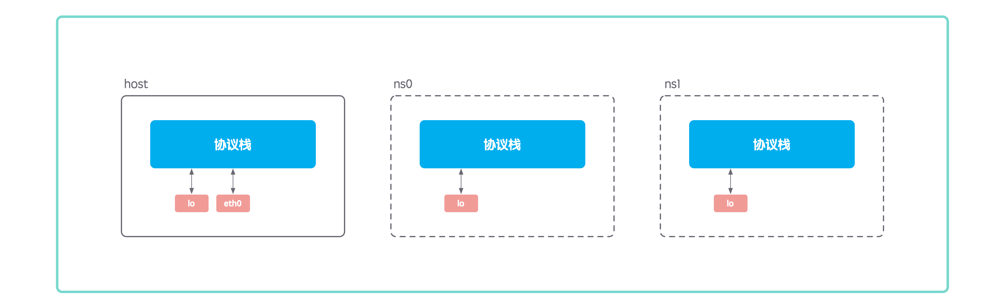
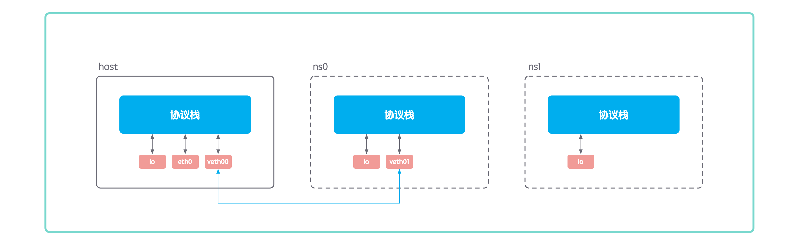
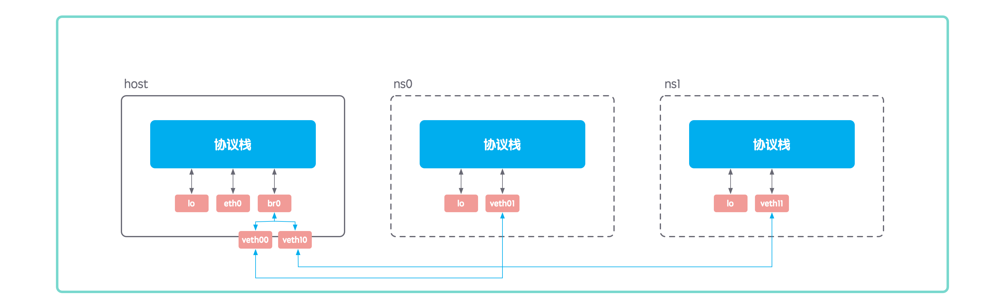
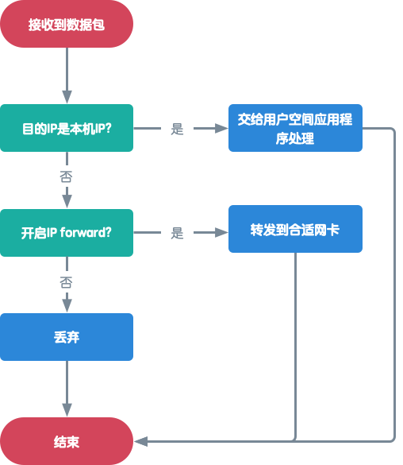
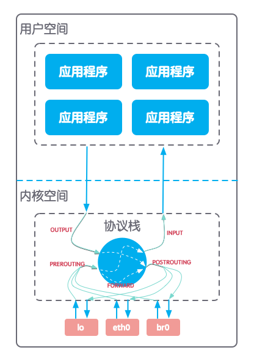
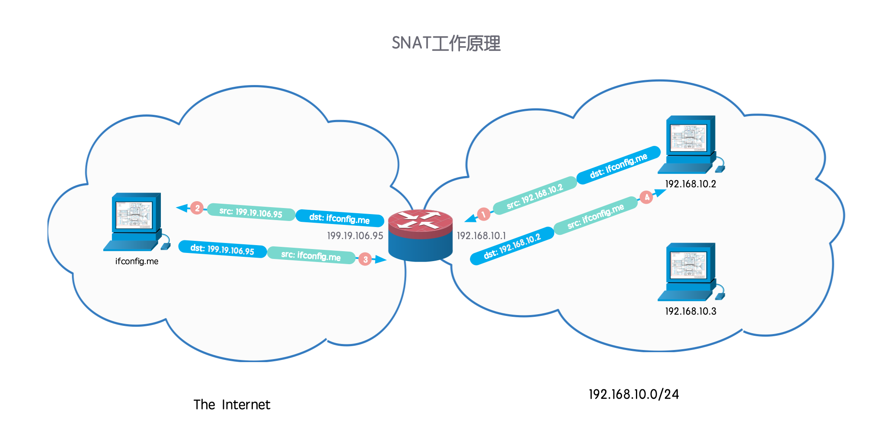
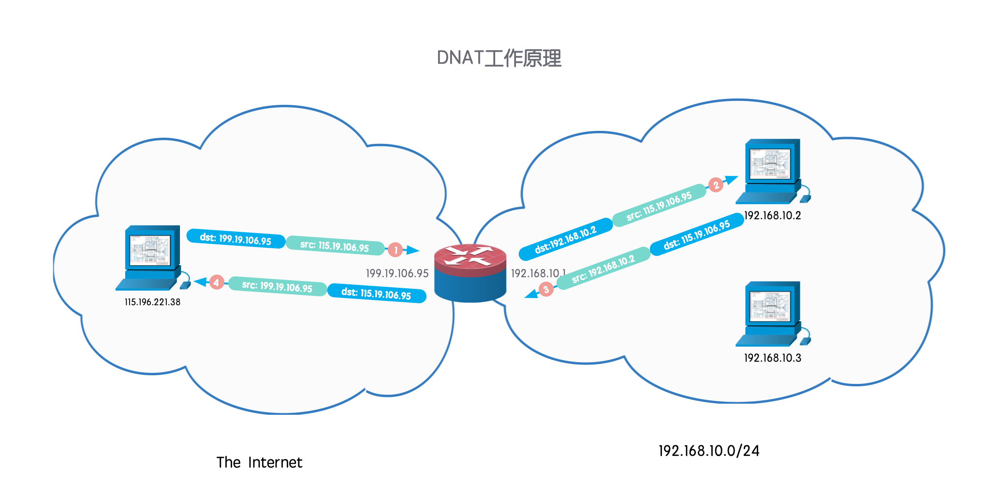

## Docker 网络是怎么运作的？

1、net 命名空间

linux 自 2.6.29 内核版本之后，允许在同一个宿主机上创建多个隔离的 net 命名空间，各个 net 命名空间拥有各自的网络接口和 TCP/IP 协议栈，彼此之间相互隔离，不能通信。

使用 `ip netns` 可以很方便地操作 net 命名空间。首先创建两个 net 命名空间 ns0 和 ns1：

```shell
pxm@vps:~$ sudo ip netns add ns0
pxm@vps:~$ sudo ip netns add ns1
```

查看所有命名空间：

```shell
pxm@vps:~$ sudo ip netns show
ns1
ns0
```

新创建的命名空间中只有一个未启用的环回测试接口 lo：

```shell
pxm@vps:~$ sudo ip netns exec ns0 ip link show
1: lo: <LOOPBACK> mtu 65536 qdisc noop state DOWN mode DEFAULT group default qlen 1000
    link/loopback 00:00:00:00:00:00 brd 00:00:00:00:00:00
```

在命名空间中启用 lo：

```shell
pxm@vps:~$ sudo ip netns exec ns0 ip link set lo up
pxm@vps:~$ sudo ip netns exec ns0 ip link show
1: lo: <LOOPBACK,UP,LOWER_UP> mtu 65536 qdisc noqueue state UNKNOWN mode DEFAULT group default qlen 1000
    link/loopback 00:00:00:00:00:00 brd 00:00:00:00:00:00
```

测试 lo 接口联通性：

```shell
pxm@vps:~$ sudo ip netns exec ns0 ping 127.0.0.1 -c 3 -I lo
PING 127.0.0.1 (127.0.0.1) from 127.0.0.1 lo: 56(84) bytes of data.
64 bytes from 127.0.0.1: icmp_seq=1 ttl=64 time=0.030 ms
64 bytes from 127.0.0.1: icmp_seq=2 ttl=64 time=0.082 ms
64 bytes from 127.0.0.1: icmp_seq=3 ttl=64 time=0.055 ms

--- 127.0.0.1 ping statistics ---
3 packets transmitted, 3 received, 0% packet loss, time 2055ms
rtt min/avg/max/mdev = 0.030/0.055/0.082/0.022 ms
```



2、veth 设备

net 命名空间可以让数据包彼此隔离，互不串扰。但是两个 net 命名空间也有需要互相通信的需求，这时候就需要使用一个“网线”将两个隔离的 net 命名空间连接起来。这根“网线”就是 veth 设备。

veth 设备总是成对出现的，一端连着各自的协议栈，另一端彼此相连，主要作用是在 SDN 中充当物理网络中网线。

首先使用 `ip link` 命令创建一对 veth 设备：

```shell
pxm@vps:~$ sudo ip link add veth00 type veth peer name veth01
pxm@vps:~$ sudo ip link show | grep veth
44: veth01@veth00: <BROADCAST,MULTICAST,M-DOWN> mtu 1500 qdisc noop state DOWN mode DEFAULT group default qlen 1000
45: veth00@veth01: <BROADCAST,MULTICAST,M-DOWN> mtu 1500 qdisc noop state DOWN mode DEFAULT group default qlen 1000
```

将 veth 设备对中的一端移动到 net 命名空间中，另外一端留在宿主机，分别配置 ip 地址并启用：

```shell
pxm@vps:~$ sudo ip link set dev veth01 netns ns0
pxm@vps:~$ sudo ifconfig veth00 192.168.10.1/24 up
pxm@vps:~$ sudo ip netns exec ns0 ifconfig veth01 192.168.10.2/24 up
```

这样主机就可以通过“网线”和 net 命名空间通信了：

```shell
pxm@vps:~$ sudo ping 192.168.10.2 -c 3 -I veth00
PING 192.168.10.2 (192.168.10.2) from 192.168.10.1 veth00: 56(84) bytes of data.
64 bytes from 192.168.10.2: icmp_seq=1 ttl=64 time=0.140 ms
64 bytes from 192.168.10.2: icmp_seq=2 ttl=64 time=0.082 ms
64 bytes from 192.168.10.2: icmp_seq=3 ttl=64 time=0.080 ms

--- 192.168.10.2 ping statistics ---
3 packets transmitted, 3 received, 0% packet loss, time 2052ms
rtt min/avg/max/mdev = 0.080/0.100/0.140/0.030 ms
```



3、bridge 设备

veth 设备可以连接两个 net 命名空间，但是当个有更多的 net 命令空间包括主机空间有通信需求时，使用“网线”两两连接就不太现实。这时候就需要有一个“交换机”，“网线”的一端接到“交换机”，另一端留在 net 命名空间中，所有连接到这个“交换机”的 net 命名空间之间就可以互相通信了。bridge 设备就是这个交换机。

bridge 设备上允许多个网络接口接入，主要作用是在 SDN 中充当物理网络中交换机。

bridge 设备同样可以使用 `ip link` 命令创建：

```shell
pxm@vps:~$ sudo ip link add name br0 type bridge
pxm@vps:~$ sudo ip addr del 192.168.10.1/24 dev veth00
pxm@vps:~$ sudo ifconfig br0 192.168.10.1/24 up
```

将 veth00 和 br0 相连，宿主机就可以和 ns0 通信了：

```shell
pxm@vps:~$ sudo ip link set dev veth00 master br0
pxm@vps:~$ ping -c 3 -I br0 192.168.10.2
PING 192.168.10.2 (192.168.10.2) from 192.168.10.1 br0: 56(84) bytes of data.
64 bytes from 192.168.10.2: icmp_seq=1 ttl=64 time=0.264 ms
64 bytes from 192.168.10.2: icmp_seq=2 ttl=64 time=0.084 ms
64 bytes from 192.168.10.2: icmp_seq=3 ttl=64 time=0.097 ms

--- 192.168.10.2 ping statistics ---
3 packets transmitted, 3 received, 0% packet loss, time 2025ms
rtt min/avg/max/mdev = 0.084/0.148/0.264/0.082 ms
```

这里需要注意 veth00 连接上 br0 之后，不需要再配置 IP 地址，避免协议栈发送数据包时错误的选择 veth00 进行发送。

然后按照同样的方式创建一对 veth 设备，通过 veth 设备将 ns1 也连接上 br0：

```shell
pxm@vps:~$ sudo ip link add veth10 type veth peer name veth11
pxm@vps:~$ sudo ip link set dev veth11 netns ns1
pxm@vps:~$ sudo ip netns exec ns1 ifconfig veth11 192.168.10.3/24 up
pxm@vps:~$ sudo ifconfig veth10 up
pxm@vps:~$ sudo ip link set dev veth10 master br0
pxm@vps:~$ ping -c 3 -I br0 192.168.10.3
PING 192.168.10.3 (192.168.10.3) from 192.168.10.1 br0: 56(84) bytes of data.
64 bytes from 192.168.10.3: icmp_seq=1 ttl=64 time=0.285 ms
64 bytes from 192.168.10.3: icmp_seq=2 ttl=64 time=0.085 ms
64 bytes from 192.168.10.3: icmp_seq=3 ttl=64 time=0.103 ms

--- 192.168.10.3 ping statistics ---
3 packets transmitted, 3 received, 0% packet loss, time 2050ms
rtt min/avg/max/mdev = 0.085/0.157/0.285/0.091 ms
```



4、数据包转发和 NAT

bridge 设备允许所有连接到这个设备的 net 命名空间之间能够互相通信。现在我们希望 net 命名空间需要访问外网，net 命名空间中没有连接到外网的网卡，因此是不能直接和外网通信的：

```shell
pxm@vps:~$ sudo ip netns exec ns0 ping -c 3 114.114.114.114
connect: Network is unreachable
```

但是主机上存在连接到外网的网卡，使用主机作为 net 命名空间的网关，是有可能间接和外网通信的：

```shell
pxm@vps:~$ sudo ip netns exec ns0 route add default gw 192.168.10.1
pxm@vps:~$ sudo ip netns exec ns0 ping -c 3 114.114.114.114
PING 114.114.114.114 (114.114.114.114) 56(84) bytes of data.
^C
--- 114.114.114.114 ping statistics ---
3 packets transmitted, 0 received, 100% packet loss, time 2028ms
```

ICMP 请求报文发到了主机，但是主机不能正确处理这个数据包，因此在 net 命名空间中是不能接收到 ICMP 响应报文的。这时候就需要在主机上启用数据包转发和 NAT 功能。

数据包转发是指当协议栈从一个网卡接收到一个数据包，发现目的 IP 地址本机的 IP 地址，将数据包转发到其他网卡的过程。

在一个网络上，作为终端的 linux 主机通常默认是不开启数据包转发的，作为网关的 linux 主机（例如拨号路由器）需要开启数据包转发。启用数据包转发功能，首先是打开内核 IP forward，这个功能取决于 `net.ipv4.ip_forward` 内核参数，`0` 表示禁用，`1` 表示启用：



编辑 `/etc/sysctl.conf` 文件，将 `net.ipv4.ip_forward` 的值设置为 `1`，并且执行 `sysctl -p` 更新配置即可。

```shell
pxm@vps:~$ cat /proc/sys/net/ipv4/ip_forward
1
```

除了开启内核的 IP forward，还需要在内核中的网络防火墙框架 netfilter 上设置放行 FORWARD 数据包。netfilter 可以通过在协议栈处理数据包的流程链路上固定的几个点上加一些钩子函数，实现数据包过滤、网络地址转换等功能。



图中的 PREROUTING、OUTPUT、INPUT、FORWARD、POSTROUTING 就是钩子函数所在的几个点。能够在这几个点设定处理规则的工具是 iptables。iptables 的数据包过滤功能一般默认会丢弃 FORWARD 点上的数据包，需要修改数据包过滤功能在 FORWARD 点上的默认处理策略为放行：

```shell
pxm@vps:~$ sudo iptables -t filter -P FORWARD ACCEPT
```

NAT（Network Address Translation）就是网络地址转换。NAT 出现在 ipv4 地址不够用，ipv6 还没有普及的背景下，让一群主机共用一个公网 IP 联网，暂时解决 IP 短缺的问题。NAT 分为两种场景，分别是 SNAT（Source NAT）源地址转换和 DNAT（Destination NAT）目标地址转换。

场景一：一个内网里的主机需要访问外网上的某个服务，因为内网 IP 不能出现在外网上，所以当内网机器的请求数据包经过网关转发时，网关需要将数据包的源 IP 地址替换成自己的外网 IP 并转发到连接到外网的网卡，并建立维护一个会话表。当接收到外网的响应数据包时，网关再将数据包的目的 IP 替换成会话表中记录的曾经请求过这个外网地址的内网 IP。这个过程就是 SNAT。



```shell
pxm@vps:~$ sudo iptables -t nat -A POSTROUTING -s 192.168.10.0/24 -j SNAT --to-source 199.19.106.95
pxm@vps:~$ sudo ip netns exec ns0 curl ifconfig.me
199.19.106.95
```

场景二：一个内网的主机对外提供服务，外网上的主机请求数据包到达网关时，因为网关本身不提供服务，所以需要将数据包目的 IP 地址替换成提供服务的内网机器的 IP 并转发到连接到内网的网卡。当接收到到内网机器的响应数据包时，网关再将数据包的源 IP 地址替换成自己的外网 IP。这个过程就是 DNAT。



首先在 net 命名空间中启动 nginx 提供 www 服务：

```shell
pxm@vps:~$ sudo echo hello | sudo tee /var/www/html/index.html
hello
pxm@vps:~$ sudo tee -a greetings.txt > /dev/null <<EOT
> worker_processes  1;
>
> events {
>     worker_connections  1024;
> }
>
> http {
>     include       mime.types;
>     default_type  application/octet-stream;
>     sendfile        on;
>     keepalive_timeout  65;
>
>     server {
>         listen       8080;
>         server_name  localhost;
>         location / {
>             root  /var/www/html;
>             index.html index.html;
>         }
>     }
> }
> EOT
pxm@vps:~$ sudo ip netns exec ns0 nginx -g 'daemon off;'
```

然后再添加 DNAT 规则：

```shell
pxm@vps:~$ sudo iptables -t nat -A PREROUTING -d 199.19.106.95 -p tcp --dport 80 -j DNAT --to-destination 192.168.10.2:8080
```

在外网主机上尝试请求服务：

```shell
pxm@pengxiaomengs-MacBook-Pro:~$ curl 199.19.106.95:80
hello
```

有了数据包转换和 NAT 最终实现了 net 命名空间就能够访问外网的服务并且能够对外网提供服务。

## Docker 网络模型

Docker 有三种基本的网络模型：

```shell
root@vps:~# docker network ls
NETWORK ID          NAME                DRIVER              SCOPE
7c85c4fea21e        bridge              bridge              local
ecf3a85a2c9d        host                host                local
38a28d436d80        none                null                local
```

### 第一种：none 网络

容器中的 net 命名空间只有一个本地环回网卡 lo，没有其他网卡，没有接入其他任何网络

```shell
root@vps:~# docker run -it --rm --net none busybox
/ # ip link list
1: lo: <LOOPBACK,UP,LOWER_UP> mtu 65536 qdisc noqueue qlen 1000
    link/loopback 00:00:00:00:00:00 brd 00:00:00:00:00:00
```

这时候在主机上查看已经创建的 net 命名空间：

```shell
root@vps:~# ip netns ls
ns1 (id: 1)
ns0 (id: 0)
```

结果中并没有容器的 net 命名空间，这是因为 Docker 默认隐藏容器的 net 命名空间：

```shell
root@vps:~# docker ps -aq
8b87d0cf3938
root@vps:~# docker inspect 8b87d0cf3938 | grep '"Pid"'
            "Pid": 11374,
root@vps:~# ln -s /proc/11374/ns/net /var/run/netns/8b87d0cf3938
root@vps:~# ip netns ls
8b87d0cf3938
ns1 (id: 1)
ns0 (id: 0)
```

### 第二种：bridge 网络

容器中的 net 命名空间通过一个 veth 设备对连接到主机的 docker0 桥，并且在主机上设置 SNAT/DNAT 规则和外部网络通信。创建容器时默认 bridge 网络

```shell
root@vps:~# docker run -it --rm --net bridge busybox
/ # ifconfig
eth0      Link encap:Ethernet  HWaddr 02:42:AC:11:00:02
          inet addr:172.17.0.2  Bcast:172.17.255.255  Mask:255.255.0.0
          UP BROADCAST RUNNING MULTICAST  MTU:1500  Metric:1
          RX packets:10 errors:0 dropped:0 overruns:0 frame:0
          TX packets:0 errors:0 dropped:0 overruns:0 carrier:0
          collisions:0 txqueuelen:0
          RX bytes:836 (836.0 B)  TX bytes:0 (0.0 B)

lo        Link encap:Local Loopback
          inet addr:127.0.0.1  Mask:255.0.0.0
          UP LOOPBACK RUNNING  MTU:65536  Metric:1
          RX packets:0 errors:0 dropped:0 overruns:0 frame:0
          TX packets:0 errors:0 dropped:0 overruns:0 carrier:0
          collisions:0 txqueuelen:1000
          RX bytes:0 (0.0 B)  TX bytes:0 (0.0 B)

```

这个容器中的 eth0 设备就是 veth 设备对的一端，另一端连接在主机上的 docker0 桥上。使用 `ethtool -S veth8b6f79d` 可以查看一个网卡的编号：

```shell
root@vps:~# ip link ls
1: lo: <LOOPBACK,UP,LOWER_UP> mtu 65536 qdisc noqueue state UNKNOWN mode DEFAULT group default qlen 1000
    link/loopback 00:00:00:00:00:00 brd 00:00:00:00:00:00
2: eth0: <BROADCAST,MULTICAST,UP,LOWER_UP> mtu 1500 qdisc fq state UP mode DEFAULT group default qlen 1000
    link/ether aa:aa:00:15:44:26 brd ff:ff:ff:ff:ff:ff
3: eth1: <BROADCAST,MULTICAST> mtu 1500 qdisc noop state DOWN mode DEFAULT group default qlen 1000
    link/ether ba:aa:00:15:44:26 brd ff:ff:ff:ff:ff:ff
4: docker0: <BROADCAST,MULTICAST,UP,LOWER_UP> mtu 1500 qdisc noqueue state UP mode DEFAULT group default
    link/ether 02:42:85:84:8e:f5 brd ff:ff:ff:ff:ff:ff
35: br0: <BROADCAST,MULTICAST,UP,LOWER_UP> mtu 1500 qdisc noqueue state UP mode DEFAULT group default qlen 1000
    link/ether 42:26:da:e9:1d:87 brd ff:ff:ff:ff:ff:ff
45: veth00@if44: <BROADCAST,MULTICAST,UP,LOWER_UP> mtu 1500 qdisc noqueue master br0 state UP mode DEFAULT group default qlen 1000
    link/ether 7e:62:ca:57:e7:36 brd ff:ff:ff:ff:ff:ff link-netnsid 0
47: veth10@if46: <BROADCAST,MULTICAST,UP,LOWER_UP> mtu 1500 qdisc noqueue master br0 state UP mode DEFAULT group default qlen 1000
    link/ether 42:26:da:e9:1d:87 brd ff:ff:ff:ff:ff:ff link-netnsid 1
49: veth8b6f79d@if48: <BROADCAST,MULTICAST,UP,LOWER_UP> mtu 1500 qdisc noqueue master docker0 state UP mode DEFAULT group default
    link/ether 7a:84:0f:fa:20:90 brd ff:ff:ff:ff:ff:ff link-netnsid 2
root@vps:~# docker exec -it b2f9d49b1f18 ip link ls
1: lo: <LOOPBACK,UP,LOWER_UP> mtu 65536 qdisc noqueue qlen 1000
    link/loopback 00:00:00:00:00:00 brd 00:00:00:00:00:00
48: eth0@if49: <BROADCAST,MULTICAST,UP,LOWER_UP,M-DOWN> mtu 1500 qdisc noqueue
    link/ether 02:42:ac:11:00:02 brd ff:ff:ff:ff:ff:ff
root@vps:~# ethtool -S veth8b6f79d
NIC statistics:
     peer_ifindex: 48
```

从结果中可以看到，主机的 veth8b6f79d 网卡的编号是 49，容器中 eth0 网卡的编号是 48，通过 ethtool 工具可以看到 veth8b6f79d 的另一端是编号为 48 网卡，正是容器中的 eth0 设备。

而 veth8b6f79d 这个接口是连接到虚拟网桥设备 docker0 上的，使用 `brctl show` 命令可以查看：

```shell
root@vps:~# brctl show
bridge name	bridge id		STP enabled	interfaces
br0		8000.4226dae91d87	no		veth00
							veth10
docker0		8000.024285848ef5	no		veth8b6f79d
```

从 docker0 到外网之间需要做 NAT：

```shell
root@vps:~# iptables -t nat -nL
Chain PREROUTING (policy ACCEPT)
target     prot opt source               destination
DOCKER     all  --  0.0.0.0/0            0.0.0.0/0            ADDRTYPE match dst-type LOCAL
DNAT       tcp  --  0.0.0.0/0            199.19.106.95        tcp dpt:80 to:192.168.10.2:8080

Chain INPUT (policy ACCEPT)
target     prot opt source               destination

Chain OUTPUT (policy ACCEPT)
target     prot opt source               destination
DOCKER     all  --  0.0.0.0/0           !127.0.0.0/8          ADDRTYPE match dst-type LOCAL

Chain POSTROUTING (policy ACCEPT)
target     prot opt source               destination
MASQUERADE  all  --  172.17.0.0/16        0.0.0.0/0
SNAT       all  --  192.168.10.0/24      0.0.0.0/0            to:199.19.106.95

Chain DOCKER (2 references)
target     prot opt source               destination
RETURN     all  --  0.0.0.0/0            0.0.0.0/0
```

其中 `MASQUERADE  all  --  172.17.0.0/16        0.0.0.0/0` 这个规则就是 SNAT，MASQUERADE 是动态从本机选择一个可以上网的 IP 作为替换的源 IP 地址，因为很多设备是通过拨号上网，获取到的 IP 地址不是固定的。

DNAT 需要在启动容器的命令中指定需要映射的端口：

```shell
root@vps:~# docker run -it --rm --net bridge -p 80:8080 busybox
root@vps:~# iptables -t nat -nL
Chain PREROUTING (policy ACCEPT)
target     prot opt source               destination
DOCKER     all  --  0.0.0.0/0            0.0.0.0/0            ADDRTYPE match dst-type LOCAL
DNAT       tcp  --  0.0.0.0/0            199.19.106.95        tcp dpt:80 to:192.168.10.2:8080

Chain INPUT (policy ACCEPT)
target     prot opt source               destination

Chain OUTPUT (policy ACCEPT)
target     prot opt source               destination
DOCKER     all  --  0.0.0.0/0           !127.0.0.0/8          ADDRTYPE match dst-type LOCAL

Chain POSTROUTING (policy ACCEPT)
target     prot opt source               destination
MASQUERADE  all  --  172.17.0.0/16        0.0.0.0/0
SNAT       all  --  192.168.10.0/24      0.0.0.0/0            to:199.19.106.95

Chain DOCKER (2 references)
target     prot opt source               destination
RETURN     all  --  0.0.0.0/0            0.0.0.0/0
root@vps:~# iptables -t nat -nL
Chain PREROUTING (policy ACCEPT)
target     prot opt source               destination
DOCKER     all  --  0.0.0.0/0            0.0.0.0/0            ADDRTYPE match dst-type LOCAL
DNAT       tcp  --  0.0.0.0/0            199.19.106.95        tcp dpt:80 to:192.168.10.2:8080

Chain INPUT (policy ACCEPT)
target     prot opt source               destination

Chain OUTPUT (policy ACCEPT)
target     prot opt source               destination
DOCKER     all  --  0.0.0.0/0           !127.0.0.0/8          ADDRTYPE match dst-type LOCAL

Chain POSTROUTING (policy ACCEPT)
target     prot opt source               destination
MASQUERADE  all  --  172.17.0.0/16        0.0.0.0/0
SNAT       all  --  192.168.10.0/24      0.0.0.0/0            to:199.19.106.95
MASQUERADE  tcp  --  172.17.0.2           172.17.0.2           tcp dpt:8080

Chain DOCKER (2 references)
target     prot opt source               destination
RETURN     all  --  0.0.0.0/0            0.0.0.0/0
DNAT       tcp  --  0.0.0.0/0            0.0.0.0/0            tcp dpt:80 to:172.17.0.2:8080
```

可以看到 NAT 表 DNAT 规则 `DNAT       tcp  --  0.0.0.0/0            0.0.0.0/0            tcp dpt:80 to:172.17.0.2:8080`，将对主机 80 端口访问的数据包转发到容器的 8080 端口。

`-p` 命令还有一下几种常用的形式：

```shell
# 主机所有网卡 80 端口的 tcp 数据包转发到容器的 8080 端口
docker run -it --net bridge -p 80:8080 busybox
# 主机所有本地环回网卡 80 端口的 tcp 数据包转发到容器的 8080 端口
docker run -it --net bridge -p 127.0.0.1:80:8080 busybox
# 主机所有本地环回网卡一个随机端口的 tcp 数据包转发到容器的 8080 端口
docker run -it --net bridge -p 127.0.0.1::8080 busybox
# 主机所有网卡 80 端口的 udp 数据包转发到容器的 8080 端口
docker run -it --net bridge -p 80:8080/udp busybox
```

### 第三种：host 网络

有自己独立的 Mount、PID、IPS、UTS 命名空间，和主机共用 NET、USER 命名空间

```shell
root@vps:~# docker run -it --rm --net host busybox
/ # ip link
1: lo: <LOOPBACK,UP,LOWER_UP> mtu 65536 qdisc noqueue qlen 1000
    link/loopback 00:00:00:00:00:00 brd 00:00:00:00:00:00
2: eth0: <BROADCAST,MULTICAST,UP,LOWER_UP> mtu 1500 qdisc fq qlen 1000
    link/ether aa:aa:00:15:44:26 brd ff:ff:ff:ff:ff:ff
3: eth1: <BROADCAST,MULTICAST> mtu 1500 qdisc noop qlen 1000
    link/ether ba:aa:00:15:44:26 brd ff:ff:ff:ff:ff:ff
4: docker0: <NO-CARRIER,BROADCAST,MULTICAST,UP> mtu 1500 qdisc noqueue
    link/ether 02:42:85:84:8e:f5 brd ff:ff:ff:ff:ff:ff
35: br0: <BROADCAST,MULTICAST,UP,LOWER_UP> mtu 1500 qdisc noqueue qlen 1000
    link/ether 42:26:da:e9:1d:87 brd ff:ff:ff:ff:ff:ff
45: veth00@if44: <BROADCAST,MULTICAST,UP,LOWER_UP,M-DOWN> mtu 1500 qdisc noqueue master br0 qlen 1000
    link/ether 7e:62:ca:57:e7:36 brd ff:ff:ff:ff:ff:ff
47: veth10@if46: <BROADCAST,MULTICAST,UP,LOWER_UP,M-DOWN> mtu 1500 qdisc noqueue master br0 qlen 1000
    link/ether 42:26:da:e9:1d:87 brd ff:ff:ff:ff:ff:ff
/ #
```

使用 `ls -l /proc/$$/ns` 分别在主机和容器中执行，可以看到 net 命名空间编号是相同的：

```shell
root@vps:~# ls -l /proc/$$/ns
total 0
lrwxrwxrwx 1 root root 0 Mar 12 20:36 cgroup -> 'cgroup:[4026531835]'
lrwxrwxrwx 1 root root 0 Mar 12 20:36 ipc -> 'ipc:[4026531839]'
lrwxrwxrwx 1 root root 0 Mar 12 20:36 mnt -> 'mnt:[4026531840]'
lrwxrwxrwx 1 root root 0 Mar 12 20:36 net -> 'net:[4026531993]'
lrwxrwxrwx 1 root root 0 Mar 12 20:36 pid -> 'pid:[4026531836]'
lrwxrwxrwx 1 root root 0 Mar 12 20:36 pid_for_children -> 'pid:[4026531836]'
lrwxrwxrwx 1 root root 0 Mar 12 20:36 user -> 'user:[4026531837]'
lrwxrwxrwx 1 root root 0 Mar 12 20:36 uts -> 'uts:[4026531838]'
```

```shell
/ # ls -l /proc/$$/ns
total 0
lrwxrwxrwx    1 root     root             0 Mar 12 12:44 cgroup -> cgroup:[4026531835]
lrwxrwxrwx    1 root     root             0 Mar 12 12:44 ipc -> ipc:[4026532517]
lrwxrwxrwx    1 root     root             0 Mar 12 12:44 mnt -> mnt:[4026532515]
lrwxrwxrwx    1 root     root             0 Mar 12 12:44 net -> net:[4026531993]
lrwxrwxrwx    1 root     root             0 Mar 12 12:44 pid -> pid:[4026532518]
lrwxrwxrwx    1 root     root             0 Mar 12 12:44 pid_for_children -> pid:[4026532518]
lrwxrwxrwx    1 root     root             0 Mar 12 12:44 user -> user:[4026531837]
lrwxrwxrwx    1 root     root             0 Mar 12 12:44 uts -> uts:[4026532516]
/ #
```

### 额外一种：joined 网络

有自己独立的 Mount、PID、IPS、UTS 命名空间，和别的主机共用 NET、USER 命名空间

```shell
root@vps:~# docker run --name b1 busybox
root@vps:~# docker run --name b1 -it --net bridge busybox
/ # ls -l /proc/$$/ns
total 0
lrwxrwxrwx    1 root     root             0 Mar 12 12:55 cgroup -> cgroup:[4026531835]
lrwxrwxrwx    1 root     root             0 Mar 12 12:55 ipc -> ipc:[4026532519]
lrwxrwxrwx    1 root     root             0 Mar 12 12:55 mnt -> mnt:[4026532517]
lrwxrwxrwx    1 root     root             0 Mar 12 12:55 net -> net:[4026532522]
lrwxrwxrwx    1 root     root             0 Mar 12 12:55 pid -> pid:[4026532520]
lrwxrwxrwx    1 root     root             0 Mar 12 12:55 pid_for_children -> pid:[4026532520]
lrwxrwxrwx    1 root     root             0 Mar 12 12:55 user -> user:[4026531837]
lrwxrwxrwx    1 root     root             0 Mar 12 12:55 uts -> uts:[4026532518]
/ # root@vps:~# docker run --name b2 -it --net container:b1 busybox
/ # ls -l /proc/$$/ns
total 0
lrwxrwxrwx    1 root     root             0 Mar 12 12:56 cgroup -> cgroup:[4026531835]
lrwxrwxrwx    1 root     root             0 Mar 12 12:56 ipc -> ipc:[4026532588]
lrwxrwxrwx    1 root     root             0 Mar 12 12:56 mnt -> mnt:[4026532586]
lrwxrwxrwx    1 root     root             0 Mar 12 12:56 net -> net:[4026532522]
lrwxrwxrwx    1 root     root             0 Mar 12 12:56 pid -> pid:[4026532589]
lrwxrwxrwx    1 root     root             0 Mar 12 12:56 pid_for_children -> pid:[4026532589]
lrwxrwxrwx    1 root     root             0 Mar 12 12:56 user -> user:[4026531837]
lrwxrwxrwx    1 root     root             0 Mar 12 12:56 uts -> uts:[4026532587]
/ #
```


https://www.jianshu.com/p/f86d4b88777d