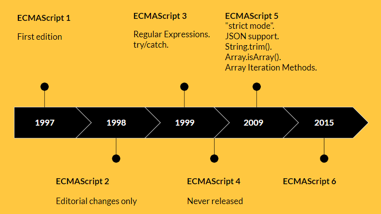

## ECMAScript 历史

1995年，Netscape Navigator 是当时最流行的浏览器，占据了80% 的市场份额，Netscape 公司创建者 - Mark Andreessen 对浏览器未来市场很有远见，浏览器做的不仅仅是分享和发布文档，还需要更多复杂的动态交互。Netscape 与 Sun Microsystems 合作，使 Java 可以在 Netscape Navigator 中使用。但是 Java 不是一门简单到让设计者和业余者能够使用的语言，因此 Netscape 公司做两手准备，一方面将风头正热的 Java 带入 Netscape Navigator，让专家能够在浏览器中使用 Java；另一方面设计一门足够简单的脚本语言，让设计者和业余者能够在 Netscape Navigator 中做页面的交互效果。Netscape 公司的 Brendan Eich 在这个背景下登场了。

Brendan Eich 开始着手设计 “Mocha” 语言，这是 JavaScript 的最初命名。由于与 Java 的合作关系，Mocha 语言要求要与 Java 保持相似的语法。最终经过 10 天，Brendan Eich 完成了 Mocha 的设计。这门语言的名字从最初的 Mocha 变成 LiveScript，再变成 JavaScript（JavaScript 商标为 Sun 公司所有，Sun 公司授权 Netscape 使用）。

JavaScript 从根本上改善了 Netscape Navigator 的使用体验，作为竞争者的 Internet Explorer 不得不推出自己的 JavaScript 实现，Microsoft 称之为 JScript。 由于那时候 JavaScript 没有标准化，JScript 和 JavaScript 并不兼容，开发者不能构建出一个能够在两款浏览器上完美运行的网站，因此那时候，“Best viewed in Netscape” 和 “Best viewed in Internet Explorer” 的 logo 随处可见。

这个背景下 ECMA（欧洲计算机制造商协会 - European Computer Manufactures Association）登场了。1996 年的 11 月，Netscape 向 ECMA 提交了 JavaScript 1.1，用来构建一个标准规范。由于 Oracle 拿到了 JavaScript 这个名字的版权，为了避免纠纷，ECMA 将这门语言命名为 ECMAScript，指定 TC39（39 号技术委员会 - Technical Committee 39）负责对其标准化，指定语言标准为 [ECMA-262](https://www.ecma-international.org/ecma-262/)。

TC39 的成员由各个主流浏览器厂商的代表构成。会议的每一项决议必须大部分人赞同，并且没有人强烈反对才可以通过。因为，对成员来说，同意就意味着有责任去实现它。

 - 1997年6月，TC39 发布 ES1，本质上与 JavaScript 1.1 相同
 - 1998年6月，TC39 发布 ES2，没有添加新的特性，只是修改规范完全符合ISO/IEC 16262国际标准
 - 1999年12月，TC39 发布 ES3，添加了正则表达式、try...catch 块、Error 的更明确定义、新的控制语句、数字输出格式等等
 - 2007年10月，TC39 发布 ES4草案，预计次年8月发布正式版本。但是，各方对于是否通过这个标准，发生了严重分歧（这一版标准中曾经有一个极其复杂的支持泛型和类型推断的内建静态类型系统）。以 Yahoo、Microsoft、Google 为首的大公司，反对 JavaScript 的大幅升级，主张小幅改动；以 JavaScript 创造者 Brendan Eich 为首的 Mozilla 公司，则坚持当前的草案。
 - 2008年7月，各方分歧太大，争论过于激烈，ECMA 开会决定，中止 ES4 的开发，将其中涉及现有功能改善的一小部分，发布为 ES 3.1，而将其他激进的设想扩大范围，放入以后的版本，由于会议的气氛，该版本的项目代号起名为 Harmony（和谐）。
 - 2009年12月，TC39 将 ES 3.1 就改名为 ES5，正式发布，引入了严格模式、JSON、数组和对象的新方法 forEach/filter/reduce/some...、getters和setters
- 2015年6月，TC39 发布 ES6，新特性包括：基于类的面向对象编程、块级作用域、箭头函数、Promise 等等

|版本   |时间       |特性
|:--    |:--        |:--
|1      |1997.6     |本质上与javascript 1.1 相同，支持 Unicode 标准
|2      |1998.6     |修改规范完全符合ISO/IEC 16262国际标准
|3      |1999.12    |正则表达式、try...catch 块、Error 的更明确定义、新的控制语句、数字输出格式等等
|5      |2009.12    |严格模式、JSON、数组和对象的新方法 forEach/filter/reduce/some...、getters和setters等等
|6      |2015.6     |基于类的面向对象编程、块级作用域、箭头函数、Promise 等等

从 ES6 开始，TC39 决定，ECMAScript 调整工作流程，每年发布一个版本，因此 ES6 也叫 ES2015，以后每年类推：

- ES2015(ES6) - June 2015
- ES2016(ES7) - June 2016
- ES2017(ES8) - June 2017
- ...

每个特性从最初的构想到正式列入 ECMA 规范，经历下面几个阶段：

- Stage 0 - Strawman 构想阶段：任何TC39成员，或者注册为TC39贡献者的会员，都可以提交
- Stage 1 - Proposal 提案阶段：产生一个正式的提案，确定一个带头人来负责该提案
- Stage 2 - Draft 草案阶段：产生规范的第一个版本，与最终标准中包含的特性不会有太大差别
- Stage 3 - Candidate 候选阶段：产生规范的最终版本，并且浏览器完成初版实现
- Stage 4 - Finished 就绪阶段：将会出现在年度发布的规范之中

[在这里](https://github.com/tc39/proposals) 可以查询当前正在处理的提案
