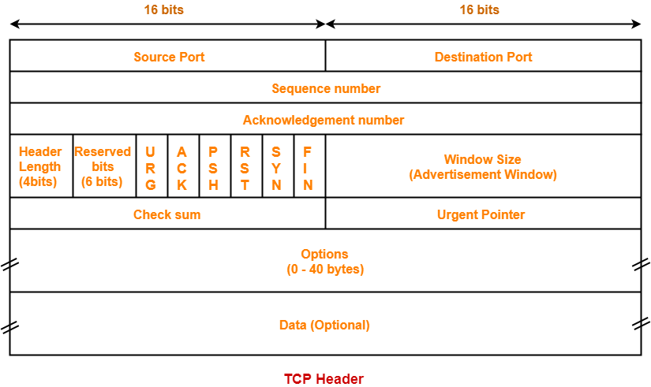

## HTTP 请求和响应

```bash
curl 'http://onlyoffices.tongdouzi.com:8888/login' \
  -H 'Connection: keep-alive' \
  -H 'Cache-Control: max-age=0' \
  -H 'Upgrade-Insecure-Requests: 1' \
  -H 'User-Agent: Mozilla/5.0 (Macintosh; Intel Mac OS X 10_14_6) AppleWebKit/537.36 (KHTML, like Gecko) Chrome/83.0.4103.61 Safari/537.36' \
  -H 'Accept: text/html,application/xhtml+xml,application/xml;q=0.9,image/webp,image/apng,*/*;q=0.8,application/signed-exchange;v=b3;q=0.9' \
  -H 'Sec-Fetch-Site: none' \
  -H 'Sec-Fetch-Mode: navigate' \
  -H 'Sec-Fetch-User: ?1' \
  -H 'Sec-Fetch-Dest: document' \
  -H 'Accept-Language: zh-CN,zh;q=0.9' \
  --compressed
```

```
GET /login HTTP/1.1
Host: onlyoffices.tongdouzi.com:8888
Cache-Control: max-age=0
Upgrade-Insecure-Requests: 1
User-Agent: Mozilla/5.0 (Macintosh; Intel Mac OS X 10_14_6) AppleWebKit/537.36 (KHTML, like Gecko) Chrome/83.0.4103.61 Safari/537.36
Accept: text/html,application/xhtml+xml,application/xml;q=0.9,image/webp,image/apng,*/*;q=0.8,application/signed-exchange;v=b3;q=0.9
Accept-Encoding: gzip, deflate
Accept-Language: zh-CN,zh;q=0.9

```

```
HTTP/1.1 200 OK
Content-Type: text/html; charset=utf-8
Content-Length: 422
Date: Thu, 11 Jun 2020 12:55:28 GMT
Connection: Keep-alive

<!DOCTYPE html>
<html>
  <head>
    <meta charset="UTF-8">
    <meta name="viewport" content="width=device-width, initial-scale=1.0">
    <title>Welcome</title>
  </head>
  <body>
    <form action="/index" method="post">
      <input type="text" name="name" />
      <input type="password" name="pwd" />
      <input type="submit" />
    </form>
  </body>
</html>

```

```bash
curl 'http://onlyoffices.tongdouzi.com:8888/index' \
  -H 'Connection: keep-alive' \
  -H 'Cache-Control: max-age=0' \
  -H 'Upgrade-Insecure-Requests: 1' \
  -H 'Origin: https://onlyoffices.tongdouzi.com:9999' \
  -H 'Content-Type: application/x-www-form-urlencoded' \
  -H 'User-Agent: Mozilla/5.0 (Macintosh; Intel Mac OS X 10_14_6) AppleWebKit/537.36 (KHTML, like Gecko) Chrome/83.0.4103.61 Safari/537.36' \
  -H 'Accept: text/html,application/xhtml+xml,application/xml;q=0.9,image/webp,image/apng,*/*;q=0.8,application/signed-exchange;v=b3;q=0.9' \
  -H 'Sec-Fetch-Site: same-origin' \
  -H 'Sec-Fetch-Mode: navigate' \
  -H 'Sec-Fetch-User: ?1' \
  -H 'Sec-Fetch-Dest: document' \
  -H 'Referer: https://onlyoffices.tongdouzi.com:9999/login' \
  -H 'Accept-Language: zh-CN,zh;q=0.9' \
  --data-raw 'name=pxm&pwd=123' \
  --compressed
```

```
POST /index HTTP/1.1
Host: onlyoffices.tongdouzi.com:8888
Content-Length: 16
Cache-Control: max-age=0
Upgrade-Insecure-Requests: 1
Origin: http://onlyoffices.tongdouzi.com:8888
Content-Type: application/x-www-form-urlencoded
User-Agent: Mozilla/5.0 (Macintosh; Intel Mac OS X 10_14_6) AppleWebKit/537.36 (KHTML, like Gecko) Chrome/83.0.4103.61 Safari/537.36
Accept: text/html,application/xhtml+xml,application/xml;q=0.9,image/webp,image/apng,*/*;q=0.8,application/signed-exchange;v=b3;q=0.9
Referer: http://onlyoffices.tongdouzi.com:8888/login
Accept-Encoding: gzip, deflate
Accept-Language: zh-CN,zh;q=0.9

name=pxm&pwd=123
```

```
HTTP/1.1 200 OK
Content-Type: text/html; charset=utf-8
Content-Length: 270
Date: Thu, 11 Jun 2020 12:55:33 GMT
Proxy-Connection: Keep-alive

<!DOCTYPE html>
<html>
  <head>
    <meta charset="UTF-8">
    <meta name="viewport" content="width=device-width, initial-scale=1.0">
    <title>Welcome</title>
  </head>
  <body>
    <h3>Welcome, pxm!</h3>
  </body>
</html>

```

### HTTP 请求方法

HTTP 0.9 定义了一种请求方法：GET
HTTP 1.0 定义了三种请求方法：GET, POST 和 HEAD
HTTP 1.1 新增了五种请求方法：OPTIONS, PUT, DELETE, TRACE 和 CONNECT

- **GET** 用于请求服务器发送某个资源
- **HEAD** 与GET方法的行为很类似，但服务器在响应中只返回首部。不会反回实体的主体部分
- **POST** 用来向服务器写入数据（例如提交表单或者上传文件），数据被包含在请求体中
- **PUT** 向服务器写入文档取代请求 URL 所指定的资源
- **DELETE** 请服务器删除请求 URL 所指定的资源
- **TRACE** 用于测试或诊断，服务器会回显收到的请求，客户端可以分析在网络传输过程中请求有没有被修改或者如何被修改
- **OPTIONS** 请求服务器告知其支持的各种功能
- **CONNECT** HTTP/1.1协议中预留给能够将连接改为管道方式的代理服务器。通常用于SSL加密服务器的链接与非加密的HTTP代理服务器的通信。
- **PATCH** 2010 年才在标准中出现，与PUT请求类似，但是略有区别：PATCH一般用于资源的部分更新，PUT一般用于资源的整体更新；当资源不存在时，PATCH会创建一个新的资源，而PUT只会对已在资源进行更新。

### HTTP 响应状态码

| 状态码 |       类别       |          原因短语          |
|:------:|:----------------:|:--------------------------:|
|   1xx  |   信息性状态码   |     接收的请求正在处理     |
|   2xx  |    成功状态码    |      请求正常处理完毕      |
|   3xx  |   重定向状态码   | 需要进行附加操作以完成请求 |
|   4xx  | 客户端错误状态码 |     服务端无法处理请求     |
|   5xx  | 服务端错误状态码 |     服务端处理请求出错     |

- **101 Switching Protocols** 切换协议，例如 HTTP 请求中带了 Upgrade: websocket 头，服务器如果允许 ws 通信，就会返回一个 101 允许浏览器切换协议

- **200 OK** 成功请求，服务端成功处理并返回
- **204 Not Content** 请求处理成功但是响应报文中不含实体的主体部分，一般在只需要客户端给服务端发消息，而对客户端不需要发送新内容的情况下使用
- **206 Partial Content** 表示客户端进行了范围请求，客户端只要某一部分的信息，服务器成功执行了这部分的 GET 请求相应报文中包含 Content-Range 指定范围的实体内容

- **301 Moved/Moved Permanently** 永久性重定向，资源移动会更新浏览器书签相应状态码返回时，所有浏览器都会把 POST 改成 GET，并删除请求报文主体，之后请求会自动再次发送
- **302 Found/Moved Temporarily** 临时性重定向，资源移动不会更新浏览器书签相应状态码返回时，所有浏览器都会把 POST 改成 GET，并删除请求报文主体，之后请求会自动再次发送
- **303 See Other** 资源的 URI 已经更新，临时按新的URI进行访问，使用 GET 请求获取相应的资源相应状态码返回时，所有浏览器都会把POST改成GET，并删除请求报文主体，之后请求会自动再次发送
- **304 Not Modified** 自从上次请求后，请求的网页未修改过。服务器返回此响应时，不会返回网页内容。如果网页自请求者上次请求后再也没有更改过，您应将服务器配置为返回此响应（称为 If-Modified-Since HTTP 标头）。服务器可以告诉 Googlebot 自从上次抓取后网页没有变更，进而节省带宽和开销。返回时不包含任何请求的主体部分，304和重定向无任何关系
- **307 Temporarily Redirect** 临时重定向，和302有相同的含义严格遵循浏览器标准，不会把 POST 变为GET。当一个服务器返回的响应中带有 `Strict-Transport-Security` 时，表示这个网站强制使用 https 连接，浏览器会记录这个网站，在下次用户使用 http 访问这个网站的资源时，浏览器不会真的发送这个 http 请求，会伪造一个 307 响应，然后使用 https 协议发送请求。

- **400 Bad Request** 请求报文中存在语法错误，服务端无法理解，需修改请求的内容后再次发送请求浏览器会像对待200一样对待该状态码
- **401 Unauthorized** 发送的请求需要有通过HTTP认证的认证信息。另外若之前已经已经进行过一次请求，则表示用户认证失败当浏览器初次接收到401响应，会弹出认证用的对话窗口
- **403 Forbidden** 服务器拒绝请求该资源或者表示未获取文件系统的访问授权，访问权限出现某些问题服务器端可以说明拒绝的理由，并返回给客户端展示
- **404 Not Found** 服务器上没有请求的资源也可以在服务器端拒绝请求且不想说明拒绝的理由

- **500 Interval Server Error** 服务器在执行请求时发生故障也可能是web应用存在的bug或者某些临时故障
- **503 Service Unavailable** 服务器目前超负载，正忙着呢正在进行停机维护，现在无法处理请求

### 表单提交和文件上传

`application/x-www-form-urlencoded`
`multipart/form-data; boundary=----WebKitFormBoundaryl26ybaR9lyPaJk99`

```html
<!DOCTYPE html>
<html>
  <head>
    <meta charset="UTF-8">
    <meta name="viewport" content="width=device-width, initial-scale=1.0">
    <title>Welcome</title>
  </head>
  <body>
    <form action="/index" method="post" enctype="multipart/form-data">
      <input type="text" name="name" />
      <input type="password" name="pwd" />
      <input type="file" name="avatar" />
      <input type="submit" />
    </form>
  </body>
</html>
```

```
POST /index HTTP/1.1
Host: onlyoffices.tongdouzi.com:8888
Content-Length: 184678
Cache-Control: max-age=0
Upgrade-Insecure-Requests: 1
Origin: http://onlyoffices.tongdouzi.com:8888
Content-Type: multipart/form-data; boundary=----WebKitFormBoundaryl26ybaR9lyPaJk99
User-Agent: Mozilla/5.0 (Macintosh; Intel Mac OS X 10_14_6) AppleWebKit/537.36 (KHTML, like Gecko) Chrome/83.0.4103.61 Safari/537.36
Accept: text/html,application/xhtml+xml,application/xml;q=0.9,image/webp,image/apng,*/*;q=0.8,application/signed-exchange;v=b3;q=0.9
Referer: http://onlyoffices.tongdouzi.com:8888/login
Accept-Encoding: gzip, deflate
Accept-Language: zh-CN,zh;q=0.9

------WebKitFormBoundaryl26ybaR9lyPaJk99
Content-Disposition: form-data; name="name"

pxm
------WebKitFormBoundaryl26ybaR9lyPaJk99
Content-Disposition: form-data; name="pwd"

123
------WebKitFormBoundaryl26ybaR9lyPaJk99
Content-Disposition: form-data; name="avatar"; filename="WechatIMG101.jpeg"
Content-Type: image/jpeg

二进制数据...
```

### 缓存机制

强缓存：Expires、Cache-Control
协商缓存：ETag 和 If-None-Match、Last-Modified和If-Modified-Since

https://www.jianshu.com/p/54cc04190252

强制刷新 (Ctrl + F5)：浏览器不使用缓存，因此发送的请求头部均带有 Cache-control: no-cache(为了兼容，还带了 Pragma: no-cache),服务器直接返回 200 和最新内容

### keep-alive

---

### CDN

### 浏览器安全机制

**HSTS - HTTP Strict Transport Security** 强制客户端（如浏览器）使用HTTPS与服务器创建连接。
HSTS 这个响应头只能用于 HTTPS 响应；网站必须使用默认的 443 端口；必须使用域名，不能是 IP。而且启用 HSTS 之后，一旦网站证书错误，用户无法选择忽略。

- max-age 多少秒之内都强制使用 SSL/TLS
- includeSubDomains，强制这个网站所有子域名也必须使用 SSL/TLS
- preload 强制使用 SSL/TLS 的网站列表，这个列表由谷歌维护，Chrome、Firefox 和 Safari 都会在浏览器中内置这个列表。这样当一个用户通过浏览器初次访问这个网站时，不需要先用 http 协议尝试请求一次，在 http 响应中发现了 hsts 头再使用 https 重新请求。

**CSP - Content-Security-Policy** 防止受到跨站脚本攻击以及其他跨站注入攻击。
- 'Content-Security-Policy': 'default-src http: https:' 禁止内联资源
- 'Content-Security-Policy': 'default-src \'self\'' 只能从同域下加载
- 'Content-Security-Policy': 'default-src \'self\' https://cdn.bootcss.com/; form-action \'self\''

- `script-src`：脚本
- `img-src`：图片
- `media-src`：媒体文件（音频和视频）
- `font-src`：字体文件
- `object-src`：`<object>`
- `style-src`：样式表
- `child-src`：嵌入的 `<iframe>`
- `frame-ancestors`：被嵌入的文档
- `form-action`：form 表单
- `connect-src`：HTTP 连接（通过 XHR、WebSockets、EventSource等）
- `worker-src`：worker脚本
- `manifest-src`：manifest 文件
- `default-src`：所有外部资源

- `block-all-mixed-content`：HTTPS 网页不得加载 HTTP 资源（浏览器已经默认开启）
- `upgrade-insecure-requests`：自动将网页上所有加载外部资源的 HTTP 链接换成 HTTPS 协议
- `plugin-types`：限制可以使用的插件格式
- `sandbox`：浏览器行为的限制，比如不能有弹出窗口等。

- `report-uri` 报告注入行为

主机名：example.org，https://example.com:443
路径名：example.org/resources/js/
通配符：*.example.org，*://*.example.com:*（表示任意协议、任意子域名、任意端口）
协议名：https:、data:
关键字'self'：当前域名，需要加引号
关键字'none'：禁止加载任何外部资源，需要加引号
多个值也可以并列，用空格分隔。
如果不设置某个限制选项，就是默认允许任何值。

**X-Content-Type-Options** 防止 IE 浏览器使用 MIME-sniffing 来确定响应的类型。IE 接收到一个资源时，如果 Content-Type 和文件签名类型不一致，则会使用 MIME-sniffing 来最终确定文件类型。MIME-sniffing 是通过检查文件开头的256字节内容来确定文件的类型，这个设计的本意是防止服务器返回错误的 Content-Type，但是有恶意攻击者故意制造错误的 Content-Type，例如浏览器加载一个图片，但是这个地址返回的是一个 js 文件，服务器返回的 Content-Type 是 `text/plain`，IE 检测到 Content-Type 和文件签名类型，就会以 MIME-sniffing 的结果为准，这时候认定这个一个 js 资源并加载执行。

- X-Content-Type-Options: nosniff;

**X-Frame-Options** 防止页面以 iframe 的方式被嵌入到其他页面中，其他页面在 iframe 上覆盖一个图层诱使用户点击，就是所谓的**点击劫持**。

- X-Frame-Options: DENY; 不能被嵌入到任何iframe或者frame中。
- X-Frame-Options: SAMEORIGIN; 页面只能被本站页面嵌入到iframe或者frame中
- X-Frame-Options: ALLOW-FROM uri; 只能被嵌入到指定域名的框架中

**X-XSS-Protection** 开启大多现代浏览器内建的对于跨站脚本攻击（XSS）的过滤功能，防御反射型 XSS 攻击。

https://helmetjs.github.io/docs/
https://www.jianshu.com/p/3e2d31e4b464

4. CORS

什么是简单请求：

- method: GET | POST | HEAD
- header: Accept/Accept-Language/Accept-Encoding/Origin/Host/UserAgenet/Referer/Connection
- Content-Type 的值仅限于下列三者之一：text/plain、multipart/form-data、application/x-www-form-urlencoded
- 请求中的任意XMLHttpRequestUpload 对象均没有注册任何事件监听器；XMLHttpRequestUpload 对象可以使用 XMLHttpRequest.upload 属性访问。
- 请求中没有使用 ReadableStream 对象。

`Access-Control-Allow-Origin` 允许访问这个资源的外域 URI，当携带 credentials 请求时，这个头不能设置为 *
`Access-Control-Allow-Headers` 允许客户端 xhr 对象的 getResponseHeader() 方法拿到的其他响应头，默认只能获取到最基本的响应头：Cache-Control、Content-Language、Content-Type、Expires、Last-Modified、Pragma
`Access-Control-Max-Age` 预检请求的结果能够被缓存多久
`Access-Control-Allow-Methods`
`Access-Control-Allow-Credentials` 浏览器的 xhr 对象是否允许携带 credentials。当这个请求是简单请求不会先发送预检请求时，如果这个响应头是 false，浏览器会忽略掉这个响应。
`Access-Control-Expose-Headers` 实际请求中允许携带的首部字段

预检请求中的请求头：

Origin
Access-Control-Request-Method: POST
Access-Control-Request-Headers: X-PINGOTHER, Content-Type

<table>
<thead>
<tr>
<th>Module</th>
<th>Default?</th>
</tr>
</thead>
<tbody>
<tr>
<td><a href="https://helmetjs.github.io/docs/csp/" rel="nofollow">contentSecurityPolicy</a> for setting Content Security Policy</td>
<td></td>
</tr>
<tr>
<td><a href="https://helmetjs.github.io/docs/crossdomain/" rel="nofollow">permittedCrossDomainPolicies</a> for handling Adobe products' crossdomain requests</td>
<td></td>
</tr>
<tr>
<td><a href="https://helmetjs.github.io/docs/dns-prefetch-control" rel="nofollow">dnsPrefetchControl</a> controls browser DNS prefetching</td>
<td>✓</td>
</tr>
<tr>
<td><a href="https://helmetjs.github.io/docs/expect-ct/" rel="nofollow">expectCt</a> for handling Certificate Transparency</td>
<td></td>
</tr>
<tr>
<td><a href="https://helmetjs.github.io/docs/feature-policy/" rel="nofollow">featurePolicy</a> to limit your site's features</td>
<td></td>
</tr>
<tr>
<td><a href="https://helmetjs.github.io/docs/frameguard/" rel="nofollow">frameguard</a> to prevent clickjacking</td>
<td>✓</td>
</tr>
<tr>
<td><a href="https://helmetjs.github.io/docs/hide-powered-by" rel="nofollow">hidePoweredBy</a> to remove the X-Powered-By header</td>
<td>✓</td>
</tr>
<tr>
<td><a href="https://helmetjs.github.io/docs/hpkp/" rel="nofollow">hpkp</a> for HTTP Public Key Pinning</td>
<td></td>
</tr>
<tr>
<td><a href="https://helmetjs.github.io/docs/hsts/" rel="nofollow">hsts</a> for HTTP Strict Transport Security</td>
<td>✓</td>
</tr>
<tr>
<td><a href="https://helmetjs.github.io/docs/ienoopen" rel="nofollow">ieNoOpen</a> sets X-Download-Options for IE8+</td>
<td>✓</td>
</tr>
<tr>
<td><a href="https://helmetjs.github.io/docs/nocache/" rel="nofollow">noCache</a> to disable client-side caching</td>
<td></td>
</tr>
<tr>
<td><a href="https://helmetjs.github.io/docs/dont-sniff-mimetype" rel="nofollow">noSniff</a> to keep clients from sniffing the MIME type</td>
<td>✓</td>
</tr>
<tr>
<td><a href="https://helmetjs.github.io/docs/referrer-policy" rel="nofollow">referrerPolicy</a> to hide the Referer header</td>
<td></td>
</tr>
<tr>
<td><a href="https://helmetjs.github.io/docs/xss-filter" rel="nofollow">xssFilter</a> adds some small XSS protections</td>
<td>✓</td>
</tr>
</tbody>
</table>

**跨站脚本攻击 - XSS**

XSS 指的是利用网页开发时留下的漏洞，注入恶意指令代码到网页，使用户加载并执行攻击者恶意制造的脚本程序。
攻击成功后，攻击者可以获取用户的 cookie、storage 中的私密数据，绑架代码逻辑，发送请求等等。

HTML的节点内容或属性
javascript代码
富文本

- 1.反射型 用户输入的注入代通过浏览器传入到服务器后，又被目标服务器反射回来，在浏览器中解析并执行。
- 2.存储型 用户输入的注入代码，通过浏览器传入到服务器后，被永久存放在目标服务器的数据库或文件中。当用户再次访问这个注入代码的页面就出发了xss漏洞
- 3.Dom型xss 它和反射型以及存储型xss的区别在于，dom型xss的代码并不需要服务器解析响应的直接参与，触发xss靠的是浏览器的dom解析，可以认为完全是客户端的事情


### http1.0、http1.1、http2

在 Web 技术诞生初期，http 协议主要功能是将网页内容展示给用户，用户通过 url 获取到服务器的 html 文档和图片，浏览器将这些内容展示出来。

WEB2.0 时代，页面的排版和交互更加复杂，浏览器需要除了需要获取 html 文档和图片之外，还需要获取 css 文件和 js 文件。特别是 ajax 技术的出现，多了一种异步获取服务端数据的方式，这一切都是基于 http 协议的。

同样到了移动互联网时代，面临的网络环境情况更加复杂，页面中需要获取的资源数量也急剧攀升。

所以在不同阶段，http 应用的环境和需要解决的问题都在不断变化中，这就要求 http 协议也需要不断更新变化以适应当时的环境和问题。


http1.1 和 http1.0 的主要区别：

- **长连接和流水线**，http1.1 支持长连接（Persistent Connection），默认开启 `Connection： keep-alive`，在一次 http 对话完成之后，还可以保持住这个 TCP 连接，复用这个 TCP 连接继续进行下一次 http 对话。http1.1 还支持请求的流水线（Pipelining）处理，在第一个 http 对话请求发送出去但是响应还没有接收到之前，发送第二个 http 对话请求，服务器端必须按照接收到客户端请求的先后顺序依次回送响应结果。
- **缓存处理**，http1.0 支持 `If-Modified-Since`、`Expires` 缓存策略，http1.1 中引入了 `Entity tag`，`If-Unmodified-Since`, `If-Match`, `If-None-Match` 等缓存策略。
- **Host 头**，在 http1.0 中认为每台服务器只有唯一的主机名，因此 http 请求中的 URL 不包含主机名部分。随着虚拟主机技术的发展，一台服务器可以又多个主机名，因此在 http1.1 中增加了 Host 头来指定访问的主机名，服务端结束到的请求中没有包含 Host 会返回一个 400 - Bad Request 错误。
- **带宽优化**，http1.0 中不允许浏览器只请求某个资源的一部分，并且不支持断点续传。http1.1 中引入了 `range` 头，允许浏览器请求资源的某一个部分，服务器发送完成请求的部分数据后返回 206（Partial Content）。同时 http1.1 中加入了一个新的状态码 100（Continue），客户端事先发送一个只带头域的请求试探一下服务器，如果服务器因为权限拒绝了请求，就回送响应码401（Unauthorized）；如果服务器接收此请求就回送响应码 100，客户端就可以继续发送带实体的完整请求了。
- **错误通知**，http1.1 中新增了24个错误状态响应码，如409（Conflict）表示请求的资源与资源的当前状态发生冲突；410（Gone）表示服务器上的某个资源被永久性的删除。

http2 和 http1.x 的主要区别：

- **二进制格式**，http1.x 的解析是基于文本的，文本格式形式多样解析低效。http2 中采用二进制格式。
- **多路复用**，和 http1.1 中的长连接不同，http2 中的多路复用是在一个 TCP 连接中同时进行多个 http 对话，是并行的。
- **header压缩**，http 请求和响应中都有很多头信息，这些头信息在多个 http 请求和响应中是固定不变的，http2 会压缩 http 报文头部，浏览器和服务端各自缓存一份header fields 表，既避免了重复header的传输，又减小了需要传输的大小。
- **服务端推送**，在 http2 之前，访问一个页面需要先获取 html 文档，然后浏览器根据 html 文档解析这个页面中使用到了图片、css、js 等资源，然后再去请求这些资源。http2 中，服务端接收到对 html 文档的请求后，会将这个页面用到的图片、css、js 等资源一起推送给浏览器，等浏览器解析完 html 文档需要去获取这些资源时，这些资源已经在缓存中了。

## tcp 连接的建立和关闭



- seq number - 序列号：占用4个字节，表示报文段携带数据的第一个字节的编号
- ack number - 确认号：占用4个字节，期望接收到下一个字节的编号
- ACK - 确认标记位：占用一个字节
- SYN - 同步标记位：占用一个字节
- FIN - 终结标记位：占用一个字节

**建立连接的三次握手**


**断开连接的四次握手**


**数据传输**


**问题1**：建立连接为什么要经历三次握手，而不是两次？

服务端接收到客户端的 SYN 报文后，返回 ACK + SYN 报文，SYN 报文用来同步初始序列号。ACK 报文用来应答对方发送的报文。
服务端必须等待客户端确认了这个报文，服务端的处始序列号已经同步到客户端，才能开始发送数据。
如果客户端没有确认服务端的初始序列号，会忽略接收到的所有报文。因此需要三次握手。

**问题2**：断开连接为什么要经历四次挥手，而不是三次？

断开连接可以由客户端和服务端任何一方发起，这里假设客户端作为发起方，服务端作为发起方同理。

服务端接收到客户端的 FIN 报文后，会马上回送一个 ACK 报文告诉客户端 FIN 报文已经接收到了，避免客户端重传。
但是这时候，服务端可能还有数据正在发送，需要等待正在发送的数据完成后，才能够发送 FIN 报文告诉客户端可以停止接收数据关闭连接了。
服务端发送的 FIN 报文和 ACK 报文不能合并成一个，因此需要四次挥手。

实际上，当服务端接收到 FIN 报文后，如果此时没有数据正在发送，会合并 ACK 报文和 FIN 报文


**问题3**：如果建立连接的一段突然出现故障怎么办？

连接双方各自维护着一个 keep-alive 计时器，如果一方出现故障，另外一方不能一直等下去白白浪费资源。每当接收到一个报文，这个 keep-alive 计时器重置。
一旦这个 keep-alive 计时器超时，表示在指定超时时间（通常是两个小时）内没有接收到对方的任何数据，这时候会每隔 75s 发送一个探测报文，如果连续 10 个探测报文都没有正确应答，就可以认定对方出现了故障，关闭连接即可。

## https

在 http 协议中，所有数据都是以明文方式在网络中传输，攻击者可以在网络中任何位置窥探和篡改的数据。https 即 http over TLS，也就是在 TCP 协议之上增加了一个 TLS - Transport Layer Security，TLS 协议负责确保数据在传输过程中的安全。


TLS 怎么确保数据在网络传输过程中的安全呢？首先需要对数据加密，不能以明文方式传输。怎么加密呢？有两种类型的加密算法：

- 对称加密：加密过程和解密过程中使用的密钥是相同的。
- 非对称加密：加密过程和解密过程中使用的密钥是不同的，密钥成对出现，用其中任意一个密钥加密的数据，只能使用另外一个密钥解密。

<!--


-->

对称加密的优点是加密解密过程速度快，但是因为加密和解密过程中使用一个密钥，所以接收方接收到加密数据开始解密前，需要先从发送方获取到这个对称密钥。而服务端只能以明文的方式下发对称密钥，这个密钥可能被网络中的任何人捕获到，使用这个对称密钥可以解密这个服务端接收和发出的所有数据，因此数据还是不安全的。

非对称加密就完美解决了密钥下发的问题。非对称密钥对中的其中一个密钥是公开的，网络中所有人都知道，而另外一个密钥是私密的，只有自己知道。公开的那个密钥称为公钥，私密的那个密钥称为私钥。

当我要安全地接收数据时，对方用我的公钥先对数据加密之后在发送到网络，我接收到数据后，使用自己的私钥进行解密。网络中的攻击者窥探到的都是秘文，但是攻击者没有我的私钥，无法解密。

https://zhuanlan.zhihu.com/p/75461564
---


--- 协议版本和加密套件协商
1. Client Hello
  随机数
  访问的域名
  支持的加密套件


2. Server Hello
  随机数：
    Random: 485d306e9167b0bad9e31f90044840024c3ec3b028497a2f…
      GMT Unix Time: Jun 22, 2008 00:46:38.000000000 CST
      Random Bytes: 9167b0bad9e31f90044840024c3ec3b028497a2f444f574e…

  选中的加密套件：Cipher Suite: TLS_ECDHE_RSA_WITH_AES_128_GCM_SHA256 (0xc02f)

TSL_密钥交换算法_WITH_对称加密算法_哈希算法

也就是说选中的：
- 密钥交换算法是 ECDHE_RSA，用于协商公共密钥
- 对称加密算法是 AES_128_GCM，用于加密传输数据
- 哈希算法是 SHA256，用于校验数据完整性


--- 证书传输
3. Certificate
  证书列表
    证书签发者
    证书有效期
    证书域名
    证书公钥

4. Server Key Exchange
  ECDH 参数
5. Server Hello Done
--- 验证签名
Client Key Exchange
Change Cipher Spec
Encrypted Handshake Message

Change Cipher Spec
Encrypted Handshake Message

应用数据

Encrypted Alert

**证书验签过程**

证书中包含以下重要信息：

- 证书内容
- 证书签名
- 证书签名算法


证书内容里面又包含这些要素：

- 证书签发者
- 证书有效期
- 证书域名
- 证书公钥

验签的过程：

1. 浏览器找到证书签发者的公钥，对证书签名进行解密，得到证书的指纹A
2. 浏览器对证书内容进行哈希运算，得到证书的指纹B
3. 比对证书的指纹A和证书的指纹B，如果一致则校验通过

浏览器如何找到证书签发者的公钥呢？

服务器发送的证书列表中包含多个证书，第一个证书由第二个证书所有者签发，第二个证书由第三个证书签发，依此类推。
浏览器验签时要从第一个证书开始，依次验证。后一个证书的公钥用于验证前一个证书。
最后一个证书是一个根证书，这个证书由 CA 机构持有，并且内置在浏览器中，浏览器中有一个信任根证书列表。
如果根证书不在浏览器信任列表中，则验签过程失效，浏览器提示用户访问不安全。

## 多个请求的处理策略

- http1.0 的一问一答

HTTP 1.0规定浏览器与服务器只保持短暂的连接，浏览器的每次请求都需要与服务器建立一个TCP连接，服务器完成请求处理后立即断开TCP连接，服务器不跟踪每个客户也不记录过去的请求。

- http1.1 的长链接和流水线处理
- http2 的多路复用

<!--
### 什么是 WEB1.0、WEB2.0 和 WEB3.0

web1.0 是由系统决定向用户展示内容。服务员把菜单放在你面前说：我们今天提供番茄炒蛋，你吃不吃？这是web1.0。
web2.0 是由用户选择查看的内容。你去饭店，你去饭店跟服务员说：我要番茄炒蛋，不要番茄只要蛋，少放盐，这是web2.0。
web3.0 是系统根据你用户的口味和习惯向用户展示内容。你去饭店，服务员说：这位爷，您经常来咱们饭店，根据您以往的点菜习惯，我们向您推荐我们的最新菜肴番茄鸡蛋炒牛肉。这是web3.0。
-->

<!-- ```js
const http = require('http');

const server = http.createServer((req, res) => {
  response.write('<html>');
  response.write('<body>');
  response.write('<h1>Hello, World!</h1>');
  response.write('</body>');
  response.write('</html>');
  response.end();
});
server.listen(8888);
``` -->


