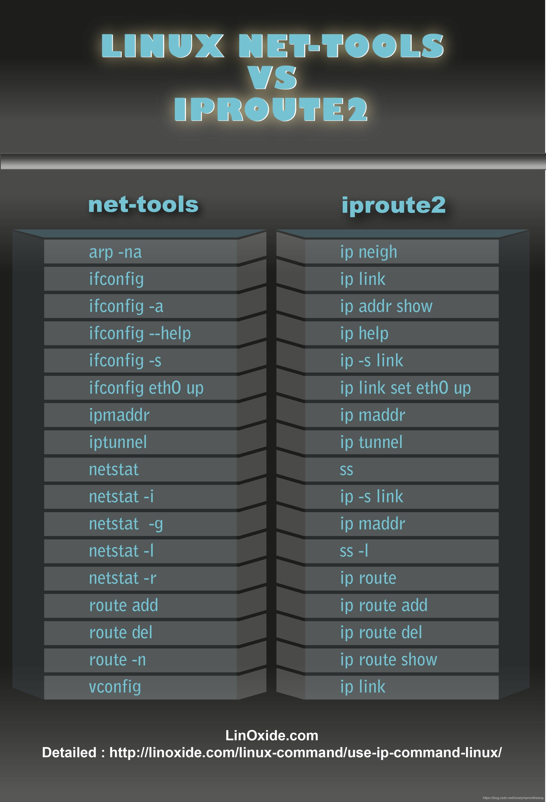

> iproute2 包是用来取代 net-tools 包的网络管理工具，net-tools 提供了流行的 ifconfig、arp、netstat 等工具，iproute2 提供了 ip、ss 等命令。net-tools 自 2001 年后 linux 社区停止对其维护，iproute2 则一直处于[持续开发](https://mirrors.edge.kernel.org/pub/linux/utils/net/iproute2/)中。net-tools 通过 procfs(/proc) 和 ioctl 系统调用去访问和改变内核网络配置，iproute2 则通过 netlink 套接字直接与内核通信，性能更快功能更强。

## linux 网络防火墙

iptables/netfilter

netfilter 是内核中的一个网络过滤框架
iptables 是一个规则生成的工具，可以实现数据包过滤、NAT、mangle

IP 报文首部
TCP 报文首部

route add default gw 192.168.0.254

sudo tcpdump -n -i eth0 'src host 192.168.10.2'

