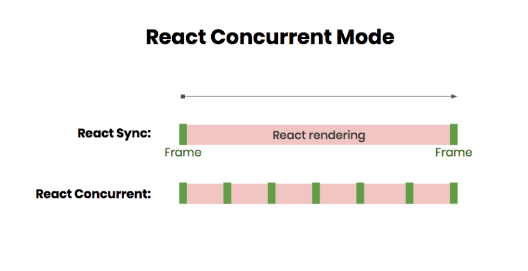

## Error Boundary

`try catch` 擅长在命令式代码中捕获异常，React 中采用声明式 API，因此在 React 中使用 `try catch` 处理异常的体验并不好。
因此 React 16 中引入了一个“错误边界”的概念，在应用发生异常时提供更好的用户体验。

错误边界是一种 React 组件，这种组件可以捕获发生在其子组件树构造函数、render 函数和生命周期函数中发生的错误，并且渲染出备用 UI，而不是渲染那些崩溃了的子组件树。
同时 React 也修改了出现未捕获异常的新行为：任何未被错误边界捕获的错误将会导致整个 React 组件树被卸载，这样避免了把一个错误的 UI 留在页面上。


`static getDerivedStateFromError()` 或 `componentDidCatch()`

```js
const React = window.React;

class ErrorBoundary extends React.Component {
  constructor(props) {
    super(props);
    this.state = { hasError: false };
  }

  static getDerivedStateFromError(error) {
    return { hasError: true };
  }

  componentDidCatch(error, errorInfo) {
    console.log('应用崩溃：', error, errorInfo);
  }

  render() {
    if (this.state.hasError) {
      return <h1>Something went wrong.</h1>;
    }

    return this.props.children;
  }
}

class BuggyCounter extends React.Component {
  constructor(props) {
    super(props);
    this.state = { counter: 0 };
    this.handleClick = this.handleClick.bind(this);
  }

  handleClick() {
    this.setState(({counter}) => ({
      counter: counter + 1
    }));
  }

  render() {
    if (this.state.counter === 5) {
      throw new Error('I crashed!');
    }
    return <h1 onClick={this.handleClick}>{this.state.counter}</h1>;
  }
}

const App = () => (
  <ErrorBoundary>
    <BuggyCounter />
  </ErrorBoundary>
);

export default App;
```

**以下几个场景下发生异常，错误边界并不能捕获到：**

- 事件处理函数中发生异常
- 异步代码（例如 setTimeout 或 requestAnimationFrame 回调函数）中发生异常
- 服务端渲染
- 错误边界自身抛出来的错误（并非它的子组件）

## Suspense

```js
export function fetchProfileData() {
  let userPromise = fetchUser();
  let postsPromise = fetchPosts();
  return {
    user: wrapPromise(userPromise),
    posts: wrapPromise(postsPromise)
  };
}

// Suspense integrations like Relay implement
// a contract like this to integrate with React.
// Real implementations can be significantly more complex.
// Don't copy-paste this into your project!
function wrapPromise(promise) {
  let status = "pending";
  let result;
  let suspender = promise.then(
    r => {
      status = "success";
      result = r;
    },
    e => {
      status = "error";
      result = e;
    }
  );
  return {
    read() {
      if (status === "pending") {
        throw suspender;
      } else if (status === "error") {
        throw result;
      } else if (status === "success") {
        return result;
      }
    }
  };
}

function fetchUser() {
  console.log("fetch user...");
  return new Promise(resolve => {
    setTimeout(() => {
      console.log("fetched user");
      resolve({
        name: "Ringo Starr"
      });
    }, 1000);
  });
}

function fetchPosts() {
  console.log("fetch posts...");
  return new Promise(resolve => {
    setTimeout(() => {
      console.log("fetched posts");
      resolve([
        {
          id: 0,
          text:
            "I get by with a little help from my friends"
        },
        {
          id: 1,
          text:
            "I'd like to be under the sea in an octupus's garden"
        },
        {
          id: 2,
          text:
            "You got that sand all over your feet"
        }
      ]);
    }, 2000);
  });
}
```

```js
const resource = fetchProfileData();

function ProfilePage() {
  return (
    <Suspense fallback={<h1>Loading profile...</h1>}>
      <ProfileDetails />
      <Suspense fallback={<h1>Loading posts...</h1>}>
        <ProfileTimeline />
      </Suspense>
    </Suspense>
  );
}

function ProfileDetails() {
  // Try to read user info, although it might not have loaded yet
  const user = resource.user.read();
  return <h1>{user.name}</h1>;
}

function ProfileTimeline() {
  // Try to read posts, although they might not have loaded yet
  const posts = resource.posts.read();
  return (
    <ul>
      {posts.map(post => (
        <li key={post.id}>{post.text}</li>
      ))}
    </ul>
  );
}
```

## 可打断式渲染

渲染的过程类比于版本管理。

假设一个场景：代码库中需要新增一个特性，正在编码的时候，出现一个紧急 bug 需要修复。

没有版本管理工具之前，bug 修复任务必须等待新增特性任务结束后才能开始。也就说说，低优先级的新增特性任务阻塞了高优先级的 bug 修复任务。这种情况类比到渲染过程中，就是阻塞式渲染。

有了版本管理工具之后，新增特性任务和 bug 修复任务在各自的分支上进行，互补干扰。在新增特性编码没有完成的时候，随时可以挂起这个任务，切换到 bug 修复分支完成 bug 修复任务。等到 bug 修复相关代码编辑完成，再切换回新增特性分支接着进行未完成的任务。这种情况类比到渲染过程中，就是 React 16 中提倡的可打断式渲染。

在 Web App 渲染的过程中，一些人机交互的任务具有更高的优先级，例如文本框更新和动画刷新；而另外一些例如更新 UI 的任务相对来说优先级较低。如果低优先级任务阻塞高优先级任务，文本框更新和动画刷新得不到及时执行，人就会感受到页面卡顿。React 的 Concurrent 模式让渲染过程变成可打断的，文本框更新、动画刷新等更高优先级的任务可以打断 UI 更新等低优先级的任务，完美的解决了这一问题。



---
loading data 的例子，在数据准备好之前，React 等所有数据准备好之后再更新 UI，避免了 loading 状态

CPU 密集型更新，如创建 DOM 节点、运行组件内代码 =>可打断
IO 密集型更新，如从网络上拉取数据 => 在内存中先渲染，等到数据都到达时，再更新到屏幕上。

[官方文档](https://reactjs.org/docs/concurrent-mode-intro.html)
