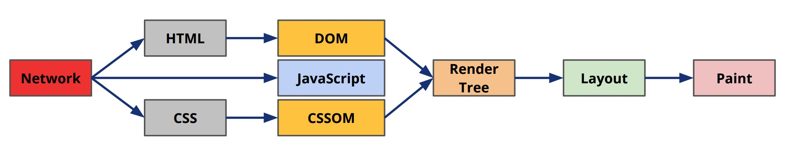
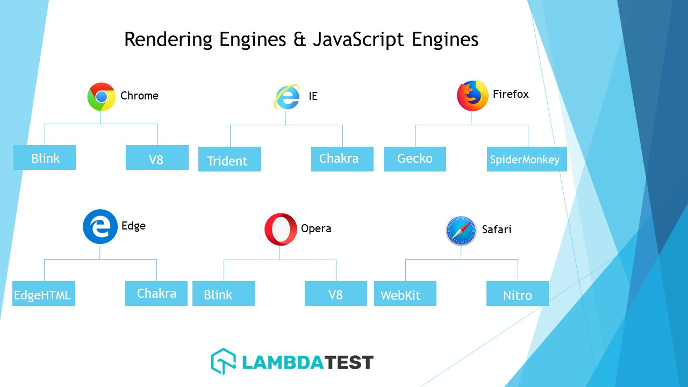

先回顾一下，浏览器渲染引擎的工作流程：



渲染引擎解析 HTML 文档，生成 DOM 树，再经过渲染树构建、布局、绘制，最终呈现在屏幕上。这些步骤都存在大量的计算，会消耗大量的 CPU 时间。而浏览器渲染和 JS 共用一个线程，用于渲染的时间长，就会压缩用于动画、脚本执行、事件处理等事情的时间。通过 JavaScript 可以操作 DOM 树，每个 DOM 操作都有可能触发 DOM 树构建、渲染树构建、布局、绘制。所以说 DOM 操作的成本是很高的。

合并、批量更新，修改节点的开销就变小了

HTML => JSX
HTML 元素 => React Element
DOM 节点 => Plain JavaScript Object
DOM 树 => Vritual DOM 树

reconciliation 和 rendering 是两个分开的阶段。reconciler 的工作是计算哪些部分修改了，renderer 使用这些信息去实际更新渲染环境

这就意味着 React DOM 和 React Native 可以使用各自的 renderer，共享同一个 reconciler

在浏览器渲染的过程中，只要进行一次 DOM 更新，整个渲染流程都会重做一遍。在一个复杂的单页面应用中，经常会涉及到大量的 DOM 操作，这将引起多次计算，使得整个流程变得低效，这应该尽量避免。

Virtual DOM 的好处：

1. 创建快，document.createElement 和 React.createElement
2. 更新快，document.append 会重新触发渲染流程

最简单的方法，每次更新的时候都重新渲染。在应用小的时候可以很好工作。
Actually re-rendering the entire app on each change only works for the most trivial apps

stack reconciler 被用在React 15 以及更早的版本中，
fiber reconciler

https://reactjs.org/docs/reconciliation.html

## 浏览器的渲染引擎和 JS 引擎

浏览器两个最核心的部件是渲染引擎（Rendering Engine）和 JS 引擎。其实最初浏览器中渲染引擎和 JS 引擎并没有区分的很明确，后来 JS 引擎越来越独立，内核就倾向于只指渲染引擎。

**渲染引擎：负责将解析 HTML、CSS 生成图像**

- Blink – 谷歌公司开发，是 Webkit 的一个分支，使用在 Chrome 和 Opera 浏览器（还有新版本的 Edge 浏览器）中
- WebKit – 是 KHTML 的一个分支，最初是 linux 平台的开源渲染引擎，后由苹果公司修改支持多个平台，使用在 Safari 浏览器中
- Gecko – Mozilla 公司开发，使用在 Firefox 浏览器中
- Trident – 微软公司开发，使用在 IE 浏览器中
- EdgeHTML – 微软公司开发，使用在 Edge 浏览器中

**JS 引擎：负责解析和执行 JavaScript 代码**

- V8 – 谷歌公司开发，用于 Chrome 和 Opera 浏览器中，搭配 Blink 渲染引擎使用，Chrome 早起版本中也用来搭配 Webkit 渲染引擎
- Nitro – 苹果公司开发，搭配 Webkit 渲染引擎使用
- SpiderMonkey – 最初由网景公司开发，后由 Mozilla基金会维护，搭配 Gecko 渲染引擎使用
- Chakra – 微软公司开发，搭配 Trident & EdgeHTML 渲染引擎使用

主流浏览器使用的引擎：



> Edge 浏览器已经将内核切换成 Chromium

## 渲染引擎的工作流程

不同的渲染引擎的工作流程虽然在术语上有些许不同，但是整体步骤是基本相同的：


**1. 构建 DOM 树**

浏览器接收到 HTML 文档，经过一些列的处理最终构建起 DOM 树。

```html
<!DOCTYPE html>
<html>
  <head>
    <meta name="viewport" content="width=device-width,initial-scale=1">
    <link href="style.css" rel="stylesheet">
    <title>Critical Path</title>
  </head>
  <body>
    <p>Hello <span>web performance</span> students!</p>
    <div></div>
  </body>
</html>
```


**2. 构建 CSSOM 树**

DOM 树构建完成后，浏览器会基于 HTML 文档中使用样式表构建 CSSOM 树。样式表的来源包括外部 css 文件、内嵌 style 样式、元素行内样式和浏览器内置 user agent 样式。

```css
body { font-size: 16px }
p { font-weight: bold }
span { color: red }
p span { display: none }
img { float: right }
```


**3. 构建渲染树（Render Object Tree）**

DOM 树与 CSSOM 树结合后形成渲染树。这个过程在 Webkit 中称为挂载（Attachment）。


> DOM 树的节点不会全部出现在渲染树上：
>
> - 有些节点不可见，如 `head` 的节点
> - 某些节点被隐藏，如应用了样式 `display: none;` 的节点

还存在其他渲染相关的树：

- Render Layer Tree：有些节点如 `video`、`canvas` 有自己的渲染实现，有些节点可能包含 GPU 层
- Render Style Tree：渲染树用来计算样式

**4. 布局**

计算每个节点在设备视口内的确切位置和大小，其实输出的就是每个节点的盒模型。

**5. 绘制**

通过调用操作系统 Native GUI 的 API 绘制将每一个节点绘制出来，将渲染树转换成屏幕上的像素。


## Stack Reconciler

好处：

diff 算法

第一个：性能

第二个：自动管理 DOM 更新

ui = fn(data)

两个假设：


diff 算法，比较两个虚拟 DOM 树的差异：

虚拟节点不同：

1. 节点类型不同：删除旧的节点、插入新的节点，因为类型不同，根据假设一，DOM 结构也会不同，与其花时间比较，不如直接删除
2. 节点类型相同，但是属性不同

React的DOM Diff算法实际上只会对树进行逐层比较

[整体印象](https://reactjs.org/docs/implementation-notes.html)

- `<App />` 是一个 React Element，React Element 是一个结构为 `{"type": "xx", props: { ... }}` 的 plain object
- “Mounting” 是一个根据指定的顶层 React element 创建 DOM 或者 Native tree 的**递归**过程
- `App` 是一个用户自定义组件，可以是函数或者是类

An element is a plain object describing a component instance or DOM node and its desired properties

React element 是一个描述一个组件实例或者 DOM node 的普通对象。可以直接使用普通对象形式表示：

```js
ReactDOM.render({type: App, props: {}}, container)
```

也可以使用 JSX 形式：

```
ReactDOM.render(<App />, container)
```

- React Element 有两种类型，host element 和 user-defined element   `<div />` `<Button />`
- React Component 有两种类型，host component 和 user-defined component `'div'` 和 `Button`

挂载时遇到 user-defined (“composite”) element，如果是函数组件，调用 App(props) 得到 renderedElement，如果是类组件，调用 new App(props).render() 方法得到 renderedElement，然后对再 mount(renderedElement) 实现递归

挂载时遇到 host element，React 让对应的 renderer 自己去处理，例如 React DOM 这个 renderer 会创建一个 DOM node
host element 有 children，则递归 mount，children 产生的 DOM node 会附加到 parent 的 DOM node 上
递归完成之后，mounting 过程得到的是一个完整的 DOM 结构

---

注意区别于组件的实例
element 的实例化，是为了保存这个 element 渲染过程的一些信息，以便后续 update 操作。比如一个组件的更新，需要找到组件事例并调用这个实例的 componentDidUpdate 声明周期的钩子。这个要求在 mount 操作时，保存这个组件的实例

因为 element 只在 React 内部的 renderer 和 reconciler 用到，是实现细节，不会对用户暴露，所以也称为 internal instances。相反，类组件的实例称为 public instances

instantiateComponent(element) 实际上这个方法应该叫做 instantiateElement 而不应该叫 instantiateElement，Poel 也是这么说的

composite element 的实例化过程中，实际上会创建 类 component 的实例并保存他

- this.currentElement 当前挂载的 element
- this.publicInstance 当前的组件实例（不是类组件，为空）
- this.renderedComponent renderedElement 的实例 `instantiateComponent(renderedElement)`

host element 的实例化过程中：

- this.currentElement 当前挂载的 element
- this.renderedChildren 所有子元素的内部实例
- this.node DOM node

=>

```js
const App = () => <Button />
const Button = class {
  render () {
    return <div />
  }
}
render(<App />)
```

最终得到的 `<App />` 的内部实例结构是：

```json
[object CompositeComponent] {
  currentElement: <App />,
  publicInstance: null,
  renderedComponent: [object CompositeComponent] {
    currentElement: <Button />,
    publicInstance: [object Button],
    renderedComponent: [object DOMComponent] {
      currentElement: <div />,
      node: [object HTMLDivElement],
      renderedChildren: []
    }
  }
}
```

React DevTools 中看到的结构，紫色的是 Composite Element 实例，灰色的是 Host Element 实例，都是内部实例

<!-- => 最终结果，不管是 Composite Element 还是 Host Element，最终 root.mount 操作的结果是得到一个 最顶级的 DOM node。 -->
instantiateComponent(rootElement).mount() => root DOM node


---
unmount 操作：

Composite Element 卸载时如果存在 publicInstance 调用 componentWillUnmount 声明周期函数，然后递归调用 renderedComponent.unmount()，renderedComponent 渲染之后的 renderedElement 的内部实例

Host Element 轮训调用 renderedChildren 的 unmount()，并清除 listener 和 cache

unmountTree 需要通过给定的 containerNode dom node 找到对应的 root element instance，方法是 containerNode.frstChild._internalInstance

注意 containerNode 和 rootNode

这就要求在 mountTree 操作时，在 rootNode 上加上一个 _internalInstance 属性：

containerNode.firstChild

rootElementInstance.mount()._internalInstance = rootElementInstance

返回的是一个 rootElementInstance.getPublicInstance()，因为内部实例不对外暴露

---
update 操作
Composite Element instance：

renderElementInstance(nextElement)
计算一个新的 renderedElement，与老的 renderedElement 相比较：
1. type 相同（并且 key 没有改变）：递归调用新的 renderedElementInstance().receive(新的 renderElement)
2. type 不同：prevRenderedComponent().unmount()、instantiateComponent(nextRenderedElement).mount()。并且要 DOM API 用新的 renderElement 取代老的 renderElement

> 其实 remount 还有一个条件是 key 相同，这里暂不讨论

不考虑移动的情况，也就是不考虑 key

Host element
1. 先更新本节点的属性，setAttribute
2. 子节点：同样暂时不考虑 key，轮训比较新的 childElement ，以此和老的 childElemet
  - prevChildElemet 不存在 => { type: 'ADD', node: 、instantiateComponent(nextElement).node }
  - prevChildElemet 和 nextChildElement 不一样：prevChildComponent.unmount(); nextChildComponent.mount() => { type: 'REPLACE', prevNode, nextNode }
  - prevChildElemet 和 nextChildElement 一样：prevChild.receive(nextChildren[i]);
- 另外、prevChildElemet 存在而 nextChildElemet 不存在：{type: 'REMOVE', node: prevChildComponent.node}
3. 根据 operationQueue 实际进行 DOM 操作

注意：DOMComponent 是由 renderer 注入的，例如 react-dom 的 ReactDOMComponent 会注入到 reconciler DOMComponent

Stack Reconciler 相关资料：
https://reactjs.org/blog/2015/12/18/react-components-elements-and-instances.html
https://reactjs.org/docs/implementation-notes.html#overview

## Fiber Reconciler

大家应该都清楚进程（Process）和线程（Thread）的概念，在计算机科学中还有一个概念叫做Fiber，英文含义就是“纤维”，意指比Thread更细的线，也就是比线程(Thread)控制得更精密的并发处理机制。

React Fiber 目标：使 React 更加适用与动画、手势、布局等场景
特性

- 增量渲染：撕碎渲染过程，分散到不同的帧中去处理
- 在接收到新的 update 时，停止、终止、复用现在的渲染过程
- 为不同的 update 指定不同优先级
- new concurrency primitives

- pause work and come back to it later.
- assign priority to different types of work.
- reuse previously completed work.
- abort work if it's no longer needed. some of that work may be unnecessary if it's superseded by a more recent update

新的浏览器环境和 Native 环境提供了一些 APIs 帮助处理优先级的问题：

`requestIdleCallback` 调度一个低优先级的函数在空闲期间执行
`requestAnimationFrame` 调度一个高优先级的函数在下一个动画帧执行

为了利用这些 APIs 实现增量渲染，首先需要 React 做的就是将 work 撕碎成一个个小碎片，一个 fiber 就是一个 work 碎片。如果依靠函数调用栈，work 会一直做知道 stack 变成空的，也就是 work 结束

可以认为一个 fiber 就是一个虚拟的 stack frame。除了调度，手动操作 stack frames 解锁了 concurrency 和 error boundaries

一个 fiber 对应一个 stack frame, 同时也和一个 component 实例相对应。fiber 就是一个包含 react element/component 和其输入、输出信息的 JavaScript 对象

<!-- react element 的 type 对应一个 react component，不区分（user-defined component 和 host component） -->

fiber 对象是使用 react element 创建的。

fiber 的结构：

**type and key**

直接拷贝 React element 的 type 和 key。key 用来决定这个 fiber 能不能被复用

**child and sibling**

引用 renderedElements 的 fiber，注意[React 16 中允许 render() 返回数组或者 React Fragment](https://reactjs.org/blog/2017/09/26/react-v16.0.html)，因此 `renderedElements` 可能是一个数组，

```js
const Parent = () => [<Child1 />, <Child2 />]
ReactDOM.render(<Parent />, container)
```

假设 `<Parent />` 对应的 fiber 是 pfiber
pfiber.child 就是 `<Child1 />` 对应的 fiber
pfiber.child.sibling `<Child2 />` 对应的 fiber

**return**

父 fiber，renderElements 中的每个 element 对应的 fiber 的 return 都是父 fiber

上面的例子中，`<Child1 />` 和 `<Child2 />` 对应的 fiber 的 return 都指向 pfiber

**pendingProps & memoizedProps**

pendingProps 在 fiber 这个 stack frame 执行之前设置，memoizedProps 在 stack frame 执行之后设置

（类似于我们平时用的 currProps 和 lastProps）

在执行前，发现 pendingProps 和 memoizedProps 是相等的，则表示 fiber 上一次的输出可以复用，没必要执行

**pendingWorkPriority**

fiber 对应的 stack frame/work 的优先级，是一个数字

在 `packages/react-reconciler/src/SchedulerWithReactIntegration.js` 文件中有定义：

```js
export type ReactPriorityLevel = 99 | 98 | 97 | 96 | 95 | 90;

// Except for NoPriority, these correspond to Scheduler priorities. We use
// ascending numbers so we can compare them like numbers. They start at 90 to
// avoid clashing with Scheduler's priorities.
export const ImmediatePriority: ReactPriorityLevel = 99;
export const UserBlockingPriority: ReactPriorityLevel = 98;
export const NormalPriority: ReactPriorityLevel = 97;
export const LowPriority: ReactPriorityLevel = 96;
export const IdlePriority: ReactPriorityLevel = 95;
// NoPriority is the absence of priority. Also React-only.
export const NoPriority: ReactPriorityLevel = 90;
```

scheduler 使用 fiber.pendingWorkPriority 字段寻找下一个需要执行的 fiber 对应的 unit of work

**output**

Every fiber eventually has output, but output is created only at the leaf nodes by host components. The output is then transferred up the tree.

The output is what is eventually given to the renderer so that it can flush the changes to the rendering environment. It's the renderer's responsibility to define how the output is created and updated.

**alternate**

实际上 React element 有同一时间最多有两个 fiber，current/flush fiber 和 work-in-progress fiber 与其对应

work-in-progress fiber 表示对应的 work unit 还没有执行完成，current fiber 已经完成已经完成

work-in-progress fiber 的 alternate 是 current fiber
current fiber 的 alternate 是 work-in-progress fiber

alternate 的存在主要是为了克隆方便

**tag**

跟这个 fiber 对应的 React element 的类型有关系，类型是函数组件、类组件还是 host 组件

`packages/react-reconciler/src/ReactWorkTags.js`

```js
export type WorkTag =
  | 0
  | 1
  | 2
  | 3
  | 4
  | 5
  | 6
  | 7
  | 8
  | 9
  | 10
  | 11
  | 12
  | 13
  | 14
  | 15
  | 16
  | 17
  | 18;

export const FunctionComponent = 0;
export const ClassComponent = 1;
export const IndeterminateComponent = 2; // Before we know whether it is function or class
export const HostRoot = 3; // Root of a host tree. Could be nested inside another node.
export const HostPortal = 4; // A subtree. Could be an entry point to a different renderer.
export const HostComponent = 5;
export const HostText = 6;
export const Fragment = 7;
export const Mode = 8;
export const ContextConsumer = 9;
export const ContextProvider = 10;
export const ForwardRef = 11;
export const Profiler = 12;
export const SuspenseComponent = 13;
export const MemoComponent = 14;
export const SimpleMemoComponent = 15;
export const LazyComponent = 16;
```


scheduling：the process of determining when work should be performed.
work：any computations that must be performed. Work is usually the result of an update (e.g. setState).

**理解 撕碎 work**

React 执行 work 经历两个阶段：`render` 和 `commit`

React 应用 `setState()` 或者 `ReactDOM.render()` 产生 update

`render` 阶段：搞清楚 UI 的哪些部分需要被更新。如果是第一次渲染， React 为每个 `render()` 方法返回的 element 创建一个新的 fiber node，在接下来的渲染中，已经存在的 React element 可以复用这些 fiber node 并且更新它。这一阶段工作的结果是产生一个标记了 side-effect 的 fiber 树

`commit` 阶段：从 fiber 中读取 side-effect ，遍历 side-effect 列表，并执行 DOM 更新和其他用户可见的 side-effect

render 阶段的工作是可以被拆分为异步完成的，React 可以先处理fiber 树中的几个 fiber，然后没有剩余时间完成其他 fiber 阶段，可以中断工作，等空闲下来之后再从这个地方开始进行处理剩下的 fiber node。可以这么做的原因是：这个阶段的工作用户不可见，因为这个阶段不会操作 DOM。

`commit` 阶段的工作因为可能触发 DOM 更新，用户可以看见，所以必须是同步的

`render` 和 `commit` 阶段都会调用一些生命周期方法：

render 阶段调用的生命周期方法包括：

- [UNSAFE_]componentWillMount (deprecated)
- [UNSAFE_]componentWillReceiveProps (deprecated)
- getDerivedStateFromProps
- shouldComponentUpdate
- [UNSAFE_]componentWillUpdate (deprecated)
- render

https://reactjs.org/blog/2018/03/27/update-on-async-rendering.html#gradual-migration-path
注意：有些生命周期方法在 16.3 之后加了 UNSAFE_ 前缀，在接下来的 16.x 版本中会标记为废弃，在 17 版本中会被完全移除，在官方文档中这些生命周期被表述为 “传统生命周期”。这是因为 React 要保证 render 阶段不执行副作用，但是这些生命周期钩子中经常被误解和误用，开发者在里面执行了副作用。（还有 Concurrent 的问题)

commit 阶段调用的生命周期方法包括：

- getSnapshotBeforeUpdate
- componentDidMount
- componentDidUpdate
- componentWillUnmount

这些生命周期中可以执行 sideEffect，比如 DOM 操作

**render 阶段**

从调用 `renderRoot()` 开始

render 阶段的 work 可以被打碎，分散到不同的 **work loop** 中去完成。work loop 的任务就是处理 fiber 树，调用 `renderRoot()` 从最顶层的 Host fiber node 开始，跳过已经处理过的 fiber 节点，直到找到 未完成的工作。
例如在组件树的很深的节点中调用了 setState() 触发了更新，render 阶段开始的时候会很快跳过他的父 fiber 找到它

```js
function workLoop(isYieldy) {
  if (!isYieldy) {
    while (nextUnitOfWork !== null) {
      nextUnitOfWork = performUnitOfWork(nextUnitOfWork);
    }
  } else {...}
}
```

上面的代码中，nextUnitOfWork 指向的是 workInProgress 树中的一个需要没处理的 fiber node，workloop 调用 `performUnitOfWork(nextUnitOfWork)` 去处理这个 fiber node，并且找到下一个需要处理的 fiber node，如果没有就返回 null

如果这个值变成 null，表示没有待处理的 fiber node 了。React 等待新的 update。

`performUnitOfWork`
`beginWork`
`completeUnitOfWork`
`completeWork`

```js
// 这个 workInProgress 是本次要被处理的 fiber node，不是指哪个 workInProgress Tree
function performUnitOfWork(workInProgress) {
    let next = beginWork(workInProgress);
    if (next === null) {
        next = completeUnitOfWork(workInProgress);
    }
    return next;
}

function beginWork(workInProgress) {
    // 实际上去处理 调用 render() 调用生命周期钩子...
    console.log('work performed for ' + workInProgress.name);
    return workInProgress.child;
}
```

注意：这个地方 beginWork 返回的是 workInProgress.child，如果当前处理的 fiber node 有 child fiber node，（不是子元素，`<P />` 可能有多个 `<C />`，但是 `<P />` 对应的 fiber 的 child 只指向第一个 `<C />` 对应的 fiber ），这个 work loop 会继续处理他的 child fiber node

但是如果 child fiber node 是 null，则表示这条分支已经到头了，可以标记这个 fiber node 处理完成了。调用 `completeUnitOfWork()` 开始沿着 sibing 和 return 这条线往旁边找

```js
function completeUnitOfWork(workInProgress) {
    while (true) {
        let returnFiber = workInProgress.return;
        let siblingFiber = workInProgress.sibling;

        nextUnitOfWork = completeWork(workInProgress);

        if (siblingFiber !== null) {
            // If there is a sibling, return it
            // to perform work for this sibling
            return siblingFiber;
        } else if (returnFiber !== null) {
            // If there's no more work in this returnFiber,
            // continue the loop to complete the parent.
            workInProgress = returnFiber;
            continue;
        } else {
            // We've reached the root.
            return null;
        }
    }
}

function completeWork(workInProgress) {
   // 标记这个节点已经完成
    console.log('work completed for ' + workInProgress.name);
    return null;
}
```

总结：`performUnitOfWork()/completeUnitOfWork()` 主要实现遍历这个 fiber 树，但是真正的工作都是 `beginWork()/completeWork()` 完成的。

render 阶段的结果就是哪些 DOM 节点需要更新、删除、添加，哪些 组件 public 实例 pre and post 的生命周期需要被调用。这些信息形成一个 effect 列表，

pre and post 修改前、修改后

<!-- 除了 current 之外的那棵树，可能叫 workInProgress，也可能叫 finishedWork -->

finishedWork tree 通过 nextEffect 指向这个列表

Commit 阶段：

从 `completeRoot()` 开始，commit 阶段就是迭代 effect list 并依次执行。能够执行的操作有：
- Snapshot effect：调用 `getSnapshotBeforeUpdate()` 生命周期
- Deletion effect：调用 `componentWillUnmount()` 生命周期
- 执行所有的 DOM insertions, updates and deletions
- 设置 finishedWork tree 为 current
- Placement effect：调用 `componentDidMount()` 生命周期
- Update efflect：调用 `componentDidUpdate()` 生命周期

关键点：

- UI 中，没有立刻马上应用 update，这么做会浪费，造成帧浪费、降级用户体验
- 不同的 update 有不同的优先级，animation 更新比 data store 更新的优先级更高，需要更快执行
- A push-based approach requires the app (you, the programmer) to decide how to schedule work. A pull-based approach allows the framework (React) to be smart and make those decisions for you.


Fiber Reconciler 相关资料：
https://reactjs.org/docs/codebase-overview.html#fiber-reconciler
https://github.com/acdlite/react-fiber-architecture
https://blog.ag-grid.com/inside-fiber-an-in-depth-overview-of-the-new-reconciliation-algorithm-in-react/

=========

[how React processes state updates and builds the effects list?](https://medium.com/react-in-depth/in-depth-explanation-of-state-and-props-update-in-react-51ab94563311)

## 参考

[现代浏览器的呈现引擎的工作流程介绍](http://www.nowamagic.net/academy/detail/48110122)

[constructing-the-object-model](https://developers.google.com/web/fundamentals/performance/critical-rendering-path/constructing-the-object-model)

[render-tree-construction](https://developers.google.com/web/fundamentals/performance/critical-rendering-path/render-tree-construction)

[Virtual DOM 的实现和 React Fiber 简介](https://www.jianshu.com/p/b189b2949b33)

https://medium.com/react-in-depth/in-depth-explanation-of-state-and-props-update-in-react-51ab94563311
https://medium.com/react-in-depth/the-how-and-why-on-reacts-usage-of-linked-list-in-fiber-67f1014d0eb7
https://medium.com/react-in-depth
这个专栏不错