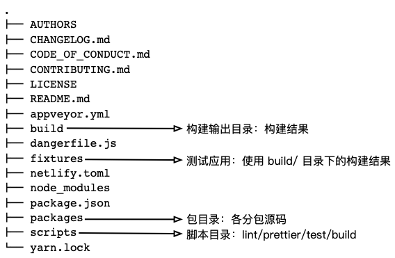
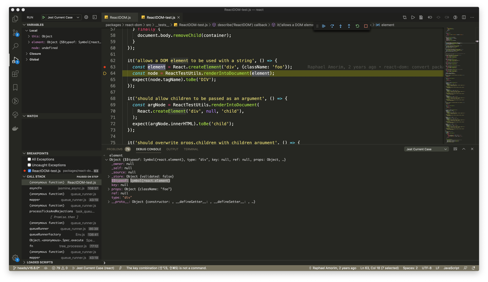
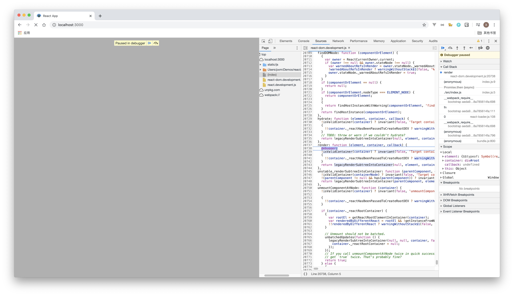

## 搭建本地环境

先拉取 react 代码到本地：

```shell
# fork react 官方仓库并克隆到本地
git clone https://github.com/Shawmon/react.git

# 选择一个稳定版本
git checkout v16.8.0 tags/v16.8.0

# 安装依赖
yarn
# 执行构建脚本
# yarn build
```

整体浏览整个项目目录结构：



React 仓库是一个 monorepo，在 `packages/` 目录存放着很多包：

**Core：定义组件的 APIs**

- `packages/react`

**Renderers：管理 React Tree 怎么转换成不同平台的调用**

- `packages/react-dom`：渲染 React Tree 到浏览器平台
- `packages/react-native-renderer`：渲染 React Tree 到 Native 平台
- `packages/react-test-renderer`：渲染 React Tree 成 JSON，用在 Jest 的 snapshot 测试
- `packages/react-art`：渲染 React Tree 到 art 平台，主要用于绘制矢量图

还有 `react-dom-server` 这个 Renderer 用于服务端渲染

**Reconcilers：不同平台通用的渲染逻辑的抽象**

- `packages/react-reconciler`

**Event System：React 自己实现的合成事件系统，适用于 React DOM 和 React Native**

- `packages/legacy-events`

参考：[React 仓库源码组织结构](https://reactjs.org/docs/codebase-overview.html)

<!-- ## npm 脚本
```sh
yarn lint checks the code style.
yarn linc is like yarn lint but faster because it only checks files that differ in your branch.
yarn test runs the complete test suite.
yarn test --watch runs an interactive test watcher.
yarn test <pattern> runs tests with matching filenames.
yarn test-prod runs tests in the production environment. It supports all the same options as yarn test.
yarn debug-test is just like yarn test but with a debugger. Open chrome://inspect and press “Inspect”.
yarn flow runs the Flow typechecks.
yarn build creates a build folder with all the packages.
yarn build react/index,react-dom/index --type=UMD creates UMD builds of just React and ReactDOM.
```
https://reactjs.org/docs/how-to-contribute.html#development-workflow -->

## 从测试用例入手

`packages/` 目录下的每个包下面都有一个 `src/__test__` 目录，这个目录下存放着 React 的测试用例，每个单独的测试用例通常用来测试一个单独 React 特性，并且这些测试用例代码覆盖率达到了 85%，所以通过这些测试用例或者自己编写测试用例去调试、理解 React 的运作原理是一个不错的途径。

Jest 是 React 的御用单元测试框架，Jest 默认的从项目中的 `package.json` 文件的 jest 属性或者 `jest.config.js` 配置文件中获取配置，在 React 的 `package.json` 文件中：

```json
"jest": {
  "testRegex": "/scripts/jest/dont-run-jest-directly\\.js$"
},
```

这个配置让 Jest 只会匹配 `/scripts/jest/dont-run-jest-directly.js` 作为测试文件，而这个文件只会告诉你不要直接使用 `jest`，而要通过 npm 脚本 `yarn test`：

```js
throw new Error("Don't run `jest` directly. Run `yarn test` instead.");
```

`package.json` 中 `test` 脚本执行的命令是：

```json
"scripts": {
  "test": "cross-env NODE_ENV=development jest --config ./scripts/jest/config.source.js",
  // ...
}
```

所以 React 中 Jest 配置文件是 `scripts/jest/config.source.js`。有了这个信息可以结合 vscode 的启动脚本，启用 vscode 的一键调试。项目中新建 `.vscode/launch.json`：

```json
{
  "version": "0.2.0",
  "configurations": [
    {
      "type": "node",
      "request": "launch",
      "name": "Jest All",
      "program": "${workspaceFolder}/node_modules/.bin/jest",
      "args": [
        "--config",
        "./scripts/jest/config.source.js",
        "--runInBand"
      ],
      "console": "integratedTerminal",
      "internalConsoleOptions": "neverOpen",
      "disableOptimisticBPs": true,
      "windows": {
        "program": "${workspaceFolder}/node_modules/jest/bin/jest",
      },
      "env": {
        "NODE_ENV": "development"
      },
    },
    {
      "type": "node",
      "request": "launch",
      "name": "Jest Current File",
      "program": "${workspaceFolder}/node_modules/.bin/jest",
      "args": [
        "${fileBasenameNoExtension}",
        "--config",
        "./scripts/jest/config.source.js",
        "--runInBand",
      ],
      "console": "integratedTerminal",
      "internalConsoleOptions": "neverOpen",
      "disableOptimisticBPs": true,
      "windows": {
        "program": "${workspaceFolder}/node_modules/jest/bin/jest",
      },
      "env": {
        "NODE_ENV": "development"
      },
    },
    {
      "type": "node",
      "request": "launch",
      "name": "Jest Current Case",
      "program": "${workspaceFolder}/node_modules/.bin/jest",
      "args": [
        "${fileBasenameNoExtension}",
        "--config",
        "./scripts/jest/config.source.js",
        "--runInBand",
        "--testNamePattern",
        "${selectedText}",
      ],
      "console": "integratedTerminal",
      "internalConsoleOptions": "neverOpen",
      "disableOptimisticBPs": true,
      "windows": {
        "program": "${workspaceFolder}/node_modules/jest/bin/jest",
      },
      "env": {
        "NODE_ENV": "development"
      },
    }
  ]
}
```

同时修改 `scripts/jest/preprocessor.js`：

```js
const babelOptions = {
  // ...
  sourceMaps: 'both',
};
```



## 从 fixtures 入手

项目中的 `fixtures/` 目录已经准备好了一些测试应用，这些应用启动时会自动拷贝 `build/` 目录下的编译结果到测试应用中：

```json
"scripts": {
  "start": "react-scripts start",
  "prestart": "cp ../../build/node_modules/react/umd/react.development.js ../../build/node_modules/react-dom/umd/react-dom.development.js ../../build/node_modules/react/umd/react.production.min.js ../../build/node_modules/react-dom/umd/react-dom.production.min.js ../../build/node_modules/react-dom/umd/react-dom-server.browser.development.js ../../build/node_modules/react-dom/umd/react-dom-server.browser.production.min.js public/",
}
```

这些测试应用也是调试 React 的好途径：

```shell
yarn build react/index,react-dom/index,react-dom/server.browser,scheduler --type=NODE,UMD
cd fixtures/dom
yarn
yarn start
```



> 除了 `yarn pre*`，`yarn link` 也是比较好的选择

```sh
yarn build react/index,react-dom/index,scheduler --type=NODE

cd build/node_modules/react
yarn link
cd build/node_modules/react-dom
yarn link

cd ../../fixtures/xxx
yarn link react react-dom
```

## 心法

Fiber introduces several novel concepts that are difficult to grok solely by looking at code
- 带着目的看代码，有所侧重点，而不是看小说一样
- 不钻死胡同：看不懂，换个角度，或者换个问题，别再一颗树上吊死
- 不钻牛角尖：先捋整体、再抠细节
