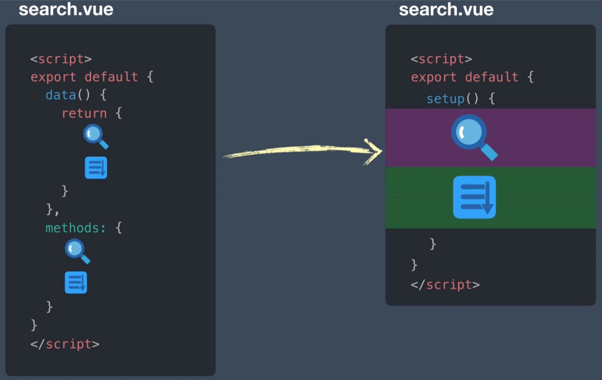

[RFCs](https://github.com/vuejs/rfcs/tree/master/active-rfcs)

## new Proxy() vs Object.defineProperty()

在 Vue 2.x 中数据拦截的方法是通过 ES5 的 `Object.defineProperty`，需要枚举 data 对象的每一个属性，使用 `Object.defineProperty` 劫持对属性的 get 和 set 操作，对于数组对象还需要改写数组的 `.push()`、`.pop()`、`.unshift()`、`.shift()`、`revsese()` 和 `.sort()` 方法。因为这个 API 的局限性，在 Vue 2.x 中对数据进行操作时以下几种情况下不能被观察：

- 当你利用索引直接设置一个数组项时，例如：`vm.items[indexOfItem] = newValue`
- 当你修改数组的长度时，例如：`vm.items.length = newLength`
- 当被观察对象是 ES6 中的 `Set`、`Map` 等数据结构时，例如：`vm.items.add(newValue)`

在 Vue 3.x 中数据拦截的方法改成了 ES6 的 `new Proxy()`，直接对 data 对象进行代理观察，没有了以上的所有限制，并且 Proxy 作为新标准，JS 引擎会继续优化 Proxy，这就是所谓的性能红利。除了浏览器兼容性，Proxy 方案可以说是完美的数据劫持方案。

Proxy 在 IE 浏览器的兼容上是一个灾难，并且目前并没有一个完整支持 Proxy 所有拦截方法的 Polyfill 方案，有一个 google 编写的 proxy-polyfill 也只支持了 get，set，apply，construct 四种拦截，可以支持到 IE9+ 和 Safari 6+。

[Proxy浏览器兼容性](https://developer.mozilla.org/en-US/docs/Web/JavaScript/Reference/Global_Objects/Proxy#Browser_compatibility)

```vue
<template>
  <ul>
    <li v-for="(val, key) in object" :key="key">{{key}}: {{val}}</li>
  </ul>
  <button @click="addPropertyToObject">添加对象属性</button>
  <ul>
    <li v-for="(val, key) in array" :key="key">{{key}}: {{val}}</li>
  </ul>
  <button @click="addElementToArray">添加数组元素</button>
  <ul>
    <li v-for="(val, key) in set" :key="key">{{key}}: {{val}}</li>
  </ul>
  <button @click="addElementToSet">添加Set元素</button>
</template>

<script>
import random from './random'

export default {
  data () {
    return {
      object: {},
      array: [],
      set: new Set(),
    }
  },
  methods: {
    addPropertyToObject() {
      this.object[random(3)] = random(3)
    },
    addElementToArray() {
      this.array[this.array.length] = random(3)
    },
    addElementToSet() {
      this.set.add(random(3))
    },
  }
}
</script>
```

## Composition API vs Instance options + Mixin/scopedSlot

[Composition API](https://vue-composition-api-rfc.netlify.app/#summary) 是 Vue 3.x 中最核心的语法，这是一种全新的代码组织和逻辑重用方法：

**在代码组织上**，相比 Vue 2.x 中的 Instance Options，Composition API 写出的代码具有更高的内聚性，处理相同逻辑的代码组织在一起，读起来更顺畅。

```vue
<template>
  <button @click="inc">Clicked {{ count }} times.</button>
</template>

<script>
export default {
  data () {
    return {
      count: 0,
    }
  },
  methods: {
    inc() {
      this.count++
    },
  }
}
</script>
```

```vue
<!-- Counter.vue -->
<template>
  <slot v-bind="{ count, inc }" />
</template>

<script>

export default {
  data() {
    return {
      count: 0,
    }
  },
  methods: {
    inc() {
      this.count++
    }
  },
}
</script>

<!-- App.vue -->
<template>
  <Counter v-slot="{ count, inc }">
    <button @click="inc">Clicked {{ count }} times.</button>
  </Counter>
</template>

<script>
import Counter from './Counter.vue'

export default {
  components: {
    Counter
  },
  data() {
    return {}
  }
}
</script>
```

```vue
<template>
  <button @click="inc">Clicked {{ count }} times.</button>
</template>

<script>
import { ref } from 'vue'

export default {
  setup() {
    const count = ref(0)
    const inc = () => {
      count.value++
    }

    return {
      count,
      inc,
    }
  },
}
</script>
```



- 在逻辑重用上，相比 Vue 2.x 的 Mixins 方案，Composition API 写出的代码属性和方法的来源更加明确。

```vue
<template>
  <button @click="inc">Clicked {{ count }} times.</button>
</template>

<script>
import { ref } from 'vue'

const countMixin = {
  data () {
    return {
      count: 0,
    }
  },
  methods: {
    inc() {
      this.count++
    }
  }
}

export default {
  mixins: [countMixin],
  data() {
    return {}
  }
}
</script>
```

```vue
<template>
  <button @click="inc">Clicked {{ count }} times.</button>
</template>

<script>
import { ref } from 'vue'

function useCount(init) {
  const count = ref(init)
  const inc = () => {
    count.value++
  }
  return {
    count,
    inc,
  }
}

export default {
  setup() {
    const { count, inc } = useCount(0)
    return {
      count,
      inc,
    }
  },
}
</script>
```

## new Vue() vs createApp()

在 Vue 2.x 中，创建 Vue 实例使用 `new Vue()`，对应用的配置也在这个全局 Vue 对象上。这样做的缺点是对全局 Vue 对象的任何修改将影响所有 Vue 实例，在引入的第三方库很多的情况下，很容易产生冲突和混乱。

```js
import Vue from 'vue'
import App from './App.vue'

Vue.config.ignoredElements = [/^app-/]
Vue.use(/* ... */)
Vue.mixin(/* ... */)
Vue.component(/* ... */)
Vue.directive(/* ... */)

new Vue({
  render: h => h(App)
}).$mount('#app')
```

在 Vue 3.x 中，隐藏了全局 Vue 对象，创建 Vue 实例使用 `createApp()`，对应用的配置应用在 Vue 实例上，避免了可能的冲突和混乱：

```js
import { createApp } from 'vue'
import App from './App.vue'

const app = createApp(App)

app.config.ignoredElements = [/^app-/]
app.use(/* ... */)
app.mixin(/* ... */)
app.component(/* ... */)
app.directive(/* ... */)

app.mount('#app')
```

## Fragment & Suspense & Portals

## Multiple v-models

Replace v-bind's .sync with a v-model argument

## new Directive API

Before
``` js
const MyDirective = {
  bind(el, binding, vnode, prevVnode) {},
  inserted() {},
  update() {},
  componentUpdated() {},
  unbind() {}
}
```

After

``` js
const MyDirective = {
  beforeMount(el, binding, vnode, prevVnode) {},
  mounted() {},
  beforeUpdate() {},
  updated() {},
  beforeUnmount() {}, // new
  unmounted() {}
}
```
