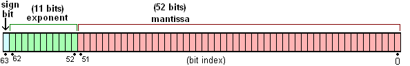
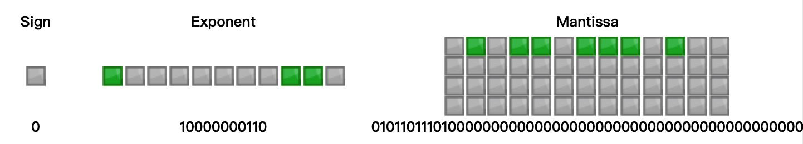

接触 JS 就是进入了一个千奇百怪的世界，这个世界里光怪陆离，充满了惊喜，也可能遭遇一些意外。你可以看到令你拍案叫绝的奇技淫巧，也可以看到令人毛骨悚然的灵异事件。其中最典型的就是匪夷所思的 `0.1 + 0.2 ≠ 0.3`。

下面本文将带领大家走进科学，揭开 `0.1 + 0.2 ≠ 0.3` 事件的神秘面纱：

## 定点数和浮点数

在计算机系统发展过程中，提出过多种方式表达一个实数，其中最典型的有定点数和浮点数：

- 定点数：小数点固定在实数所有数字中间的某个位置。现实生活中货币是定点数应用的典型场景，如 56.78，小数点固定在倒数第三个位置，小数固定2位
- 浮点数：小数点在实数中所有数字中间某个位置左右浮动。科学计数法就是浮点数应用的典型场景，如 5.678e1，其中 1.234 称做尾数（也称为有效数字），1 称为指数，表示在 5.678 的基础上小数点向右浮动一个位置

由于固定的小数点位置决定了固定位数的整数部分和小数部分，不利于同时表达特别大的数或者特别小的数，因此绝大多数计算机系统采纳浮点数表示法

IEEE 745 规范中规定了两种基本浮点格式：单精度和双精度

- 单精度：总共占用 32 位，其中 23 位表示尾数，8 位表示指数，1 位表示符号
- 双精度：总共占用 64 位，其中 52 位表示尾数，11 位表示指数，1位表示符号

JS 中不区分整数和小数类型，统统使用双精度浮点数表示：



## 十进制浮点数转换为二进制浮点数

十进制浮点数转换成二进制的过程分开成整数部分转换二进制和小数部分转换二进制两个部分

- 十进制整数转换成二进制：采用“除2取余，逆序排列”法

```
     173
÷      2
----------------    ↑
      86  ...  1    |
÷      2            |
----------------    |
      43  ...  0    |
÷      2            |
----------------    |
      21  ...  1    |
÷      2            |
----------------    |
      10  ...  1    |
÷      2            |
----------------    |
       5  ...  0    |
÷      2            |
----------------    |
       2  ...  1    |
÷      2            |
----------------    |
       1  ...  0    |
÷      2            |
----------------    |
       0  ...  1    |
```

因此十进制整数 173 的二进制表示是 `10101101`

- 十进制小树转换成二进制：采用“乘2取余，顺序排列”法

```
  0.8125
x      2
------------------  |
   0.625   +   1    |
x      2            |
------------------  |
    0.25   +   1    |
x      2            |
------------------  |
     0.5   +   0    |
x      2            |
------------------  |
       0   +   1    ↓
```

因此十进制小数 0.8125 的二进制表示是 0.1101

结合整数部分和小数部分，十进制实数 173.8125 的二进制表示是 `10101101.1101`。

## 二进制浮点数的存储

十进制浮点数的科学计数法表示是：

$$
V=(-1)^{S} \times 10^{E} \times M
$$

其中，S 是符号，M 是尾数，E 是指数；M > 0 且 M < 10。

二进制浮点数的科学计数法中的尾数 M > 0 且 M < 2，因此整数位部分必是 1，因此二进制中尾数中的整数部分可以省略。基于这一点，二进制浮点数的尾数和指数定义与十进制不同：

$$
V=(-1)^{S} \times 2^{E-1023} \times (M+1)
$$

`10101101.1101 = 1.01011011101 * 2 ^ 7` 的尾数部分舍去整数 1 得到 M 为 `01011011101`，指数部分 1023 得到十进制数 `1030`，转化成二进制 `10000000110`，因此在内存中最终存储为：



[这个网站可以查看浮点数的存储格式](http://www.binaryconvert.com/result_double.html?decimal=049055051046056049050053)

理解了双精度浮点数的存储方式，再来解释下在 JS 中的 `0.1+0.2=0.30000000000000004` 现象:

1. 十进制小数 0.1 转换成二进制小数的结果为 `0.0001100110011[0011…]`，在内存中存储为 `0 01111111011 1001100110011001100110011001100110011001100110011010`
2. 十进制小数 0.2 转换成二进制小数的结果为 `0.001100110011[0011...]`，在内存中存储为 `0 01111111100 1001100110011001100110011001100110011001100110011010`
3. 不同指数的小数相加，需要先进行对阶，即将指数小的转换和指数大的一样，因此 0.1 + 0.2 实际上是的相加过程是：

```
  0 01111111011 [1]1001100110011001100110011001100110011001100110011010
+ 0 01111111100 [1]1001100110011001100110011001100110011001100110011010
对阶 =>
  0 01111111100  [0]11001100110011001100110011001100110011001100110011010
+ 0 01111111100  [1]1001100110011001100110011001100110011001100110011010
相加 =>
= 0 01111111100 1[0]01100110011001100110011001100110011001100110011001110
规范化（进阶 + 舍入） =>
= 0 01111111101  [1]0011001100110011001100110011001100110011001100110100
转换成十进制 =>
= 0.30000000000000004
```

## 大数危机

双精度浮点数中：

- 尾数52位加上省略的最高位1，总共53位，因此能够表示的最大精度范围是 `2^53=9007199254740992`，大于这个精度在 JS 中不能表示
- 指数最大值1023，因此可以表示的最大整数是 `2^1024 - 1`，超过这个值就变成了 Infinity

```js
console.log(9007199254740993);  // 9007199254740992
console.log(Math.pow(2, 1024)); // Infinity
```

解决大数表示和计算问题，可以采用下面几种方案：[参考](https://cloud.tencent.com/developer/article/1356455)

- [bignumber.js 库](https://github.com/MikeMcl/bignumber.js/)：原理是把所有数字当作字符串，重新实现了计算逻辑，缺点是性能比原生的差很多
- [number-precision 库](https://github.com/dt-fe/number-precision)：完美支持浮点数的加减乘除、四舍五入等运算
- TC39 已经有一个 Stage 3 的提案 proposal bigint