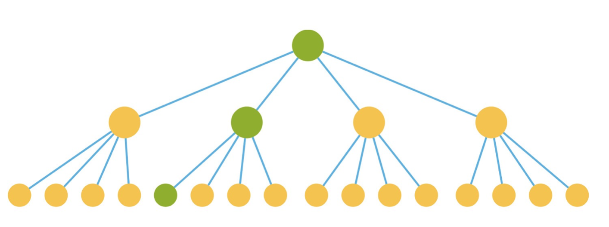
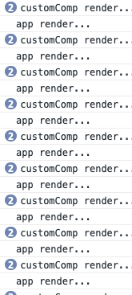
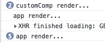
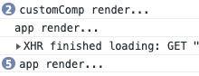
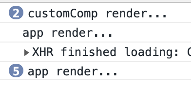

import useEffectGif from './useEffectGif.gif'
import useLayoutEffectGif from './useLayoutEffectGif.gif'

# React Hooks

React 16.8 版本中加入了一个重要的特性 - Hooks，这个特性让你不必依赖 Class Compnents 也可以使用 state、生命周期等其他特性。

## useState hooks

让你不必依赖 Class Compnents 使用 state

在 hooks 之前，使用 state 必须 Class Components

```jsx
import React, { Component } from 'react';

class App extends Component {
  constructor (props) {
    super(props)
    this.state = {
      count: 0,
    };
  }
  render () {
    return (
      <div>
        <h3>hello, hooks!</h3>
        { this.state.count }
        <button onClick={this.setCount.bind(this, this.state.count + 1)}>Increment</button>
      </div>
    );
  }

  setCount = (count) => this.setState({
    count,
  })
}

export default App;
```

利用 hooks，Function Components 也可以使用 state

> Function Components 之前被成为 Stateless Components

```js
import React, { useState } from 'react';

function App () {
  // useState() 参数是这个 state 的初始值
  // 返回一个数组，第一个元素是 state 当前值，第二个元素是设定这个当前值的方法
  const [count, setCount] = useState(0);
  return (
    <div>
      <h3>hello, hooks!</h3>
      { count }
      <button onClick={() => setCount(count + 1)}>Increment</button>
    </div>
  );
}

export default App;
```

## useEffect hooks

让你不必依赖 Class Component 使用组件的生命周期

在 Hooks 之前，通常使用 Class Component，在声明周期钩子中执行渲染之外的一些工作，如加载数据、订阅事件、手动修改 DOM 等等

```js
import React, { Component } from 'react';

class App extends Component {

  constructor (props) {
    super(props);
    this.state = {
      count: 0
    };
  }

  componentDidMount () {
    document.title = `You clicked ${this.state.count} times`;

    this.timer = setInterval(() => {
      this.setState({
        count: this.state.count + 1
      })
    }, 1000)
  }

  componentDidUpdate () {
    document.title = `You clicked ${this.state.count} times`;
  }

  componentWillUnmount () {
    clearInterval(this.timer)
  }

  render () {
    return (
      <div>
        <h3>hello, hooks!</h3>
        { this.state.count }
      </div>
    );
  }
}

export default App;
```

上面的组件，渲染之外需要额外处理两件事：1、调用浏览器 API 设置 title 使 title 与 count 的变化同步。 2、设定定时器每隔 1s 增加一次 count 的值。这些渲染之外需要处理的工作，统称为副作用 - `side effects`

使用 Hooks，可以更加优雅的处理 `side effects`：

```js
import React, { useState, useEffect } from 'react';

function App () {
  let [count, setCount] = useState(0);
  // useEffect() 第一个参数是这个 effect 执行的方法，每次渲染之后调用
  useEffect(() => {
    document.title = `You clicked ${count} times`;
  });
  // 这个方法返回值如果是也函数，则是这个 effect cleanup 方法，在下一次渲染之前或者组件 unmount 之前调用
  useEffect(() => {
    let timer = setInterval(() => {
      setCount(count + 1);
    }, 1000);
    return () => clearInterval(timer);
  });
  return (
    <div>
      <h3>hello, hooks!</h3>
      { count }
    </div>
  );
}

export default App;
```

useEffect 与 Class Components 的生命周期钩子相比：

- Class Components 的生命周期钩子中常常包含了不相关的逻辑，而相关的逻辑又被分离到各个钩子中。例如上面的案例，设定 `document.title` 的逻辑被拆散分离到 `componentDidMount` 和 `componentDidUpdate` 钩子中，设定定时器的逻辑又被分离到 `componentDidMount` 和 `componentWillUnmount` 钩子中。
- useEffect 将相同逻辑放到通过一个 effect 中。很好的分离了用户的关注点。

**effects 默认在每次 update 操作中都会运行**，无论是第一次渲染的 mount 操作，还是之后每次渲染的 update 操作。这样的好处：

- effects 表现的更像渲染结果的一部分，使用者不需要再去关心 mount 和 update 这些术语
- 可以避免很多的 bug，例如：

聊天应用中在 componentDidMount 订阅聊天 API 去更新一个 friend 的在线状态

```js
 componentDidMount() {
    ChatAPI.subscribeToFriendStatus(
      this.props.friend.id,
      this.handleStatusChange
    );
  }

  componentWillUnmount() {
    ChatAPI.unsubscribeFromFriendStatus(
      this.props.friend.id,
      this.handleStatusChange
    );
  }
```

但是当 friend 这个 prop 发生改变，在线状态订阅的依然是上一个 friend 的在线状态。在 Class Components 中，需要这么处理：

```js
  componentDidMount() {
    ChatAPI.subscribeToFriendStatus(
      this.props.friend.id,
      this.handleStatusChange
    );
  }

  componentDidUpdate(prevProps) {
    // Unsubscribe from the previous friend.id
    ChatAPI.unsubscribeFromFriendStatus(
      prevProps.friend.id,
      this.handleStatusChange
    );
    // Subscribe to the next friend.id
    ChatAPI.subscribeToFriendStatus(
      this.props.friend.id,
      this.handleStatusChange
    );
  }

  componentWillUnmount() {
    ChatAPI.unsubscribeFromFriendStatus(
      this.props.friend.id,
      this.handleStatusChange
    );
  }
```

如果使用 useEffect，则处理起来简便优雅的多，更重要的是，避免了类似 bug 的发生

```js
function FriendStatus(props) {
  // ...
  useEffect(() => {
    // ...
    ChatAPI.subscribeToFriendStatus(props.friend.id, handleStatusChange);
    return () => {
      ChatAPI.unsubscribeFromFriendStatus(props.friend.id, handleStatusChange);
    };
  });
}
```

但是有时候，出于性能优化的考虑，需要跳过一些代价昂贵的一些 effect，这时候可以利用 useState 的第二个参数，在第二个参数中声明这个 effect 依赖的 state 和 prop

```js
useEffect(() => {
  document.title = `You clicked ${count} times`;
}, [count]);
```

> 当传递一个**空数组**，表示这个 effect 没有任何依赖，只会在 mounted 和 willUnmount 声明周期中执行

## 自定义 hooks

提供 [Higher-Order Components](https://reactjs.org/docs/higher-order-components.html) 和 [Render Props](https://reactjs.org/docs/render-props.html) 之外的一种新的复用逻辑的方式

例如一个统计页面 PV 的任务，每个页面都需要在页面 mounted 时记录进入页面，willUnmounted 时记录退出页面：

```js
import React, { useEffect } from 'react';

function Home () {
  useEffect(() => {
    console.log(`page load: home`);
    return () => console.log(`page unload: home`);
  }, []);
  return (
    <div>
      <h3>hello, hooks!</h3>
    </div>
  );
};

function Main () {
  useEffect(() => {
    console.log(`page load: main`);
    return () => console.log(`page unload: main`);
  }, []);
  return (
    <div>
      <h3>hello, hooks!</h3>
    </div>
  );
};
```

对于这种可以复用的逻辑，可以抽取出来到一个函数作为自定义 hooks，自定义 hooks 就是一个普通的函数，可以有入参和返回值。这个函数中可以使用其他 hooks 如 useState、useEffect，只要遵循 hooks 使用规范，只在函数的最顶层使用 hooks 即可：

```js
import React, { useEffect } from 'react';

function usePV (title) {
  useEffect(() => {
    console.log(`page load: ${title}`);
    return () => console.log(`page unload: ${title}`);
  }, [title]);
};

function Home () {
  usePV('home');
  return (
    <div>
      <h3>hello, hooks!</h3>
    </div>
  );
};

function Main () {
  usePV('main');
  return (
    <div>
      <h3>hello, hooks!</h3>
    </div>
  );
};

export default Home;
```

## hooks 使用规则

- 只在函数的最顶层使用 hooks，不要在条件、循环、嵌套函数代码块中使用 hooks
- 只在 React 函数（包括 Function Components 和 Custom Hooks）中使用 hooks，不要在普通函数中使用 hooks

解释：当在一个组件中使用了多个 useState 或者 useEffect 时，React 并没有设计在使用时需要传递一个对应的 key，让 React 知道该返回哪个 state 或者执行哪个 effect（如果这么设计，API 会复杂，并且这个 key 可能会冲突）。实际上 React 依赖在 useState、useEffect 调用的顺序来决定返回对应的 state 或者 执行对应的 effect：

当 useState、useEffect 在条件、循环、内嵌函数调用时，调用顺序不可控制，React 返回对应 state 或者执行对应的 effect 就会出错。

```js
/* eslint-disable */
import React, { useState, useEffect } from 'react';

function App () {
  let [count, setCount] = useState(0);
  let hello;
  let world;
  if (Math.random() > 0.5) {
    [hello] = useState('hello');
    useEffect(() => console.log('hello'));
  }
  [world] = useState('world');
  useEffect(() => console.log('world'));
  return (
    <div>
      <h3>{hello}, {world}!</h3>
      <button onClick={() => setCount(count + 1)}>{ count }</button>
    </div>
  );
};

export default App;
```

## useContext hooks

让你不必依赖 Class Components 的 static contextType 或者嵌套 `<Context.Consumer>` 使用 context。

hooks 之前，使用 context 常常使用 Class Components 的 static contextType 来实现：

```js
import React, { createContext, Component } from 'react';

const ThemeContext = createContext('light');

class Button extends Component {
  static contextType = ThemeContext;
  render () {
    return (
      <button
        style={this.context === 'dark'
          ? {color: '#fff', backgroundColor: '#000'}
          : {color: '#000', backgroundColor: '#fff'}}>
        { this.props.children }
      </button>
    )
  }
}

function Toolbar () {
  return (
    <div>
      <Button>按钮</Button>
    </div>
  );
}

function App () {
  return (
    <ThemeContext.Provider value='dark'>
      <div>
        <h3>hello, world</h3>
        <Toolbar />
      </div>
    </ThemeContext.Provider>
  );
};

export default App;
```

Function Components 中使用 context 略微复杂一点，需要嵌套 `<Context.Consumer>`：

```js
import React, { createContext } from 'react';

const ThemeContext = createContext('light');

function Button (props) {
  return (
    <ThemeContext.Consumer>
      { context => <button style={context === 'dark' ? {color: '#fff', backgroundColor: '#000'} : {color: '#000', backgroundColor: '#fff'}}>{ props.children }</button> }
    </ThemeContext.Consumer>
  );
}

function Toolbar () {
  return (
    <div>
      <Button>按钮</Button>
    </div>
  );
}

function App () {
  return (
    <ThemeContext.Provider value='dark'>
      <div>
        <h3>hello, world</h3>
        <Toolbar />
      </div>
    </ThemeContext.Provider>
  );
};

export default App;
```

利用 useContext hooks，访问 context 则简便的多：

```js
import React, { createContext, useContext } from 'react';

const ThemeContext = createContext('light');

function Button (props) {
  let context = useContext(ThemeContext);
  return (
    <button style={context === 'dark' ? {color: '#fff', backgroundColor: '#000'} : {color: '#000', backgroundColor: '#fff'}}>{ props.children }</button>
  );
}

function Toolbar () {
  return (
    <div>
      <Button>按钮</Button>
    </div>
  );
}

function App () {
  return (
    <ThemeContext.Provider value='dark'>
      <div>
        <h3>hello, world</h3>
        <Toolbar />
      </div>
    </ThemeContext.Provider>
  );
};

export default App;
```

## useReducer hooks

让你能够使用 reducer 管理复杂的 state

```js
import React, { useState, useReducer } from 'react';

function reducer (state, action) {
  switch (action.type) {
    case 'add':
      return [...state, action.text];
    case 'del':
      return state.filter((item, index) => index !== action.index);
    default:
      return state;
  }
}

function App () {
  let [text, setText] = useState('');
  let [list, dispatch] = useReducer(reducer, []);
  return (
    <>
      <input type={'text'} value={text}
        onChange={(ev) => setText(ev.target.value)}
        onKeyPress={(ev) => {
          if ((ev.which || ev.keyCode) === 13 && text) {
            dispatch({type: 'add', text});
            setText('');
          }
        }} />
      <ol>
        {list.map((item, index) => <li key={index} onClick={() => dispatch({type: 'del', index})}>{item}</li>)}
      </ol>
    </>
  );
};

export default App;
```

## useRef hooks

在 React Refs API 中，拿到一个 DOM 节点或者组件实例（只有 Class Components 才有组件实例）的引用，可以有三种方式：

- 在 Class Components 中，可以使用一个字符串类型的 ref

React 自动将 DOM 节点引用设置到 this.refs 中。字符串类型 ref 只能在 Class Components 中使用

```js
import React, { Component } from 'react';

class App extends Component {
  render () {
    return (
      <>
        <input type={'text'} ref={'inputEl'} />
        <button onClick={this.submit}>submit</button>
      </>
    );
  }

  submit = () => {
    console.log(this.refs.inputEl.value);
  }
}

export default App;
```

- 可以使用一个函数类型的 ref-setter 函数

React 在 DOM 或者组件挂载时调用 ref-setter 函数，传参是这个 DOM 节点或者组件的实例。在 DOM 或者组件卸载时同样调用 ref-setter 函数，传参是 null

```js
import React, { Component } from 'react';

class App extends Component {
  render () {
    return (
      <>
        <input type={'text'} ref={(el) => this.inputEl = el} />
        <button onClick={this.submit}>submit</button>
      </>
    );
  }

  submit = () => {
    console.log(this.inputEl.value);
  }
}

export default App;
```

- 还可以使用一个 React.createRef() 创建的对象

React.createRef() 的返回值其实就是一个含有一个名为 current 的 property 的普通对象，React 自动将 DOM 节点或者组件实例设置到这个对象的 current 属性上

```js
import React, { Component, createRef } from 'react';

class App extends Component {
  constructor (props) {
    super(props)
    this.inputRef = createRef(null)
  }
  render () {
    return (
      <>
        <input type={'text'} ref={this.inputRef} />
        <button onClick={this.submit}>submit</button>
      </>
    );
  }

  submit = () => {
    console.log(this.inputRef.current.value);
  }
}

export default App;
```

在 Function Components 中，可以使用 useRef hooks，useRef 返回一个 React.createRef() 对象：

```js
import React, { useRef } from 'react';

function App () {
  let inputRef = useRef(null);
  return (
    <>
      <input type={'text'} ref={inputRef} />
      <button onClick={() => console.log(inputRef.current.value)}>submit</button>
    </>
  );
};

export default App;
```

然后，useRef 的做作用远远不只是获得 DOM 节点或者组件实例的引用。useRef 可以在 Function Components 中获得一种类似于 Class Components 中实例属性(instance fields)的用法。因为 useRef() 在每次渲染时返回的是同一个普通对对象，修改这个对象的内容不会引起重新渲染。

假设一种场景，服务器需要监听页面的存活情况，应用需要每隔一秒通知服务器一次，并且通知服务器运行了多长时间，这是可以使用 useRef() 保存系统启动时间

```js
import React, { useState, useRef, useEffect } from 'react';

function App () {
  let [count, setCount] = useState(0);
  let startTimeRef = useRef(Date.now());
  useEffect(() => {
    let timer = setInterval(() => {
      console.log(`has been running ${Date.now() - startTimeRef.current}ms`);
    }, 1000);
    console.log('timer', timer);
    return () => clearInterval(timer);
  });
  return (
    <div>
      <p>count: {count}</p>
      <button onClick={() => setCount(count + 1)}>inc</button>
    </div>
  );
}

export default App;
```

## useImperativeHandle hooks

在某些极少数场景中，父组件需要访问自组件内部的某个 DOM 节点。尽管这种做法破坏了组件的封装，但是对于完成输入框的聚焦、DOM 节点位置和尺寸的测量很实用。

最先想到的是在子组件上使用一个 ref，但是这不是一种理想的解决方案，因为并不能直接拿到 DOM 节点，而是拿到的是一个子组件实例，由于子组件是一个 Function Components，因此这种方式不适用：

```js
import React, { Component, createRef } from 'react';

class CustomInput extends Component {
  render () {
    return (
      <input ref={'input'} type="text" />
    );
  }
}

function App () {
  let inputRef = createRef(null);
  function focus () {
    inputRef.current.refs.input.focus();
  }
  return (
    <div>
      <CustomInput ref={inputRef} />
      <button onClick={focus}>focus</button>
    </div>
  );
}

export default App;
```

另外一种方式可以透传一个 ref 到子组件，这种方式子组件不再局限于 Class Components，只不过这个 ref prop 的名字不能再叫做 ref：

```js
import React, { createRef } from 'react';

function CustomInput (props) {
  return (
    <input ref={props.customRef} type="text" />
  );
}


function App () {
  let inputRef = createRef(null);
  function focus () {
    inputRef.current.focus();
  }
  return (
    <div>
      <CustomInput customRef={inputRef} />
      <button onClick={focus}>focus</button>
    </div>
  );
}

export default App;
```

React 16.3 版本开始提供一个透传 ref 的 API，可以更简介优雅的实现这种需求：

```js
import React, { createRef, forwardRef } from 'react';

const CustomInput = forwardRef((props, ref) => {
  return (
    <input ref={ref} type="text" />
  );
})


function App () {
  let inputRef = createRef(null);
  function focus () {
    inputRef.current.focus();
  }
  return (
    <div>
      <CustomInput ref={inputRef} />
      <button onClick={focus}>focus</button>
    </div>
  );
}

export default App;
```

以上这些方法都要求在子组件中添加逻辑，如果对子组件完全没有控制权，只能采用下下选方案：ReactDOM.findDOMNode()，ReactDOM.findDOMNode API 在严格模式下已经废弃，这里不再介绍。

useImperativeHandle() 与 forwardRef() API 搭配使用，可以在子组件中对父组件暴漏自定义内容，而不仅仅局限于 DOM 节点：

```js
import React, { createRef, forwardRef, useImperativeHandle, useRef } from 'react';

const CustomInput = forwardRef((props, ref) => {
  let inputRef = useRef(null)
  useImperativeHandle(ref, () => ({
    inputEl: inputRef.current,
    focus: () => inputRef.current.focus()
  }));
  return (
    <input ref={inputRef} type="text" />
  );
})


function App () {
  let selfRef = createRef(null);
  function focus () {
    selfRef.current.focus();
    // selfRef.current.inputEl.focus();
  }
  return (
    <div>
      <CustomInput ref={selfRef} />
      <button onClick={focus}>focus</button>
    </div>
  );
}

export default App;
```

## useCallback hooks

React 中某个组件实例的 state 变更时，React 默认会重新渲染以这个组件实例为根的整个组件子树。如下图：假设改变第一级组件的一个 state，这个 state 作为 props 将变更传递到第二级组件和第三级的某个组件。但是由于第一级组件是所有组件的公共祖先节点，因此所有组件都会重新渲染：



```js
import React, { useEffect, useState } from 'react';

const CustomCompo = function () {
  useEffect(() => {
    console.log('customComp render...')
  });
  return <div></div>;
}


function App () {
  let [count, setCount] = useState(0);
  useEffect(() => {
    console.log('app render...');
    setTimeout(() => setCount(count + 1), 1000);
  })
  return (
    <div>
      { count }
      <CustomCompo />
      <CustomCompo />
    </div>
  );
}

export default App;
```



为了减少不必要的渲染，节省性能损耗，React 为 Class Components 提供一个 shouldComponentUpdate() 生命周期钩子，shouldComponentUpdate() 让 React 知道组件的输出是否收到当前 state、props 的影响，当 shouldComponentUpdate() 返回 true 时，组件会重新渲染，否则组件不重新渲染。并且基类 Component shouldComponentUpdate() 总是返回 true，而 PureComponent shouldComponentUpdate() 中会对当前的 state、props 和之前的 state、props 做一次浅比较，没有更新则返回 false，有更新返回 true。

> PureComponent 中的 Pure 和 PureFunction 中的 Pure 是同一个意思，输出只取决于输入，同样的输入总是得到同样的输出

```js
import React, { PureComponent, useEffect, useState } from 'react';

class CustomCompo extends PureComponent {
  componentDidMount () {
    console.log('customComp render...');
  }
  componentDidUpdate () {
    console.log('customComp render...');
  }
  render () {
    return <div></div>;
  }
}

function App () {
  let [count, setCount] = useState(0);
  useEffect(() => {
    console.log('app render...');
    setTimeout(() => setCount(count + 1), 1000);
  })
  return (
    <div>
      { count }
      <CustomCompo />
      <CustomCompo />
    </div>
  );
}

export default App;
```



Function Component 可以使用 React.memo() 实现类似效果，React.memo() 是一个高阶组件，默认对组件的 props 进行浅比较。也可以用一个自定义规则比较函数作为第二个参数：

```js
import React, { memo, useEffect, useState } from 'react';

const CustomCompo = memo(function () {
  useEffect(() => {
    console.log('customComp render...');
  });
  return <div></div>;
})


function App () {
  let [count, setCount] = useState(0);
  useEffect(() => {
    console.log('app render...');
    setTimeout(() => setCount(count + 1), 1000);
  })
  return (
    <div>
      { count }
      <CustomCompo />
      <CustomCompo />
    </div>
  );
}

export default App;
```



了解了 PureComponent 和 React.memo() 通过浅比较来避免重复渲染带来的性能损耗，但是在无论使用 Function Components 还是 Function Components 都不可避免使用到大量的行内函数作为 props 传递到子组件，每次渲染，都会生成新的函数，通过浅比较的结果是这个 props 发生变化，需要重新渲染组件。

```js
import React, { memo, useEffect, useState } from 'react';

const CustomCompo = memo(function () {
  useEffect(() => {
    console.log('customComp render...');
  });
  return <div></div>;
})


function App () {
  let [count, setCount] = useState(0);
  useEffect(() => {
    console.log('app render...');
    setTimeout(() => setCount(count + 1), 1000);
  })
  return (
    <div>
      { count }
      <CustomCompo onXxx={() => {}} />
      <CustomCompo onXxx={() => {}} />
    </div>
  );
}

export default App;
```


useCallback() hooks 的目的就在于缓存了每次渲染时行内函数的实例，当依赖项没有变化时，总是返回缓存的行内函数实例，配合 PureComponent 或者 React.memo() 来避免比必要的渲染：

```js
import React, { memo, useEffect, useState, useCallback } from 'react';

const CustomCompo = memo(function () {
  useEffect(() => {
    console.log('customComp render...');
  });
  return <div></div>;
})


function App () {
  let [count, setCount] = useState(0);
  useEffect(() => {
    console.log('app render...');
    setTimeout(() => setCount(count + 1), 1000);
  })
  return (
    <div>
      { count }
      <CustomCompo onXxx={useCallback(() => {}, [])} />
      <CustomCompo onXxx={useCallback(() => {}, [])} />
    </div>
  );
}

export default App;
```



useMemo() hooks 是 useCallback() 的通用版，缓存的值不再局限于函数，可以是任何值。useCallback(fn, deps) 相当于 useMemo(() => fn, deps)

```js
import React, { memo, useEffect, useState, useMemo } from 'react';

const CustomCompo = memo(function () {
  useEffect(() => {
    console.log('customComp render...');
  });
  return <div></div>;
})


function App () {
  let [count, setCount] = useState(0);
  useEffect(() => {
    console.log('app render...');
    setTimeout(() => setCount(count + 1), 1000);
  })
  return (
    <div>
      { count }
      <CustomCompo onXxx={useMemo(() => () => {}, [])} />
      <CustomCompo onXxx={useMemo(() => () => {}, [])} />
    </div>
  );
}

export default App;
```

## useLayoutEffect hooks

useLayoutEffect() 与 useEffect() 类似，都是在每次渲染之后执行副作用处理，二者不通之处是，useLayoutEffect() 在渲染之后以同步的方式触发，而 useEffect() 以异步的方式触发。大部分情况下都应该使用 useEffect() 来避免同步操作阻塞渲染，但是有些需要对 DOM 进行测量的工作需要使用 useLayoutEffect() 在浏览器有机会绘制之前做一些修改。一个典型的案例是一个自跟随目标元素的 popper，如果使用 useEffect()，刷新是 popper 位置会闪烁：

```js
import React, { useEffect, useCallback, useRef, useState } from 'react';
import './App.css'

function App () {
  let [position, setPosition] = useState({top: 300, left: 300});
  let startTouch = useRef(null);
  let onMouseDown = useCallback(({clientX, clientY}) => startTouch.current = {
    clientX, clientY, positionX: position.left, positionY: position.top,
  }, [position]);
  let onMouseMove = useCallback(({clientX, clientY}) => startTouch.current && setPosition({
    top: clientY - startTouch.current.clientY + startTouch.current.positionY,
    left: clientX - startTouch.current.clientX + startTouch.current.positionX,
  }), []);
  let onMouseUp = useCallback(() => startTouch.current = null, []);
  useEffect(() => {
    document.addEventListener('mousemove', onMouseMove);
    document.addEventListener('mouseup', onMouseUp);
    return () => {
      document.removeEventListener('mousemove', onMouseMove);
      document.removeEventListener('mouseup', onMouseUp);
    }
  }, [onMouseMove, onMouseUp]);

  let targetRef = useRef(null);
  let popperRef = useRef(null);
  useEffect(() => {
    let rect = targetRef.current.getBoundingClientRect();
    popperRef.current.style.cssText = `top: ${rect.top}px; left: ${rect.left + rect.width / 2}px;`;
  }, [position]);
  return (
    <div>
      <div
        className={'target'}
        ref={targetRef}
        style={{position: 'fixed', top: position.top, left: position.left}}
        onMouseDown={onMouseDown}>Drag me!</div>
      <div
        className={'popper'}
        ref={popperRef}>
        I'm Popper!
      </div>
    </div>
  );
}

export default App;
```


而使用 useLayoutEffect() 可以完美规避这个问题：

```js
import React, { useEffect, useLayoutEffect, useCallback, useRef, useState } from 'react';
import './App.css'

function App () {
  let [position, setPosition] = useState({top: 300, left: 300});
  let startTouch = useRef(null);
  let onMouseDown = useCallback(({clientX, clientY}) => startTouch.current = {
    clientX, clientY, positionX: position.left, positionY: position.top,
  }, [position]);
  let onMouseMove = useCallback(({clientX, clientY}) => startTouch.current && setPosition({
    top: clientY - startTouch.current.clientY + startTouch.current.positionY,
    left: clientX - startTouch.current.clientX + startTouch.current.positionX,
  }), []);
  let onMouseUp = useCallback(() => startTouch.current = null, []);
  useEffect(() => {
    document.addEventListener('mousemove', onMouseMove);
    document.addEventListener('mouseup', onMouseUp);
    return () => {
      document.removeEventListener('mousemove', onMouseMove);
      document.removeEventListener('mouseup', onMouseUp);
    }
  }, [onMouseMove, onMouseUp]);

  let targetRef = useRef(null);
  let popperRef = useRef(null);
  useLayoutEffect(() => {
    let rect = targetRef.current.getBoundingClientRect();
    popperRef.current.style.cssText = `top: ${rect.top}px; left: ${rect.left + rect.width / 2}px;`;
  }, [position]);
  return (
    <div>
      <div
        className={'target'}
        ref={targetRef}
        style={{position: 'fixed', top: position.top, left: position.left}}
        onMouseDown={onMouseDown}>Drag me!</div>
      <div
        className={'popper'}
        ref={popperRef}>
        I'm Popper!
      </div>
    </div>
  );
}

export default App;
```


