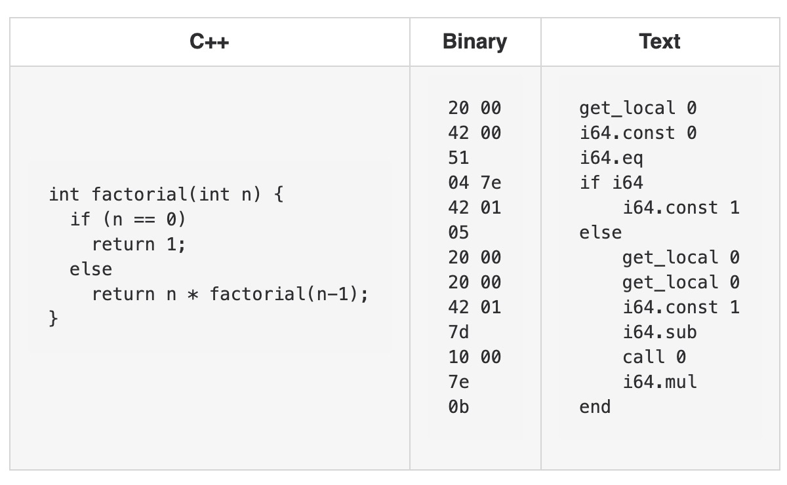

[WebAssembly](https://webassembly.org/) 不是一门编程语言，而是一种编码方式，具有紧凑的二进制格式。它由 C/C++ 等高级语言编译而来，可以在浏览器环境中与 JavaScript 配合，以接近原生的性能运行。

WebAssembly 的目的不是取代 Javascript，二者相互配合相辅相成，WebAssembly 能够弥补 Javascript 性能上的不足，Javascript 能够延伸 WebAssembly 的灵活性。WebAssembly 在浏览器端和 Node 端的应用使用需要使用 Javascript API，运行期间 WebAssembly 代码和 Javascript 代码可以共享数据、相互调用。

## 从 JavaScript 的性能说起

### JavaScript 的诞生：设计总十天，流行二十年

JavaScript 在 1995 年诞生于 [Brendan Eich](https://brendaneich.com/) 之手。从诞生开始就直接进入全球最流行编程语言行列，20 多年来稳定霸占全球最流行编程语言排行榜 TOP3[^1]。

与 JavaScript 炙手可热的流行势头形成鲜明对比的是它的设计时间仅仅是 10 天。这里面肯定有故事，[这里](https://brendaneich.com/2008/04/popularity/)是 Brendan Eich 的第一视角阐述了这段历史。


1994 年 Netscape 公司发布世界上第一款成熟的浏览器 - Navigator v0.9，获得了巨大的成功，在当时的互联网上掀起轩然大波。Navigator v0.9 有能力让开发者接触到任何操作系统平台的用户，Netscape 公司将浏览器-服务器组合视为一种新型的分布式操作系统，微软也将其视为潜在威胁，试图收购失败后，紧随其后发力追赶。

但是 Navigator v0.9 的功能还仅限于展示 html，没有自己的编程语言，不能与用户互动。比如在页面上输入用户名密码执行登录操作，浏览器不能够知道用户输入的用户名和密码是不是空的，合不合规则，只能提交到服务器去校验。1995 年的网络环境速度慢，花费高，这种交互方式无论是成本上还是体验上都不够好。Netscape 公司迫切的需要在 Navigator 中嵌入脚本程序，使得浏览器可以与网页互动。

Netscape 公司有两种选择：采用现有的编程语言（如 Perl、Python、Tcl、Scheme 等）或者重新发明一套新的语言。两种方案各有利弊，Netscape 公司管理层一时争执不断，难下定论。在早期，Netscape 公司偏向于采用现有的编程语言，于是 Brendan Eich 在这个时候登场了。

1995 年 4 月，Netscape 招募 Brendan Eich 进入公司，研究将 Scheme 语言作为网页脚本语言的可能性。但是之后不久，Netscape 公司与 SUN 公司达成合作，而 SUN 公司正在着力推动他们的 Java 编程语言，Netscape 公司和 SUN 公司顺理成章的谈判将 Java 嵌入到 Navigator 中。Brendan Eich 是 Scheme 语言的忠实信徒，此时就很尴尬，用他自己的话说，他是被 Netscape 公司用 “Come and do Scheme in Netscape” 这句话诱骗进公司的。

Netscape 决定将 Java 嵌入到 Navigator 中后，又陷入了另外一个争论：是不是需要 Java 之外的另一种语言？争论之后的最终结论是：需要另外一门比 Java 简单，可以让新手、业余编程人员和设计师能够快速上手，但是必须看起来像 Java，因此排除了 Perl、Python、Tcl、Scheme 等现有编程语言。


Brendan Eich 被指定为“简化版Java语言”的设计师，Brendan Eich 只花了 10 天时间设计出 JavaScript 来应付公司的任务，Brendan Eich 没有料到这门语言未来会如此流行。JavaScript 并不能让 Brendan Eich 感到自豪，但是也不缺乏亮点。Brendan Eich 认为类 Scheme 的将函数作为一等公民、类 Self 的原型继承都是令他满意的点，但是受 Java 影响的 y2k 日期 bug 和 区分原始类型和对象类型（e.g., string vs. String）则是不幸的。

### 性能大战的杀手锏 - JIT

想要让计算机按照人类的想法工作，需要将人类的语言翻译成计算机能够理解的机器语言。JavaScript 等高级编程语言尽管不是人类日常交流用到的语言，但是它们都是按照人类的认知去设计的，因此也是人类语言，需要翻译成机器语言才能够被计算机理解执行。JavaScript 引擎的任务是将 JavaScript 语言转化成机器语言。在编程中，把编程语言翻译成机器语言有两种方式：使用解释器（interpreter）或者使用编译器（compiler）。

解释器的翻译过程是在运行时一行一行的翻译的，而编译器是在运行之前一次性翻译完成的，二者各有利弊：

- 解释器的优势是启动快，因为代码不需要经历编译步骤就可以立刻执行
- 编译器的优势是运行快，因为重复执行的代码不需要重复翻译，并且编译器有时间代码进行优化

最初的浏览器 JavaScript 引擎都是使用解释器来执行 JavaScript 代码的，因为 JavaScript 设计初衷是面向“新手、业余编程人员和设计师”，让他们了解编译是残忍的，并且解释器看起来更快。

随着 Web 应用的应用场景越来越丰富，越来越复杂，解释器运行时的低效率也暴露出来。2008 年开始，一场称为性能大战在各浏览器厂商之间展开，Google Chrome 率先在自家的 V8 引擎中引入 JIT（just-in-time） 编译器。JIT，顾名思义，是在代码运行时悄悄编译部分执行频率高的代码并且保存，在下次再次执行这段代码时直接读取保存的编译结果。JIT 是介于解释器和编译器之间的抉择，有了 JIT 技术的加持，JavaScript 引擎能够快速启动执行 JavaScript 代码的同时，让 JavaScript 的执行速度提高 10 倍以上。


JIT 技术在 JavaScript 引擎中添加了监视器，监视器时刻监听着代码的执行，并且记录下代码执行的次数和变量类型。代码首次执行时，仅仅使用翻译器处理；当代码执行次数变多时，监视器将代码标记为 warm 并送到基础编译器（Baseline compiler）处理；当代码执行次数更多时，监视器将代码标记为 hot 并送到优化编译器（Optimizing compiler）处理。

当一个函数被标记为 warm 时，基础编译器会对函数中的每一行代码逐行编译，编译结果生成一个桩（stub），使用行号和变量类型索引。下次执行同一行代码时，如果使用到的变量的类型也相同，则可以直接拉取这个桩保存的编译结果。基础编译器在编译的同时，也会做一些优化，但是并不会花费太多时间做深度的优化。

当一个函数被标记为 hot 时，值得花更多时间做深度优化。优化编译器会对整个函数做一次编译并且深度优化。下次执行同一个函数时，如果函数使用到的变量的类型也相同，则可以直接拉取这个优化后的函数版本。

由于 JavaScript 的变量类型是在运行时动态确定的，不同的数据类型可能编译得到完全不同的结果。例如 `+` 操作符，字符串拼接和整数求和是两个完全不同的操作。基础编译器的处理方式是根据使用到的变量不同数据类型的组合编译成多个桩，运行时根据实际的数据类型选择不同的桩。优化编译器的处理方式是根据监听器收集的信息提前假设变量的类型编译成一个优化后的版本，运行时检查变量是否满足假设，如果满足选择优化后的版本执行，如果不满足退回到基础编译器或者翻译器处理，并且丢弃优化版本。

<!-- 退优化 -->

### 更快更强的 webassembly

CPU 构成中的主要部件：

- 负责计算和逻辑的 ALU
- 负责短期记忆的 registers
- 负责长期记忆的 RAM

assembly 是机器码的文本标注，方便人类理解机器码，机器码中的“句子”称为“指令”。

<!-- 010101 001 010 -->
<!-- ADD R1 R2 -->
CPU 的结构不同：ALU 能够识别和执行的操作不同、寄存器的个数不同、RAM 的寻址范围不同
=> CPU 的指令集不同
=> 能够运行的机器码不同
以上都是真实的物理机

字节码 - 虚拟机，虚拟指令，字节码 概念上的


程序最终能够被硬件系统识别并执行，需要编译成与硬件系统 CPU 架构相匹配的机器码。常见的 CPU 架构有 x86、AMD64、ARM、Power PC 等，不同的架构的 CPU 拥有不同的指令集，而机器码与 CPU 指令是一一对应的，因此同一套程序，需要运行在某一种硬件系统，需要编译成这个硬件系统 CPU 架构对应的机器码。

<!-- 不同的指令集为什么决定了不同的机器码，这里还可以详细说明 -->

传统架构的编译器（如 gcc），编译器需要同时关心程序使用的高级编程语言和程序运行硬件系统，因此每种高级编程语言都需要特定的编译器，编译器要实现源码到不同硬件系统的转换。


LLVM 架构的编译器（如 Clang），分成编译器前端和编译器后端，编译器前端只需要根据源代码生成 IR - intermediate representation，编译器后端负责根据 IR 生成能够被不同硬件系统识别并运行的机器码。编译器后端抹平了不同 CPU 架构，这样每个高级语言编译器只需要实现源码到 IR 的转换，不需要关心程序运行具体的硬件系统。


<!-- 下面这段话需要改 -->

WebAssembly 就是一种 WebAssembly 虚拟机识别的字节码格式，浏览器厂商负责规范实现 WebAssembly 虚拟机，这样各种高级语言编译出 WebAssembly 字节码就能够在各厂商的浏览器中运行。与 js 相比，WebAssembly 具有以下优势：

- 体积小：一样的逻辑，用 WebAssembly 字节码描述的 wasm 文件，比用文本描述的 js 文件体积要小很多
- 性能高：WebAssembly 字节码和底层机器码很相似可快速装载运行，js 需要先解释然后执行
- 兼容性好：WebAssembly 字节码是非常底层的字节码规范，很少变动，可能出现兼容性问题的地方在于 JS 和 WebAssembly 桥接的 JS 接口

http://mbebenita.github.io/WasmExplorer/

这个可以在线编辑生成 wasm

https://hacks.mozilla.org/2017/02/a-crash-course-in-just-in-time-jit-compilers/

[jslinux](https://bellard.org/jslinux/)

https://hacks.mozilla.org/2017/02/a-crash-course-in-just-in-time-jit-compilers/

[Brendan Eich - Javascript 简史](https://youtu.be/GxouWy-ZE80)

[Brendan Eich 2008 年自述](https://brendaneich.com/2008/04/popularity/)

[Brendan Eich - JavaScript at 20 - Curry On](https://www.youtube.com/watch?v=83_rC1FesOI)

[这篇文章的分析也很透彻](https://cheogo.github.io/learn-javascript/201709/runtime.html)

[他的 ppt](https://brendaneich.com/wp-content/uploads/2017/12/dotJS-2017.pdf)

Javascript 在 1995 年问世之初，设计初衷并不是为了执行起来快。在他前 10 个年头，它的执行速度也确实不快。

在 2008 年，性能之战开始了。多款浏览器都加上了即时编译器（Just-in-time Compiler），即 JIT。当 JavaScript 代码运行时，JIT 能够观察其运行模式，然后根据这些模式让代码跑的过快。

乘着这波性能提升的节奏，JavaScript 也开始涉足之前想都不敢想的领域，比如催生了用于服务端编程的 Node.js 。

现在，WebAssembly 极可能是下一个性能转折点。

[讲 WebAssembly 技术产生背景的](https://www.jianshu.com/p/9b67549b259d)

下载 - 解析 - 执行的时间分析

- 2012 年，Mozilla 的工程师 Alon Zakai 着手创建 Emscripten 编译器项目，目标是将 C / C++ 语言编译成 asm.js - 一种 JavaScript 变体代码
- 之后 Google 开发了 Portable Native Client，是一种能让浏览器运行C/C++代码的技术
- Google, Microsoft, Mozilla, Apple等几家大公司一起合作开发了一个面向Web的通用二进制和文本格式的项目，那就是WebAssembly。（asm.js 是文本，WebAssembly 是二进制字节码，因此运行速度更快、体积更小）

## 编译 wasm 文件

目前阶段，可以编译成 WebAssembly 字节码的高级编程语言有：

- [AssemblyScript](https://docs.assemblyscript.org/)：语法和 TypeScript 一致，对前端来说学习成本低，为前端编写 WebAssembly 最佳选择；asm.js 不配拥有姓名吗？
- C\C++：官方推荐的方式
- Rust：语法复杂、学习成本高
- Kotlin：语法和 Java、JS 相似，语言学习成本低
- Golang：语法简单学习成本低

### 编译 C/C++ 为 wasm

安装 emscripten 工具链

```shell
# 源码安装
$ git clone https://github.com/emscripten-core/emsdk.git
$ cd emsdk
$ ./emsdk install latest
$ ./emsdk activate latest
# 添加环境变量
source ./emsdk_env.sh --build=Release
emcc --help

# brew 安装
brew install emscripten
emcc --help
```

```shell
$ mkdir hello
$ cd hello
$ cat << EOF > hello.c
#include <stdio.h>
int main(int argc, char ** argv) {
  printf("Hello, world!\n");
}
EOF
# 只生成 hello.wasm
$ emcc hello.c -o hello.wasm
# 生成 hello.wasm 和 hello.js
$ emcc hello.c -o hello.js
# 生成 hello.wasm 和 hello.js 和 hello.html
$ emcc hello.c -o hello.html
```

```shell
emrun --no_browser --port 8080 .
```

### 编译 AssemblyScript 为 wasm

### wasm 文本格式

安装 WABT 工具包

```shell
# 源码安装
git clone --recursive https://github.com/WebAssembly/wabt
cd wabt
mkdir build
cd build
brew install cmake
cmake ..
cmake --build .
out/wasm2wat --help

# 直接安装
brew install wabt
wasm2wat --help
```

WebAssembly 定义了一套能够被 WebAssembly 虚拟机能够识别执行的字节码文件的二进制格式。为了方便在浏览器上调试和阅读，WebAssembly 同时还定义了一套与二进制格式等价的文本格式。



例如下面这个简单例子：

```s
(module
  (func $i (import "imports" "imported_func") (param i32))
  (func (export "exported_func")
    i32.const 42
    call $i
  )
)
```

这个 WebAssembly 模块中有两个内部函数，`$i` 取自导入对象中的 `imports.imported_func`，第二个函数中调用了 `$i`，并且导出为 `exported_func`

使用 `wat2wasm hello.wat` 编译就可以得到二进制格式。

## 加载和运行 wasm 文件

JS 调用 WebAssembly 的过程分为 3 大步:

真的没有集成吗？https://webassembly.org/docs/modules/#integration-with-es6-modules
<!-- 但未来在浏览器中可以通过像加载 JS 那样 `<script src='f.wasm'></script>` 去加载和执行 WebAssembly， -->

### 第一步：加载

WebAssembly 现在还不能够和 html 的 `<script type='module'>` 或 ES6 的 `import` 语句集成（但是有[未来计划](https://webassembly.org/docs/future-features/)），浏览器可以通过网络请求去加载字节码，Nodejs 可以通过 fs 模块读取字节码文件，最终得到一个 `ArrayBuffer`

在浏览器环境中，可以使用 fetch 和 XMLHttpRequest 去加载一个网络上的 wasm 文件

```js
// 使用 fetch
function loadWASM (url) {
  return fetch(url).then(resp => resp.arrayBuffer());
};

loadWASM('./f.wasm').then(bytes => {
  console.log(bytes);
})
```

```js
// 使用 xhr
function loadWASM (url) {
  return new Promise(resolve => {
    const request = new XMLHttpRequest();
    request.open('GET', './f.wasm');
    request.responseType = 'arraybuffer';
    request.send();
    request.onload = function () {
      resolve(request.response);
    };
  });
};

loadWASM('./f.wasm').then(bytes => {
  console.log(bytes);
})
```

在 Node 环境中，可以使用 fs 加载一个本地的 wasm 文件：

```js
const fs = require('fs');
const path = require('path');

function loadWASM (filePath) {
  return new Promise(resolve => {
    fs.readFile(path.join(__dirname, filePath), (err, content) => {
      resolve(content.buffer);
    });
  });
};

loadWASM('./f.wasm').then(bytes => {
  console.log(bytes);
})
```

### 第二步：编译

编译 arrayBuffer 为一个 `WebAssembly.Module`

```js
function compileWASM (bytes) {
  return WebAssembly.compile(bytes);
  // or return new WebAssembly.Module(bytes);
};

loadWASM('./f.wasm')
  .then(bytes => compileWASM(bytes))
  .then(wasmModule => {
    console.log(wasmModule);
  })
```

### 第三步：实例化

指定 imports 实例化 WebAssembly.Module 得到可调用的 exports

```js
function instantiateWASM (wasmModule, imports) {
  return WebAssembly.instantiate(wasmModule, imports);
  // or return new WebAssembly.Instance(wasmModule, imports);
};

const importss = {
  imports: {
    imported_func: console.log
  },
};

loadWASM('./f.wasm')
  .then(bytes => compileWASM(bytes))
  .then(wasmModule => instantiateWASM(wasmModule, imports))
  .then(instance => {
    console.log(instance.exports.exported_func());
  });
```

> 编译和初始化可以合并成一步：

```js
function compileAndInstantiateWASM (bytes, imports) {
  return WebAssembly.instantiate(bytes, imports);
};

loadWASM('./f.wasm')
  .then(bytes => compileAndInstantiateWASM(bytes, imports))
  .then((results) => {
    console.log(results.module);
    console.log(results.instance);
  });
```

> 加载、编译和初始化也可以合为一步：

```js
WebAssembly.instantiateStreaming(fetch('simple.wasm'), importObject)
.then(obj => obj.instance.exports.exported_func());
```

> module 可以在多个 Worker 之间共享

### 关于导入导出、关于 Memory、Table

[lyff needs to change memoryBase to __memory_base and tableBase to __table_base ](https://github.com/googlecodelabs/web-assembly-introduction/issues/12)

https://hacks.mozilla.org/2017/02/creating-and-working-with-webassembly-modules/
更好的理解可以看 Loading a .wasm module in JavaScript 下面的那个例子

## 应用场景和应用案例

在目前阶段，WebAssembly 适合大量密集计算、并且无需频繁与 JavaScript 及 DOM 进行数据通讯的场景。比如游戏渲染引擎、物理引擎、图像音频视频处理编辑、加密算法等。

适用于需要大量计算的场景

- 在浏览器中处理音视频的 flv.js 使用 WebAssembly 重写后，性能有很大提升
- 大型 3D 网页游戏性能瓶颈，白鹭引擎已经开始探索用 WebAssembly
- React 中的 dom diff 涉及到大量的计算，可以使用 WebAssembly 优化

[几个比较重要的应用](https://blog.csdn.net/frf0lw4/article/details/79267457)

walt 编译成 wasm
https://github.com/ballercat/walt


[浏览器中可以运行Window2000](https://bellard.org/jslinux/vm.html?url=https://bellard.org/jslinux/win2k.cfg&mem=192&graphic=1&w=1024&h=768)

参考：
[中文文档](https://developer.mozilla.org/zh-CN/docs/WebAssembly)

https://hacks.mozilla.org/2017/02/a-crash-course-in-just-in-time-jit-compilers/


Lin Clack 的文章集
https://hacks.mozilla.org/category/code-cartoons/a-cartoon-intro-to-webassembly/

[^1]: https://www.bilibili.com/video/av73321583