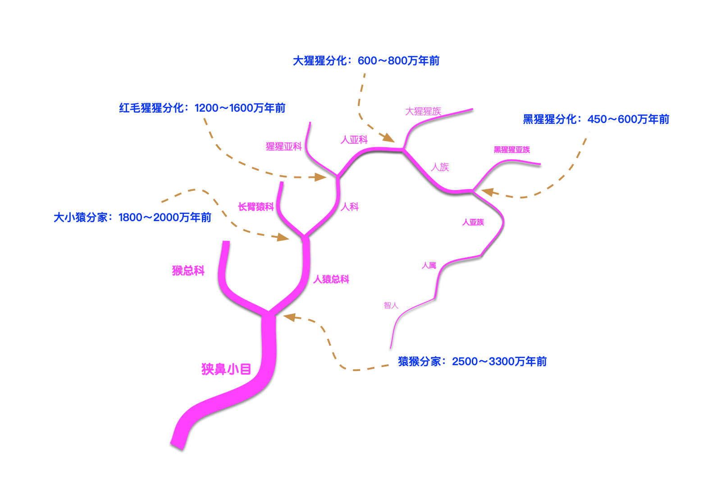

生物学上将所有生物按照以下的[生物分类级别](https://zh.wikipedia.org/wiki/%E5%88%86%E7%B1%BB%E7%BA%A7%E5%88%AB)分类，现在的所有人类都归属于

| 分类级别  | 人类所属  |
| --: | :-- |
| 域 Domain  | 真核域 Eukaryota |
| 界 Kingdom  | 动物界 Animalia |
| 门 Phylum  | 脊索动物门 Chordata |
| 纲 Class  | 哺乳纲 Mammalia |
| 目 Order  | 灵长目 Primates |
| 亚目 Suborder  | 简鼻亚目 Haplorrhini |
| 下目 Infraorder  | 类人猿下目 Simiiformes |
| 小目 Microorder  | 狭鼻小目 Catarrhini |
| 总科 Superfamily  | 人猿总科 Hominoidea |
| 科 Family | 人科 Hominidae |
| 亚科 Subfamily | 人亚科 Homininae |
| 族 Tribe | 人族 Hominini |
| 亚族 Subtribe | 人亚族 Hominina |
| 属 Genus | 人属 Homo |
| 种 Species | 智人种 Homo sapiens |
| 亚种 Subspecies | 晚期智人亚种 Homo sapiens sapiens |

这个类别有问题，大猩猩属于人科人亚科，黑猩猩属于人科人亚科人族
人和大猩猩相当于猫和猞猁
人和黑猩猩的关系，比猫和豹猫更稍微近一点

当前最流行的分类是一种五界系统，分别为原核生物界、原生生物界、菌物界、植物界以及动物界。
五界系统反映了生物进化的三个阶段和多细胞阶段的三个分支，是有纵有横的分类。它没有包括非细胞形态的病毒在内，也许是因为病毒系统地位不明之故。

物种和属这两个级别是最基本的，除此之外的级别可能是不必要的

域：真核域， Eukarya
界：动物界， Animalia
门：脊索动物门， Chordata
亚门：脊椎动物亚门 ，Vertebrata
纲：哺乳纲 ，Mammalia
亚纲：真兽亚纲 ，Eutheria
目：灵长目 ，Primates
科：人科 ，Hominidae
属：人属 ，Homo
种：智人种，Homo sapiens sapiens

- 进化的基础是差异，而不是平等。
- 鸟类会飞就是因为它们有翅膀，可不是因为有什么“飞的权利”。
- 就像政治不讲道德一样，历史从无正义。

人类知识真相：没有永恒的真理，只有暂时的正确
https://baijiahao.baidu.com/s?id=1654629380042081337&wfr=spider&for=pc