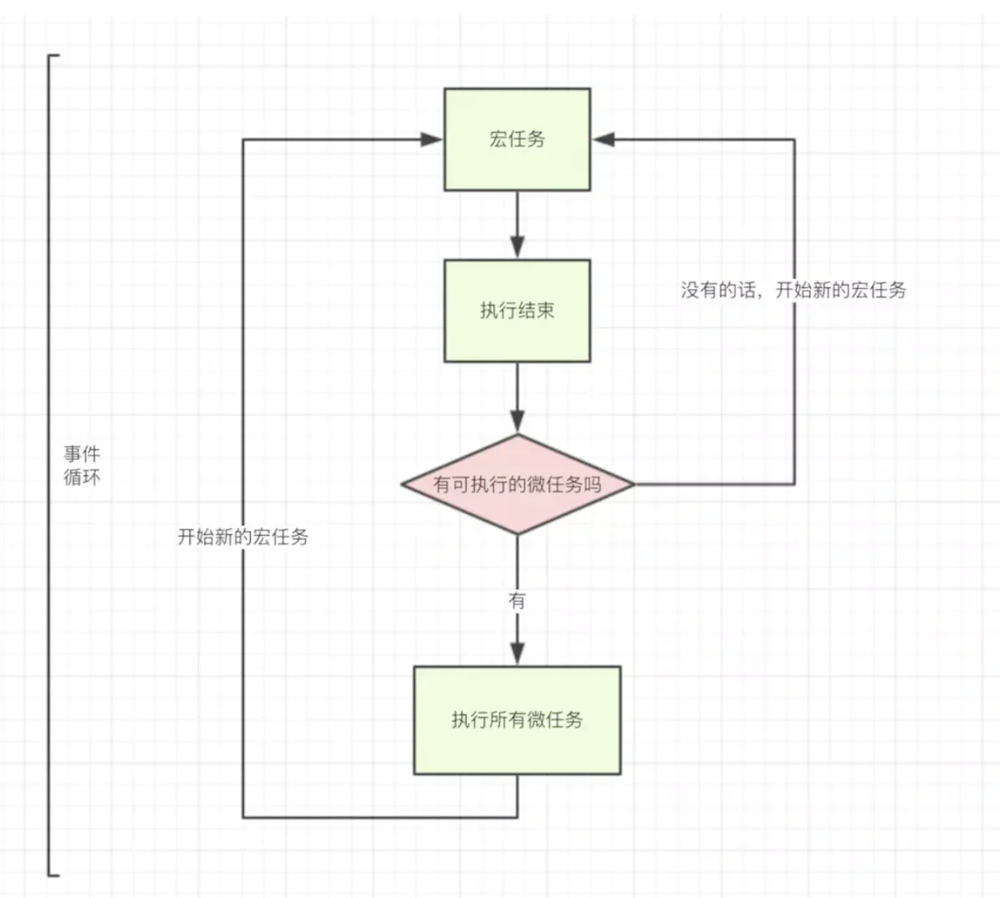

## 执行上下文

执行栈

执行上下文

<!-- - **全局执行上下文** 不在任何函数中的代码都位于全局执行上下文中。它做了两件事：1. 创建一个全局对象，在浏览器中这个全局对象就是 window 对象。2. 将 this 指针指向这个全局对象。一个程序中只能存在一个全局执行上下文。
- **函数执行上下文** 每次调用函数时，都会为该函数创建一个新的执行上下文。每个函数都拥有自己的执行上下文，但是只有在函数被调用的时候才会被创建。一个程序中可以存在任意数量的函数执行上下文。每当一个新的执行上下文被创建，它都会按照特定的顺序执行一系列步骤，具体过程将在本文后面讨论。
- **Eval 函数执行上下文** 运行在 eval 函数中的代码也获得了自己的执行上下文，但由于 Javascript 开发人员不常用 eval 函数，所以在这里不再讨论。 -->

执行上下文中存在三个重要的概念：

```js
GlobalExectionContext = {

  ThisBinding: <Global Object>,

  LexicalEnvironment: {
    EnvironmentRecord: {
      Type: "Object",
      // 标识符绑定在这里
      a: < uninitialized >,
      b: < uninitialized >,
      multiply: < func >
    }
    outer: <null>
  },

  VariableEnvironment: {
    EnvironmentRecord: {
      Type: "Object",
      // 标识符绑定在这里
      c: undefined,
    }
    outer: <null>
  }
}

FunctionExectionContext = {

  ThisBinding: <Global Object>,

  LexicalEnvironment: {
    EnvironmentRecord: {
      Type: "Declarative",
      // 标识符绑定在这里
      Arguments: {0: 20, 1: 30, length: 2},
    },
    outer: <GlobalLexicalEnvironment>
  },

  VariableEnvironment: {
    EnvironmentRecord: {
      Type: "Declarative",
      // 标识符绑定在这里
      g: undefined
    },
    outer: <GlobalLexicalEnvironment>
  }
}
```

[理解 Javascript 执行上下文和执行栈](https://github.com/yued-fe/y-translation/blob/master/en/understanding-execution-context-and-execution-stack-in-javascript.md)

Global code:通俗点讲就是源文件代码，就是一个词法环境
函数代码 ：一个函数块内自己是一个新的词法环境
eval：进入eval调用的代码有时会创建一个新的词法环境
with结构：一个with结构块内也是自己一个词法环境
catch结构：一个catch结构快内也是自己一个词环境

读到这里有些小伙伴急了，“不对，不对，我记得只有在全局代码、函数代码、和eval代码三种情况，才会创建运行上下文，你专门有5种”。
对，你说的没错，只有在全局代码、函数代码、和eval代码三种情况，才会创建运行上下文，但我这里说的是词法环境，Lexical Environments。不是运行上下文。

**在ES5中使用lexical environment来管理静态作用域,而不再是ES3中的AO/VO**

- **ThisBinding - this 绑定** `this` 的指向，在全局执行上下文中，`this` 指向全局对象 - `window`。在函数执行上下文中
如果通过 `foo.bar()` 的方式被调用，`this` 指向这个 `foo` 对象；如果通过 `bar()` 的方式被调用，`this` 指向全局对象或者 `undefined`（严格模式）；如果通过 `bar.apply(baz)/bar.call(baz)` 的方式调用，`this` 指向 `baz` 对象
- **LexicalEnvironment - 词法环境**
- **VariableEnvironment - 变量环境**

https://www.zhihu.com/search?type=content&q=js%20%E6%89%A7%E8%A1%8C%E4%B8%8A%E4%B8%8B%E6%96%87

- let 的「创建」过程被提升了，但是「初始化」没有提升。
- var 的「创建」和「初始化」都被提升了。（补充：「初始化」为 undefined）
- function 的「创建」「初始化」和「赋值」都被提升了。

```js
// 变态、步步皆坑、哈哈哈哈哈哈哈哈😂
function Foo() {
    getName = function() {
        alert(1);
    };
    return this;
}
Foo.getName = function() {
    alert(2);
};
Foo.prototype.getName = function() {
    alert(3);
};
var getName = function() {
    alert(4);
};
function getName() {
    alert(5);
}

//请写出以下输出结果：
Foo.getName();  // 2
getName();  // 4 => 注意 function getName () {} 赋值过程被提升了，
  // 而 var getName = function () {} 只提升创建和初始化过程，执行到这的时候才会赋值
  // 因此最后赋的值是 alert(4)
Foo().getName();  // 1 调用 Foo 函数，全局作用域内的 getName 被赋值成了 alert(1)，而构造函数中返回的 this 是全局对象，因此 Foo() 是全局对象
getName();  // 1
new Foo.getName();  // 这个构造函数是 Foo.getName，因此输出的是 2
new Foo().getName();  // 3，Foo 作为构造函数，会在开始执行前创建 this 指向新创建的 Foo 对象
```

```js
function Foo() {
    getName = function() {
        alert(1);
    };
    return this;
}
Foo.getName = function() {
    alert(2);
};
Foo.prototype.getName = function() {
    alert(3);
};
var getName = function() {
    alert(4);
};
function getName() {
    alert(5);
}

//请写出以下输出结果：
Foo.getName();
getName();
Foo().getName();
getName();
new Foo.getName();
new Foo().getName();
```

## 事件循环

同步和异步？

js 引擎的事件循环中，依此执行任务队列中的任务。这个任务队列中的任务都是一个宏任务，这个宏任务执行过程中，可能产生一组微任务。在这个宏任务执行结束后，需要查看有没有微产生，如果有，需要依此执行所有微任务。一个宏任务和这个宏任务产生的所有微任务都执行完毕后，浏览器开始渲染，渲染结束之后，继续执行任务队列中的下一个宏任务。



| 任务类型 | API                        | 浏览器 | Node |
|:--------:| -------------------------- | ------ | ---- |
|  宏任务  | 全局代码                   | Y      | Y    |
|  宏任务  | setTimeout                 | Y      | Y    |
|  宏任务  | setInterval                | Y      | Y    |
|  宏任务  | setImmediate               | N      | Y    |
|  宏任务  | requestAnimationFrame      | Y      | N    |
|  宏任务  | IO       | Y        | Y     |
|  微任务  | Object.observe             | Y      | Y    |
|  微任务  | process.nextTick           | N      | Y    |
|  微任务  | MutationObserver           | Y      | N    |
|  微任务  | Promise.then catch finally | Y      | Y    |

```js
setTimeout(() => {
    //执行后 回调一个宏事件
    console.log('内层宏事件3')
}, 0)
console.log('外层宏事件1');

new Promise((resolve) => {
    console.log('外层宏事件2');
    resolve()
}).then(() => {
    console.log('微事件1');
}).then(()=>{
    console.log('微事件2')
})
```

```js
async function async1 () {
  console.log('async1 start')
  await async2();
  console.log('async1 end')
}

async function async2 () {
  console.log('async2')
}

console.log('script start')

setTimeout(function () {
  console.log('setTimeout')
}, 0)

async1();

new Promise (function (resolve) {
  console.log('promise1')
  resolve();
}).then (function () {
  console.log('promise2')
})

/*
script start
async1 start
async2
promise1
async1 end
promise2
setTimeout
*/
```


```
外层宏事件1
外层宏事件2
微事件1
微事件2
内层宏事件3
```

！！！！！！！Node和浏览器的执行顺序有所出入：浏览器是先把一个栈以及栈中的微任务走完，才会走下一个栈（宏任务）。node (v11.0-) 环境里面是遇到微任务不执行，把它入微任务队列，把所有栈（宏任务）走完，再走这个微任务队列；（下面解释如果感觉有点绕，细细品味，其实挺简单的；）
！！！！最近刚看到，node的V11版本已经做了修改，和浏览器一样！！！！

Vue 的 nextTick() 方法是利用了 h5 的 MutationObserver()，如果浏览器不支持这个 API，才会使用 setTimeout(0)，这样能够确保 nextTick() 回调执行的时候，浏览器已经渲染完成。

## 深拷贝要注意什么，遇到循环引用的话怎么办，循环引用该怎么检测？

```js
function deepCopy (obj, cache = []) {
  // typeof [] => 'object'
  // typeof {} => 'object'
  if (obj === null || typeof obj !== 'object') {
    return obj
  }
  // 如果传入的对象与缓存的相等, 则递归结束, 这样防止循环
  /**
   * 类似下面这种
   * var a = {b:1}
   * a.c = a
   * 资料: https://developer.mozilla.org/en-US/docs/Web/JavaScript/Reference/Errors/Cyclic_object_value
   */
  const hit = cache.filter(c => c.original === obj)[0]
  if (hit) {
    return hit.copy
  }

  const copy = Array.isArray(obj) ?  [] :   {}
  // 将copy首先放入cache, 因为我们需要在递归deepCopy的时候引用它
  cache.push({
    original: obj,
    copy
  })
  Object.keys(obj).forEach(key => {
    copy[key] = deepCopy(obj[key], cache)
  })

  return copy
}
```

## 截流和消抖 trottle & debounce

```js
function throttle(fn, delay, ctx) {
  let timer
  return function(...args) {
    if (timer) return
    fn.apply(ctx, args)
    timer = setTimeout(() => {
      if (timer) {
        clearTimeout(timer)
        timer = null
      }
    }, delay)
  }
}
```

```js
function debounce (fn, delay, ctx) {
  let timer
  return function(...args) {
    if(timer) {
      clearTimeout(timer)
      timer = null
    }
    timer = setTimeout(() => {
      fn.apply(ctx, args)
    }, delay)
  }
}
```

原生数组的一些方法：

**不改变原数组**

1. **concat()** 连接两个或多个数组，返回被连接数组的一个副本
2. **join()** 把数组中所有元素放入一个字符串，返回字符串
3. **slice()** 从已有的数组中返回选定的元素，返回一个新数组
4. **toString()** 把数组转为字符串，返回数组的字符串形式

**改变原数组**

5. **pop()** 删除数组最后一个元素，如果数组为空，则不改变数组，返回undefined，返回被删除的元素
6. **push()** 向数组末尾添加一个或多个元素，返回新数组的长度
8. **shift()** 把数组的第一个元素删除，若空数组，不进行任何操作，返回undefined，返回第一个元素的值
11. **unshift()** 向数组的开头添加一个或多个元素，返回新数组的长度
7. **reverse()** 颠倒数组中元素的顺序，返回该数组
8. **sort()** 对数组元素进行排序(ascii)，返回该数组
10. **splice()** 从数组中添加/删除项目，返回被删除的元素


## 判断一个变量的是不是一个 plain object

```js
// 1. 是一个 object，但是可以是 Date 对象
typeof obj === 'object'  && obj !== null
// 2. 构造函数可能是 Object，但是可以通过 obj[Symbol.toStringTag] 来修改 tag
Object.prototype.toString.apply(obj) === '[object Object]'
// 3. 原型是 Object.prototype
let proto = Object.getPrototypeOf(obj)
return !!proto && Object.getPrototypeOf(proto) === null
```

```js
// redux
function isPlainObject(obj) {
  if (typeof obj !== 'object' || obj === null) return false

  let proto = obj
  while (Object.getPrototypeOf(proto) !== null) {
    proto = Object.getPrototypeOf(proto)
  }

  return Object.getPrototypeOf(obj) === proto
}

// lodash
const objectProto = Object.prototype
const hasOwnProperty = objectProto.hasOwnProperty
const toString = objectProto.toString
const symToStringTag = typeof Symbol != 'undefined' ? Symbol.toStringTag : undefined
function baseGetTag(value) {
  if (value == null) {
    return value === undefined ? '[object Undefined]' : '[object Null]'
  }
  if (!(symToStringTag && symToStringTag in Object(value))) {
    return toString.call(value)
  }
  const isOwn = hasOwnProperty.call(value, symToStringTag)
  const tag = value[symToStringTag]
  let unmasked = false
  try {
    value[symToStringTag] = undefined
    unmasked = true
  } catch (e) {}

  const result = toString.call(value)
  if (unmasked) {
    if (isOwn) {
      value[symToStringTag] = tag
    } else {
      delete value[symToStringTag]
    }
  }
  return result
}
function isPlainObject(value) {
  if (!(typeof value == 'object' && value !== null) || baseGetTag(value) != '[object Object]') {
    return false
  }
  if (Object.getPrototypeOf(value) === null) {
    return true
  }
  let proto = value
  while (Object.getPrototypeOf(proto) !== null) {
    proto = Object.getPrototypeOf(proto)
  }
  return Object.getPrototypeOf(value) === proto
}


// jQuery
const toString = Object.prototype.toString;
const fnToString = Function.prototype.toString;
const ObjectFunctionString = fnToString.call(Object);
const toString = Object.prototype.toString;
isPlainObject: function (obj) {
    var proto, Ctor;

    // Detect obvious negatives
    // Use toString instead of jQuery.type to catch host objects
    if (!obj || toString.call(obj) !== "[object Object]") {
        return false;
    }

    proto = Object.getPrototypeOf(obj);

    // Objects with no prototype (e.g., `Object.create( null )`) are plain
    if (!proto) {
        return true;
    }

    // Objects with prototype are plain iff they were constructed by a global Object function
    Ctor = Object.prototype.hasOwnProperty.call(proto, "constructor") && proto.constructor;
    return typeof Ctor === "function" && fnToString.call(Ctor) === ObjectFunctionString;
}
```

## promise 并行与串行

```js
// 并行执行
Promise.all(promises)
.then(() => {
  console.log('done')
})
.catch(() => {
  console.log('error')
})

// 串行执行
let parallelPromises = promises.reduce(
  (total, currentValue) => total.then(() => currentValue.then(print)),Promise.resolve()
)

// 可控并行
```
