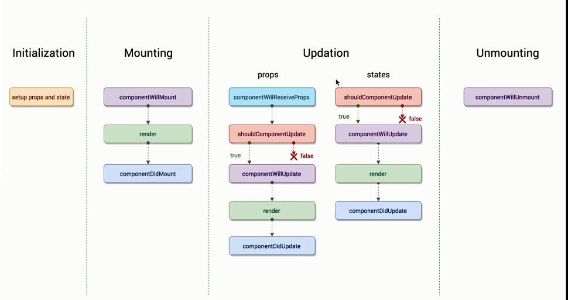

## Vue 和 React 的异同？

相同点：

- **声明式语法**：Vue template 和 React JSX 没有本质区别，Vue 中允许使用 JSX 自定义渲染函数，React 也完全可以使用工程化的方式将 template 转换成 JSX
- **代码复用**：UI 层面的复用本身不是问题，逻辑复用：hooks 和 Vue3.0 function based API 的设计无疑是最先进的
  - Mixin
  - Hoc（Vue 比较少用，模版套模版，有点奇怪了）
  - render prop（Vue 有类似思想的实现为 slot）
  - hooks（Vue3.0 function based API）
**数据流向** Vue 的双向绑定不过是 value 的单向绑定 + onChange 事件侦听的一个语法糖。因此单向数据流是 Vue 和 React 的共同选择。

不同点：

- **反应式系统** Vue 的 Push-based 和 React 的 Pull-based
  - Push-based：改动数据之后，数据本身会把这个改动推送出去，告知渲染系统自动进行渲染。Vue 通过数据拦截/监听实现 Push-based 系统，对侦测数据的变化更敏感、更精确。Vue2.0 里面也可以通过一些手段，比如把数据freeze起来，让数据不再具有反应式特点，或者通过手动调用组件更新的方法来做一个pull-based系统。
  - Pull-based：用户要给系统一个明确的信号说明现在需要重新渲染了，这个系统才会重新渲染。React 需要开发者手动调用 setState() 通知系统进行重新渲染。React 也可以使用第三方的库像 MobX 实现 Push-based 的系统。
- **设计理念** React 设计是改变开发者，提供强大而复杂的机制，开发者按照我的来；Vue 是适应开发者，让开发者怎么爽怎么来。

## Vue 是如何实现双向绑定的？

数据变化更新视图，视图变化更新数据

- View 改变更新 Data：通过事件监听的方式来实现，事件发生，事件处理函数中修改数据
- Data 改变更新 View：通过数据挟持方式实现，数据被访问和修改通知系统进行重新渲染

怎么实现 Data 变化自动更新 View，这就引申出三个问题：

1. 怎么挟持数据？
2. 怎么收集依赖？
3. 怎么更新依赖？

**怎么挟持数据？**

1. 在 Vue 2.x 中数据拦截的方法是通过 ES5 的 `Object.defineProperty`，需要枚举 data 对象的每一个属性，使用 `Object.defineProperty` 劫持对属性的 get 和 set 操作，对于数组对象还需要改写数组的 `.push()`、`.pop()`、`.unshift()`、`.shift()`、`revsese()` 和 `.sort()` 方法。因为这个 API 的局限性，在 Vue 2.x 中对数据进行操作时以下几种情况下不能被观察：

- 当你利用索引直接设置一个数组项时，例如：`vm.items[indexOfItem] = newValue`
- 当你修改数组的长度时，例如：`vm.items.length = newLength`
- 当被观察对象是 ES6 中的 `Set`、`Map` 等数据结构时，例如：`vm.items.add(newValue)`

2. 在 Vue 3.x 中数据拦截的方法改成了 ES6 的 `new Proxy()`，直接对 data 对象进行代理观察，没有了以上的所有限制，并且 Proxy 作为新标准，JS 引擎会继续优化 Proxy，这就是所谓的性能红利。除了浏览器兼容性，Proxy 方案可以说是完美的数据劫持方案。

Proxy 在 IE 浏览器的兼容上是一个灾难，并且目前并没有一个完整支持 Proxy 所有拦截方法的 Polyfill 方案，有一个 google 编写的 proxy-polyfill 也只支持了 get，set，apply，construct 四种拦截，可以支持到 IE9+ 和 Safari 6+。

[Proxy浏览器兼容性](https://developer.mozilla.org/en-US/docs/Web/JavaScript/Reference/Global_Objects/Proxy#Browser_compatibility)

使用 `Object.defineProperty` 或者 `new Proxy()` 处理之后，得到一个可以被监听 getter 和 setter 操作的对象，这个对象就是观察者模式中的观察者 - Observer。

**怎么收集依赖？**

在 Vue 应用中依赖数据的地方有很多，例如视图渲染、computed 属性、watch 属性。这些需要监听数据变化的地方都抽象成为一个 Watcher 实例。数据的每个 property 都会维持一个订阅者列表，以视图渲染为例，初次渲染时如果接触到了这个 property，也就是对这个 property 进行了 getter 操作，Vue 会将这个视图渲染对应的 watcher 加入到这个 property 的订阅者列表中。

**怎么更新依赖？**

当数据的某个 property 被修改，也就是对这个 property 进行了 setter 操作，Vue 会逐个通知订阅者列表中的每个 watcher，如果这个 watcher 对应视图渲染，会触发重新渲染；如果这个 watcher 对应 computed 属性，会重新计算新值；

## React 虚拟 DOM 是什么? 如何实现? 说一下 diff 算法？

**什么是虚拟树和 diff**

所谓的虚拟 DOM，其实就是一个描述页面长什么样子的 JavaScript 对象树。虚拟 DOM 的存在使得 React 的声明式 API 得以实现。React 是一个 pull-based 系统，数据更新需要用户手动调用 `setState()` 通知 React 数据发生改变，Vue 不能感知具体什么数据发生了改变，它的基本思维模式是每次有变动就整个重新渲染整个应用。但是浏览器 DOM 操作的成本比较高，React 需要以最小的代价来进行更新 DOM。这就是 diff 的目的。

React diff 过程就是比较更新前后的两课虚拟 DOM 树，查找出最小的更新点，得到一个 Patch，然后再更新到真实 DOM 上。但是当应用足够大时，用于 diff 的时间往往比 rendering 和 painting 话费的时间更多。所以虚拟 DOM 技术带来的红利是代码的可维护性，并不一定能够提升性能。

React 工作的过程分为几个阶段：

- 调和阶段(Reconcile)：官方解释。React 会自顶向下通过递归，遍历新数据生成新的 Virtual DOM，然后通过 Diff 算法，找到需要变更的元素(Patch)，放到更新队列里面去。
- 渲染阶段(Renderer)：遍历更新队列，通过调用宿主环境的API，实际更新渲染对应元素。宿主环境，比如 DOM、Native、WebGL 等。

React 16 之前的 Reconciler 算法是采用的递归的方式遍历整棵树，特点是一旦任务开始进行，就无法中断，那么 js 将一直占用主线程，所以称为 Stack Reconciler。这个算法的缺点是需要等到整棵虚拟 DOM 树计算完成之后，才能把执行权交给渲染引擎，这会导致一些用户交互、动画等任务无法立即得到处理，出现卡顿和延时，非常的影响用户体验。

React 16 为了解决这个问题，重写了 React 的 Reconciler 算法，把调和过程拆分成多个子任务，每次只做一小部分，做完看是否还有剩余时间，如果有继续下一个任务；如果没有，挂起当前任务，将时间控制权交给主线程，等主线程不忙的时候再继续执行。新的 Reconciler 算法称为 Fiber Reconciler。

**Fiber Reconciler 工作原理**

当有更新任务来的时候，不会马上去做 diff 操作，而是先把当前的更新送入一个 Update Queue 中，然后交给 Scheduler 去处理，Scheduler 会根据当前主线程的使用情况去处理这次 Update。

为了实现这种特性，使用了 `requestIdelCallback()` 和 `requestAnimationFrame()` 这两个 API。低优先级的任务例如普通页面更新操作交给 `requestIdelCallback()` 在浏览器空闲时操作，高优先级的任务例如涉及到用户交互操作 `requestAnimationFrame()` 在下一个帧中优先处理。`requestIdleCallback()` 这个 API 允许指定 deadline，即任务执行限制时间，用以切分任务，避免长时间执行，阻塞UI渲染而导致掉帧，这就是所谓的时间分片。

为了支持这种可中断式渲染，React 16 中对。。。

数据结构的变更？

element tree 是以树结构表示的
fiber tree 是链表结构表示的

- 跨层级的移动操作很少，所以只需要同级别比较
- 相同的组件具有相同的结构，不同的组件具有不同的结构
- key

复用 fiber 节点的原则：类型相同、并且 key 相同

## React 的 setState 是同步还是异步？

[测试](https://codesandbox.io/s/react-de-setstate-shitongbuhuanshiyibu-jx227?file=/src/App.js)

> setState() does not always immediately update the component. It **may batch or defer the update until later**. This makes reading this.state right after calling setState()a potential pitfall.

> There is no guarantee that this.state will be immediately updated, soaccessing this.state after calling this method may return the old value.

在 React 的 setState 函数实现中，会根据一个变量 isBatchingUpdates 判断是直接更新 this.state 还是放到队列中回头再说，而 isBatchingUpdates 默认是 false，也就表示 setState 会同步更新 this.state，但是，有一个函数 batchedUpdates，这个函数会把 isBatchingUpdates 修改为 true，而当 React 在调用事件处理函数之前就会调用这个 batchedUpdates，造成的后果，就是由 React 控制的事件处理过程 setState 不会同步更新 this.state。

- 在 React 控制之内的情况，setState 不会同步更新 this.state！比如使用 React 的合成事件系统，比如组件的生命周期函数中
- 在 React 控制之外的情况，setState 会同步更新 this.state！比如绕过 React 通过 JavaScript 原生 addEventListener 直接添加的事件处理函数，比如使用 setTimeout/setInterval 等 React 无法掌控的 APIs情况下

## React memos

renderProp vs slot/slot-scope

- 自上而下的数据流
- 全局状态管理
- React Context vs provide & inject

## Vue 和 React 的生命周期

**Vue 生命周期**

- `beforeCreate()`
- `created()`
- `beforeMount()`
- `mounted()`
- `beforeDestroy()`
- `destroyed()`

- `beforeUpdate()`
- `updated()`

**React 生命周期**

- `constructor()`
- `componentWillMount()`
- `componentDidMount()`
- `componentWillUnmount()`

- `componentWillReceiveProps (nextProps)`
- `shouldComponentUpdate(nextProps,nextState)`
- `componentWillUpdate (nextProps,nextState)`
- `componentDidUpdate(prevProps,prevState)`
- `render()`

- `getDerivedStateFromProps(nextProps, prevState)`
- `getSnapshotBeforeUpdate(prevProps, prevState)`

