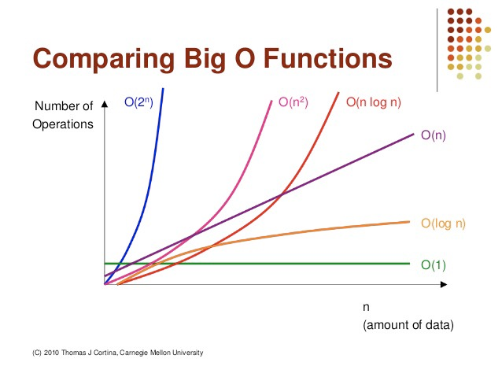

## 算法复杂度

大O表示法：
常见的大O运行时间（从快到慢进行排序）

| 大O表示法 | 非正式术语 |       执行次数       |
|:---------:|:----------:|:--------------------:|
|    O(1)   |   常数阶   |          12          |
|    O(n)   |   线性阶   |         2n+3         |
|   O(n^2)  |   平方阶   |     2n^2 + 4n + 1    |
| O(n^3)    | 立方阶     | 3n^3 + 2n^2 + 4n + 1 |
|  O(logn)  |   对数阶   |     log(2)n + 12     |
|  O(nlogn) |  nlogn阶段 |  3n + nlog(2)n + 12  |
| O(2^n)    | 指数阶     | 2^n                  |



递归会造成算法的空间复杂度提升

## 一个算法题

给定一个整数数组 nums 和一个目标值 target，请你在该数组中找出和为目标值的那两个整数，并返回他们的数组下标。
你可以假设每种输入只会对应一个答案。但是，你不能重复利用这个数组中同样的元素？

```js
function foo(arr, target) {
  for(let i = 0; i < arr.length; i++) {
    let diff = target - arr[i]
    for (let j = i + 1; j < arr.length; j++) {
      if (diff === arr[j]) return [i, j]
    }
  }
  return []
}
// 时间复杂度 O(n^2)
// 空间复杂度 O(1)
```

```js
function bar (arr, target) {
  let cache = {}
  for (let i = 0; i < arr.length; i++) {
    let diff = target - arr[i]
    if (cache[diff]) return [cache[diff], i]
    cache[diff] = i
  }
}
// 时间复杂度 O(n)
// 空间复杂度 O(1)
```

## 排序算法

```js
const arr = [3, 2, 6]
// 原生函数
arr.sort((a, b) => a - b)
// 冒泡排序实现
function bubbleSort (arr) {
  const target = Array.prototype.slice.apply(arr)
  let tmp = null
  for (let i = 0; i < arr.length - 1; i++) {
    for(let j = 1; j < arr.length - i; j++) {
      if (arr[j - 1] > arr[j]) {
        tmp = arr[j - 1]
        arr[j - 1] = arr[j]
        arr[j] = tmp
      }
    }
  }
  return target
}
// 快速排序实现
function quickSort (arr) {
  const target = Array.prototype.slice.apply(arr)
  if (target.length <= 1) return target
  const baseValue = target[0]

  let left = 0
  let right = target.length - 1
  let tmp

  while(left < right) {
    while(target[right] >= baseValue && left < right) {
      right--
    }

    while(target[left] <= baseValue && left < right) {
      left++
    }

    if (left === right) {
      tmp = target[0]
      target[0] = target[right]
      target[right] = tmp
      break
    }

    tmp = target[left]
    target[left] = target[right]
    target[right] = tmp
  }
  return [].concat(quickSort(target.slice(0, left)), target.slice(left, left + 1), quickSort( target.slice(left + 1)))
}

quickSort([2,1,5,8,3,7,4,6,9])

function quickSort (arr) {
  const target = Array.prototype.slice.apply(arr)
  const len = arr.length
  if (len <= 1) return target
  const baseIndex = Math.floor(len / 2)
  // 一定要把基准值取出来，否则可能陷入死循环
  const baseValue = target.splice(baseIndex, 1)[0]

  let left = []
  let right = []

  for (let i = 0; i < target.length; i++) {
    if (target[i] > baseValue) {
      right.push(target[i])
    } else {
      left.push(target[i])
    }
  }
  return [].concat(left, [baseValue], right)
}
```

## 数组去重

```js
const arr = [3, 2, 6]
// 原生函数
arr.filter((elem, index) => index === arr.indexOf(elem))
Array.from(new Set(arr))

// 去重实现
function distinct (arr) {
  const target = Array.prototype.slice.call(arr)
  for (let i = 0; i < target.length - 1; i++) {
    for (let j = i + 1; j < target.length; j++) {
      if (target[i] === target[j]) {
        target.splice(j, 1)
        j--
      }
    }
  }
  return target
}
```

## 数组扁平化

```js
const arr = [3, [2, 3], 6]
// 原生函数
arr.flat(arr)

// 去重实现
function flat (arr) {
  const target = []
  for (let i = 0; i < arr.length; i++) {
    if (Array.isArray(arr[i])) {
      target.splice(target.length, 0, ...flat(arr[i]))
    } else {
      target.push(arr[i])
    }
  }
  return target
}
flat([3, [2, 3], 6])
```

## 函数柯里化

```js
function curry(fn, ...arg1) {
  return function(...arg2) {
    return fn.call(this, ...arg1, ...arg2)
  }
}

function sum(...args) {
  return args.reduce((total, item) => total + item, 0)
}

curry(sum, 100)(1, 3, 4)
```

## 二叉树所有根到叶子路径组成的数字之和

```js
// 构造二叉树
function createNode (value, parent, left, right) {
  return { value, parent, left, right }
}
const node1 = createNode(1, null, null, null)
const node2 = createNode(2, node1, null, null)
const node3 = createNode(3, node1, null, null)
const node4 = createNode(4, node2, null, null)
const node5 = createNode(5, node2, null, null)
node1.left = node2
node1.right = node3
node2.left = node4
node2.right = node5
```

```js
// 递归思路
function treePathSum (root, total = 0) {
  if(!root) {
		return 0;
  }
  total = total * 10 + root.value
  if (!root.left && !root.right) {
    // 到达叶子节点
    return total
  }
  return treePathSum(root.left, total) + treePathSum(root.right, total)
}

console.log(treePathSum(node1))
```

```js
// 循环思路
// 还有一种类似 React fiber 树的遍历方式，使用循环、避免了嵌套
function performNode (node, context) {
  while(node) {
    context.total = context.total * 10 + node.value
    if (node.left) {
      node = node.left
    } else if (node.right) {
      node = node.right
    } else {
      node = completeNode(node, context)
    }
  }
}
function completeNode (node, context) {
  context.value = context.value + context.total
  while (node) {
    context.total = Math.floor(context.total / 10)
    if (node.parent && node.parent.right && node.parent.right !== node) return node.parent.right
    node = node.parent
  }
  return null
}
function treePathSum (root, total = 0) {
  const context = {
    value: 0,
    total: 0,
  }
  performNode(root, context)
  return context.value
}

console.log(treePathSum(node1))
```